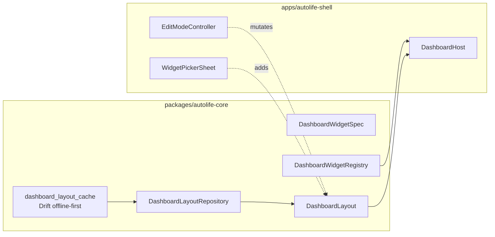
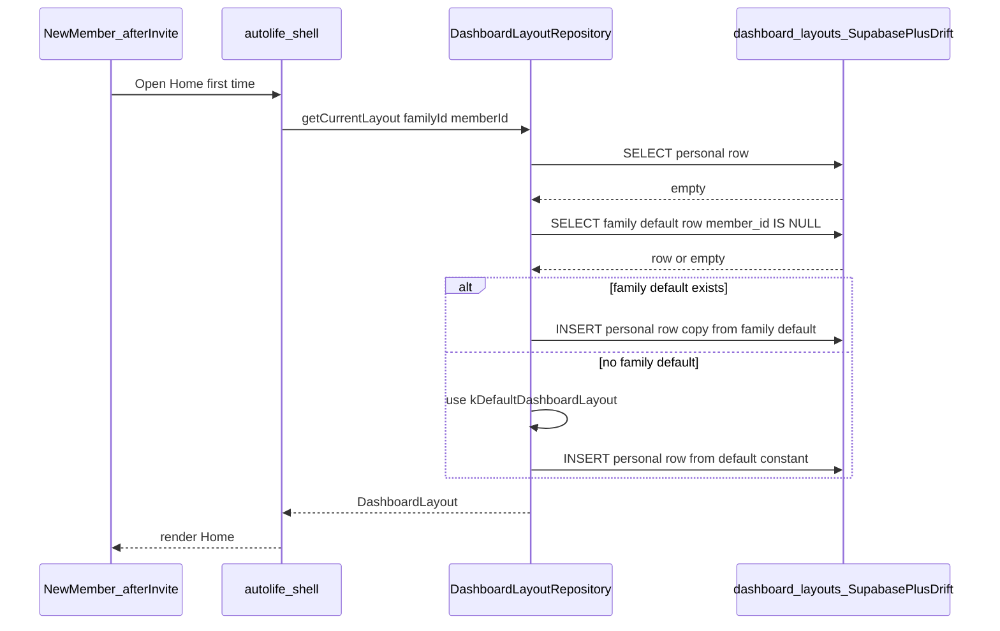

# Phase 3.1.5 - Dashboard Customization (Edit Mode)

## Objective
Each signed-in member customizes their Home dashboard by adding, removing, reordering, and resizing widgets registered in `DashboardWidgetRegistry` from [phase3.1_autolife_shell_dashboard.plan.md](phase3.1_autolife_shell_dashboard.plan.md). Layout data is offline-first, survives reconnects, syncs across devices for the same member, and respects role capabilities from phase 2.3. The **family owner** (`FamilyRole.owner`, strict — not partner/grandparent) may additionally curate a **family default layout** (`member_id IS NULL`) that is applied to a **new member's first Home resolve** via lazy client seeding; existing members are never modified when the owner changes the family default.

## Architecture

## Family default seeding (new members)

Use **lazy client seed on first resolve** (offline-first; no backend trigger required).

**Resolution order** in `DashboardLayoutRepository.getCurrent(...)`:

1. Personal layout row for `(family_id, member_id)`.
2. Family default row for `(family_id, member_id IS NULL)`.
3. `kDefaultDashboardLayout` from phase 3.1.

When step 1 misses and the resolver falls through to 2 or 3, immediately **persist a personal row** seeded from that source so the member owns an editable copy and never silently tracks live changes to the family default afterward.

## In scope
- Long-press on Home body (or overflow menu > Edit dashboard) enters **Edit Mode**: jiggle affordance, drag handles, per-tile delete control.
- Drag-and-drop reorder on the same responsive grid defined in phase 3.1 (`S/M/L/XL` on 2-col phone / 4-col tablet).
- Tap-to-resize (or compact control): cycles a tile through its declared `DashboardSize`s from the widget spec.
- `WidgetPickerSheet` listing registered widgets not yet on the current layout, grouped by `moduleId`, with thumbnail or live preview where feasible.
- Presets: built-ins **Default**, **Morning**, **Evening**, **Weekend** plus user-saved named presets stored alongside layout JSON.
- **Reset to defaults** with confirmation dialog (restores `kDefaultDashboardLayout` from phase 3.1 as starting point before optional module additions).
- Per-member layouts: each member edits **their own** layout row.
- **Family-default editing (owner only):** in Edit Mode, `FamilyRole.owner` sees a scope toggle / segmented control — **"My layout"** vs **"Family default (new members)"** — wired through `edit_mode_controller.dart` and [`scope_selector.dart`](../../apps/autolife-shell/lib/src/screens/home/edit_mode/scope_selector.dart).
- **"Save current as family default"** shortcut copies the owner's current personal `DashboardLayout` JSON into the family-default row (`member_id IS NULL`).
- **Lazy seed** in `DashboardLayoutRepository`: first resolve for `(family_id, member_id)` with no personal row seeds from family default if present, else from `kDefaultDashboardLayout`, then persists the personal row via `OfflineWriteQueue`.
- **Scope banner** while editing family default: "Editing the family default. Existing members keep their own layouts. New members will start with this."
- Persistence: new Drift table `dashboard_layout_cache` mirroring remote rows + Supabase table `dashboard_layouts`; writes enqueue through `OfflineWriteQueue` from [phase1.6_offline_sync_foundation.plan.md](phase1.6_offline_sync_foundation.plan.md).
- Capabilities: extend [phase2.3_role_policy_model.plan.md](phase2.3_role_policy_model.plan.md) with `dashboard.customize_own` (all roles that can open Home) and **`dashboard.customize_family_default` granted only to `FamilyRole.owner`**; regenerate `capability_matrix_generated.dart`.
- Realtime: subscribe (Supabase channel or `process-event` envelope `dashboard.layout.updated`) so a second device refreshes within the SLA below.

## Out of scope
- Free-canvas positioning with arbitrary x/y (explicitly not planned for Home).
- Third-party plugin marketplace or unsigned widget bundles.
- Implementing individual module widgets (each remains owned by its phase 3.x module plan).
- **Re-seeding existing members** when the owner changes the family default — personal rows already created stay unchanged.
- **Multiple named family-default presets** — at most one family-default row per family (`member_id IS NULL`).
- **Ownership transfer / promoting a new owner** — defer to [phase2.2_family_tenancy_model.plan.md](phase2.2_family_tenancy_model.plan.md); document TODO that write rights on the family-default row must follow the active owner after transfer is implemented.

## Key deliverables
- [`apps/autolife-shell/lib/src/screens/home/edit_mode/scope_selector.dart`](../../apps/autolife-shell/lib/src/screens/home/edit_mode/scope_selector.dart) — owner-only toggle between "My layout" and "Family default (new members)"; hidden unless `dashboard.customize_family_default` is granted (`owner` only).
- [`apps/autolife-shell/lib/src/screens/home/edit_mode/edit_mode_controller.dart`](../../apps/autolife-shell/lib/src/screens/home/edit_mode/edit_mode_controller.dart)
- [`apps/autolife-shell/lib/src/screens/home/edit_mode/reorderable_dashboard.dart`](../../apps/autolife-shell/lib/src/screens/home/edit_mode/reorderable_dashboard.dart)
- [`apps/autolife-shell/lib/src/screens/home/edit_mode/widget_picker_sheet.dart`](../../apps/autolife-shell/lib/src/screens/home/edit_mode/widget_picker_sheet.dart)
- [`apps/autolife-shell/lib/src/screens/home/edit_mode/preset_picker.dart`](../../apps/autolife-shell/lib/src/screens/home/edit_mode/preset_picker.dart)
- [`packages/autolife-core/lib/src/dashboard/dashboard_layout_repository.dart`](../../packages/autolife-core/lib/src/dashboard/dashboard_layout_repository.dart) — implements three-step resolve order + lazy seed-on-first-resolve for new members (persist personal copy immediately).
- [`packages/autolife-core/lib/src/dashboard/dashboard_preset.dart`](../../packages/autolife-core/lib/src/dashboard/dashboard_preset.dart)
- [`packages/autolife-core/lib/src/sync/tables/dashboard_layout_cache.dart`](../../packages/autolife-core/lib/src/sync/tables/dashboard_layout_cache.dart) + Drift codegen regen
- [`supabase/migrations/<timestamp>_dashboard_layouts.sql`](../../supabase/migrations) — `dashboard_layouts` table with RLS: scoped by `family_id`; row per `(family_id, member_id)` for personal layouts; **`member_id IS NULL` family-default row:** `SELECT` for any family member (seed reads); **`INSERT`/`UPDATE`/`DELETE` only when** `auth.uid()` corresponds to a membership where `role = 'owner'` for that `family_id`) (mirror capability `dashboard.customize_family_default`, owner-only).
- Capability matrix YAML / codegen updates: `dashboard.customize_own`; **`dashboard.customize_family_default` granted only to `FamilyRole.owner`**, all other roles `granted: false`; regenerate `capability_matrix_generated.dart`.
- Widget golden tests + integration tests for multi-device observe **and family-default seeding** (see step 10a below).

## Dependencies
- [phase3.1_autolife_shell_dashboard.plan.md](phase3.1_autolife_shell_dashboard.plan.md) — `DashboardHost`, `DashboardWidgetRegistry`, `DashboardLayout`, default layout constant.
- [phase2.2_family_tenancy_model.plan.md](phase2.2_family_tenancy_model.plan.md) — `FamilyRole.owner` on `memberships`; owner queryable for RLS and UI gating.
- [phase1.6_offline_sync_foundation.plan.md](phase1.6_offline_sync_foundation.plan.md) — Drift cache + `OfflineWriteQueue`.
- [phase2.3_role_policy_model.plan.md](phase2.3_role_policy_model.plan.md) — capability gates for edit surfaces.
- [phase2.4_rls_policies.plan.md](phase2.4_rls_policies.plan.md) — RLS templates for new table.
- At least [phase3.2_auto_calendar.plan.md](phase3.2_auto_calendar.plan.md), [phase3.3_auto_tasks.plan.md](phase3.3_auto_tasks.plan.md), and [phase3.4_auto_assets.plan.md](phase3.4_auto_assets.plan.md) so the widget picker is meaningfully populated.

Reference only; do not duplicate event envelopes, tenancy primitives, or dashboard aggregation contracts defined in phase 3.1.

## Acceptance criteria (gate)
- [ ] Long-press (or menu action) enters edit mode; tapping Done or outside the grid exits with autosave of dirty state; system back / ESC behaves like Done without losing confirmed changes.
- [ ] Reorder, resize, delete, and add-from-picker persist while offline and replay through `OfflineWriteQueue` on reconnect; second device sees the update within 10 s of successful realtime delivery under integration harness.
- [ ] Widget picker enumerates exactly `registry.all().where((w) => !currentLayout.contains(w.id))`, grouped by `moduleId`.
- [ ] Applying a preset completes visual reflow in under 300 ms on a mid-tier phone target (profiled in integration settings).
- [ ] The scope toggle "My layout / Family default" appears in Edit Mode **only** when the current user's membership row reports **`role = owner`** for the active family (`partner`, `grandparent`, and all other roles never see it).
- [ ] **Family owner** editing **family default** sees the explicit scope banner and confirmation flows described above; members **without** `dashboard.customize_family_default` never see family-default controls (`partner` must not).
- [ ] Writes to the family-default row (`member_id IS NULL`) are rejected by Supabase RLS for any role other than **`owner`**; integration test asserts a **`partner`**-role session receives permission denied on `INSERT`/`UPDATE`/`DELETE` against that row.
- [ ] A newly accepted member opens Home for the first time and renders the layout the owner saved as family default (no manual import), seeded via lazy resolve + persisted personal row.
- [ ] If no family default has been set, a new member is seeded from `kDefaultDashboardLayout` on first resolve and a personal row is persisted.
- [ ] Changing the family default after members exist **does not** modify any existing **personal** layout row (assert by snapshot diff in integration test).
- [ ] **"Save current as family default"** copies the owner's current `DashboardLayout` JSON into the family-default row and emits `dashboard.layout.updated` with metadata `scope = family_default`.
- [ ] Golden tests cover: view mode, edit mode jiggle, picker open state, transitions for three presets (e.g. Default → Morning → Evening), and owner toggling family-default scope (banner visible).
- [ ] Integration test: edit layout on device A stub → observe layout version bump on device B via realtime / bus path asserted in test doubles.

## Risks + mitigations
1. **Cross-device conflicts** — Last-write-wins per `(family_id, member_id)` with monotonic `layout_version` or `updated_at`; surface snackbar “Dashboard updated on another device” with refresh action when remote wins. Same rule for the single `(family_id, member_id IS NULL)` family-default row when two owner devices edit simultaneously.
2. **Small-phone drag UX** — Minimum 48 dp touch targets, 8 dp gutters, disable competing horizontal gestures while editing; optional “Move up/down” buttons fallback for accessibility.
3. **Empty picker before modules ship** — Gate release until calendar/tasks/assets widgets register; otherwise picker shows `AutoLifeEmptyState` (“No extra widgets yet”).
4. **RLS mistakes leaking layouts** — Peer review migration with `phase2.4` templates; integration test queries as two different members plus **`partner` denial on family-default writes**.
5. **Ambiguity between "family default" and "my layout" for the owner** — Distinct `scope_selector`, persistent banner while editing family default, confirmation dialog before saving family-default changes.
6. **Owner transfer (future)** — Ownership-transfer flow must move Supabase write predicates + capability grants so the new `owner` can mutate the family-default row; track as follow-up on `phase2.2`.

## Implementation outline
1. Add Drift `dashboard_layout_cache` table + Supabase `dashboard_layouts` migration with RLS policies.
   - **1a.** RLS: `SELECT` on family-default row (`member_id IS NULL`) allowed to any authenticated member of `family_id`; **`INSERT`/`UPDATE`/`DELETE` on that row only when** `memberships.role = 'owner'` for `auth.uid()` (matches capability matrix).
2. Implement `DashboardLayoutRepository` (read-through cache, enqueue writes, subscribe to realtime invalidation).
   - **2a.** Implement `getCurrent(familyId, memberId)` with resolution order **personal → family default → `kDefaultDashboardLayout`**; on first miss at personal, **persist a personal row** seeded from step 2 or 3 via `OfflineWriteQueue` before returning.
3. Add `currentDashboardLayoutProvider` that prefers persisted personal layout when present; repository handles lazy seed on first open (step 2a).
4. Implement `EditModeController` as a Riverpod `Notifier` (`isEditing`, working copy, dirty flag, optional undo stack depth 10).
   - **4a.** Render [`scope_selector.dart`](../../apps/autolife-shell/lib/src/screens/home/edit_mode/scope_selector.dart) only when `capabilities.has('dashboard.customize_family_default')` (owner-only post-matrix-regeneration). When toggled to **Family default**, load/save the `(family_id, NULL)` row; when **My layout**, load/save the personal row; show scope banner and confirm before committing family-default saves; wire **Save current as family default** from owner's personal snapshot.
5. Wrap `DashboardHost` body with `ReorderableDashboard` that switches between view and edit affordances without duplicating widget trees.
6. Build `WidgetPickerSheet` driven solely by `DashboardWidgetRegistry` metadata.
7. Add `DashboardPreset` definitions + `preset_picker.dart`; persist user presets as JSON blob alongside layout or separate column.
8. Add capabilities to phase 2.3 matrix — **`dashboard.customize_family_default` owner-only**; `dashboard.customize_own` for all Home-eligible roles — regenerate Dart lookup, gate UI entry points.
9. Emit / consume `dashboard.layout.updated` (or equivalent channel) for cross-device refresh (`scope` discriminates `personal` vs `family_default`).
10. Tests: repository unit tests (resolve + lazy seed), widget goldens, multi-device integration scenario.
    - **10a.** Integration: owner saves family default → **new-member stub** first Home resolve asserts seeded layout matches owner family default.
    - **10b.** Integration: owner edits family default → **existing member's personal row** unchanged after sync (snapshot equality).

## Artifacts/links
- [PR placeholder]
- [RLS review checklist]
- [Edit mode UX recording]
