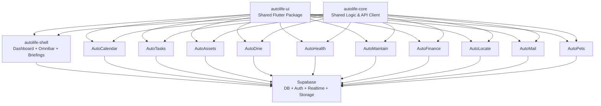
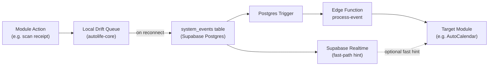

# AutoLife Integration Plan

## Architecture Overview

### Locked MVP Decisions

- **Tenancy model:** one Supabase project for all families (multi-tenant). Every data table carries `family_id`; all access is enforced via RLS.
- **Event delivery guarantee:** at-least-once delivery. Consumers must be idempotent.
- **Canonical stores:** Supabase tables are authoritative; device-native APIs (EventKit, local queues) are sync bridges and caches only.



---

## Repo Structure — Melos Monorepo

A single GitHub repo (`autolife`) managed by **Melos**, with two top-level directories:

```
autolife/
├── melos.yaml                  # workspace definition + shared scripts
├── pubspec.yaml                # root workspace pubspec
├── docker-compose.yml          # spins up all apps + local Supabase
├── supabase/                   # migrations, Edge Functions, seed data
├── packages/
│   ├── autolife-ui/            # shared Flutter widget library
│   └── autolife-core/          # Supabase client, event bus, models, auth
└── apps/
    ├── autolife-shell/         # dashboard, omnibar, voice button, briefings
    ├── auto-calendar/
    ├── auto-tasks/
    ├── auto-assets/
    ├── auto-dine/
    ├── auto-health/
    ├── auto-maintain/
    ├── auto-finance/
    ├── auto-locate/
    ├── auto-mail/
    └── auto-pets/
```

**`melos.yaml` key scripts:**

```yaml
name: autolife
packages:
  - packages/**
  - apps/**
scripts:
  bootstrap: melos exec -- flutter pub get
  build:all: melos exec --depends-on="autolife-ui" -- flutter build
  test:all:  melos exec -- flutter test
  lint:all:  melos exec -- flutter analyze
```

All `apps/*` reference `packages/autolife-ui` and `packages/autolife-core` as local path dependencies — no version bumping required when iterating on shared code. Each `apps/*` still ships its own `Dockerfile` for independent container builds.

---

## Shared Core: The Durable Event Bus

Supabase Realtime (WebSockets) is fire-and-forget — if a device loses cell service or the OS kills the app, a Realtime event is gone forever. To fix this, the event bus uses a **two-layer architecture**:

### Layer 1 — Durable Write (Source of Truth)

Modules always write to the `system_events` table first. Realtime is only a fast-path notification on top, never the record of authority.

```
system_events table
  id, idempotency_key, type, source_module, payload (jsonb),
  family_id, created_at

event_deliveries table
  id, event_id, consumer_module, status (pending|processed|failed),
  processed_at (nullable), retry_count, last_error (nullable)
```

A Postgres trigger on `INSERT` into `system_events` notifies a **Supabase Edge Function** (`/functions/process-event`) which writes one `event_deliveries` row per target consumer. Processing is **at-least-once**: failed deliveries increment `retry_count`, store `last_error`, and are retried by `pg_cron` every 60 seconds until status is `processed`. A unique index on `(event_id, consumer_module)` plus `idempotency_key` prevents duplicate downstream side effects.

### Layer 2 — Client-Side Offline Queue

`packages/autolife-core` embeds a local **Drift (SQLite)** queue. When a module generates an event offline, it writes to the local queue first. On reconnect, the queue flushes to `system_events` in order. This guarantees events like `receipt.scanned` survive airplane mode, killed background processes, or spotty subway service.



### Key Cross-Module Trigger Map

| Source Module | Event | Target Module | Action |
|---|---|---|---|
| AutoHealth | `cycle.product_heavy_usage` | AutoDine | Add pads/tampons to grocery list |
| AutoHealth | `medication.low_supply (3 left)` | AutoTasks | Create "Order Prescription" task |
| AutoAssets | `receipt.scanned` | AutoCalendar | Create warranty expiry + return window events |
| AutoAssets | `receipt.scanned` | AutoFinance | Log purchase against budget |
| AutoFinance | `trial.48h_warning` | AutoCalendar | Set aggressive alarm event |
| AutoFinance | `chore.completed (n=5)` | AutoFinance | Credit child's piggy bank |
| AutoTasks | `chore.completed` | AutoFinance | Check allowance rules |
| AutoCalendar | `event.location_set` | AutoCalendar | Auto-insert commute block (Maps API) |
| AutoMaintain | `vehicle.mileage_updated` | AutoTasks | Create oil change task |
| AutoDine | `pantry.item_expiring` | AutoDine | Suggest recipe using expiring items |
| AutoDine | `grocery.item_out_of_stock` | AutoDine | Flag item on list |

---

## External API Integrations

### Calendar Sync (`auto-calendar`)

Supabase is the **single canonical calendar store** for the whole family. No family member or the Babysitter link ever reads from a device calendar directly — they all read from the `calendar_events` table in Supabase. Each app instance acts as a sync bridge between its local device calendar and Supabase.

```
calendar_events table
  id, family_id, title, start_at, end_at, location,
  sync_source (apple | google | outlook | internal),
  external_id,   -- EventKit UUID / Google event ID (for dedup)
  synced_by_user_id, last_synced_at
```

- **Google Calendar API** — OAuth2, 2-way sync; Google events are written to `calendar_events` with `sync_source = 'google'`
- **Apple EventKit** — iOS native plugin (`flutter_calendar_connect`). The Flutter app reads local EventKit events and **upserts** them into `calendar_events` using `external_id` for deduplication. Sync runs on: app foreground, silent APNs background push, and a 15-min background fetch task. EventKit is never read by other family members — they always read Supabase.
- **Microsoft Graph API** — same bridge pattern as Google; `sync_source = 'outlook'`
- **Conflict resolution** — configurable in Settings: "If the same event is modified offline on two devices, keep [Parent's / most-recent] version." Stored as a family-level setting in Supabase.

### Maps & Traffic (`auto-calendar`)
- **Google Maps Directions API** (default) — commute block calculation
- Swappable in Settings → Integration Manager via stored API key + base URL

### Weather (`auto-calendar`, `autolife-shell`)
- **Open-Meteo API** (free, no key needed) or **OpenWeatherMap** — calendar overlays + morning briefing

### OCR & AI (`auto-assets`, `auto-dine`, `auto-health`)
- **Google Cloud Vision API** — receipt scanning, nutrition label OCR, email parsing
- Hosted as a **Supabase Edge Function** (`/functions/ocr`) so no key is exposed client-side

### Grocery Store APIs (`auto-dine`)
- **Coop CH** and **Migros CH** product/inventory APIs
- Generic "Add Store" flow: user provides base URL → Edge Function probes for product search endpoint + favicon

### Push Notifications (`autolife-shell`)
- **Firebase Cloud Messaging (FCM)** — cross-platform push
- Nag Mode + batching logic lives in a Supabase Edge Function that debounces writes to the `notifications_queue` table

### Location (`auto-locate`)
- **Flutter Geolocator** — device GPS
- Realtime positions stored in Supabase with RLS (only family members with permission can read)

### Email (`auto-mail`)
- Custom domain email via **Cloudflare Email Routing** → forwarded into a Supabase Edge Function that parses and stores messages

---

## Supabase Layer

### Auth
- Single Supabase project for all families (multi-tenant)
- Roles stored in `profiles.role` (`co-parent | teenager | child | grandparent | guest`)
- Row Level Security (RLS) policies enforce module-level visibility per role
- Every tenant-scoped table includes `family_id`; all queries are tenant-filtered via RLS

### Storage Buckets
- `receipts/` — AutoAssets scanned receipts
- `manuals/` — downloaded device PDFs (opt-in setting)
- `health-docs/` — vaccination PDFs, medical passport
- `home-media/` — AutoMaintain video notes
- All buckets: private by default, signed URLs for sharing (Babysitter Mode)

### Privacy, Safety, and Compliance Baseline
- Data retention defaults (override per family policy):
  - location history: 90 days
  - notification logs: 30 days
  - event bus delivery logs: 30 days
  - receipts/manuals/health docs: until user deletes
- Family admin controls:
  - one-click family data export (JSON + signed file links)
  - account deletion workflow with soft-delete grace period (14 days) then hard purge
- Security controls:
  - Edge Function secrets only in Supabase secrets manager; never client-side
  - quarterly API key rotation checklist
  - audit log table for privileged actions (role changes, exports, deletes, sharing links)

### Realtime
- Each module subscribes to its own Supabase Realtime channel (e.g., `calendar:family_id`, `grocery:family_id`)
- Shell subscribes to `system_events` to update the omnibar index

---

## Testing and Quality Gates

Minimum quality bar before MVP release:

- `packages/autolife-core`
  - unit tests for offline queue ordering, reconnect flush, and dedup with `idempotency_key`
- `supabase/` schema + RLS
  - migration tests in CI
  - policy tests proving role and cross-family isolation behavior
- Edge Functions
  - contract tests for OCR, notifications, process-event, and email parser handlers
- Critical E2E flows
  - `receipt.scanned -> AutoCalendar + AutoFinance`
  - `medication.low_supply -> AutoTasks`
  - `trial.48h_warning -> AutoCalendar`
  - offline event creation -> reconnect -> single successful delivery per consumer

---

## Unified UI Package (`autolife-ui`)

- Single Flutter package with design tokens (colors, typography, spacing)
- Themed components: `AutoCard`, `AutoListTile`, `AutoOmnibar`, `AutoBottomSheet`, `KidsModeTile`
- Theme switches: standard (high-density) ↔ Kids Mode (large tap targets, bright palette)
- Every `apps/*` module imports `autolife-ui` as a local Melos path dependency — no publishing needed

---

## Docker / Self-Hosting

Because everything lives in one monorepo, self-hosting is a single command:

- Root `docker-compose.yml` defines a service per app + a local Supabase stack (`supabase/postgres` image)
- Each `apps/*` has its own `Dockerfile` (Flutter web build + Nginx) so individual services can be rebuilt independently
- A shared `.env` at the root provides `SUPABASE_URL`, `SUPABASE_ANON_KEY`, and API keys — all services consume it
- `melos run docker:up` wraps `docker compose up --build` for convenience

---

## MVP Build Order

1. Scaffold Melos monorepo (`melos.yaml`, workspace `pubspec.yaml`, CI pipeline)
2. `packages/autolife-ui` + `packages/autolife-core` (everything depends on these)
3. Supabase schema + RLS policies + Edge Functions scaffold (`supabase/` directory)
4. `apps/autolife-shell` (dashboard, auth, omnibar, event bus wiring)
5. `apps/auto-calendar` + `apps/auto-tasks` (core daily-use modules)
6. `apps/auto-assets` (OCR pipeline proves the Vision API Edge Function)
7. Post-MVP: AutoDine → AutoHealth → AutoFinance → AutoMaintain → AutoLocate → AutoPets → AutoMail

### MVP Exit Criteria (Definition of Done)

MVP is complete only when all conditions below are met:

- Family auth + role-based RLS works for `co-parent`, `teenager`, `child`, and `guest`
- Durable event bus processes critical flows with no duplicate side effects under retries
- Calendar sync bridge (at least one provider + EventKit) is stable with dedup via `external_id`
- OCR pipeline writes assets and creates at least one verified calendar/finance downstream action
- Offline event queue survives app restart and flushes correctly on reconnect
- CI gates pass for unit, migration/policy, and critical E2E scenarios

### Top Risks and Mitigations

- **iOS background limitations (EventKit/APNs fetch):** treat background sync as best-effort; enforce foreground catch-up sync and explicit "last synced" state in UI
- **Store API uncertainty (Coop/Migros access terms):** keep provider adapters optional and ship manual grocery entry fallback in MVP
- **Quota/cost drift (Vision/Maps/push):** add rate limiting + per-family monthly usage counters and alert thresholds
