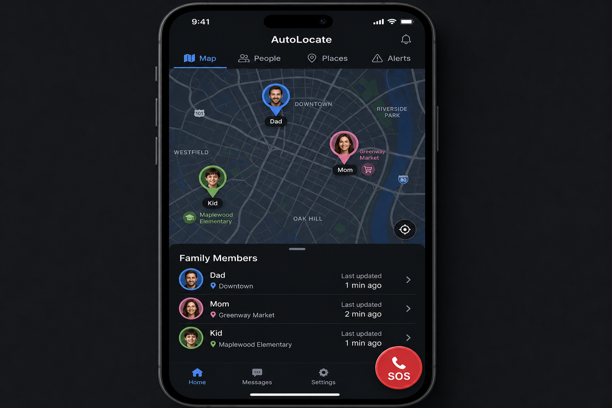
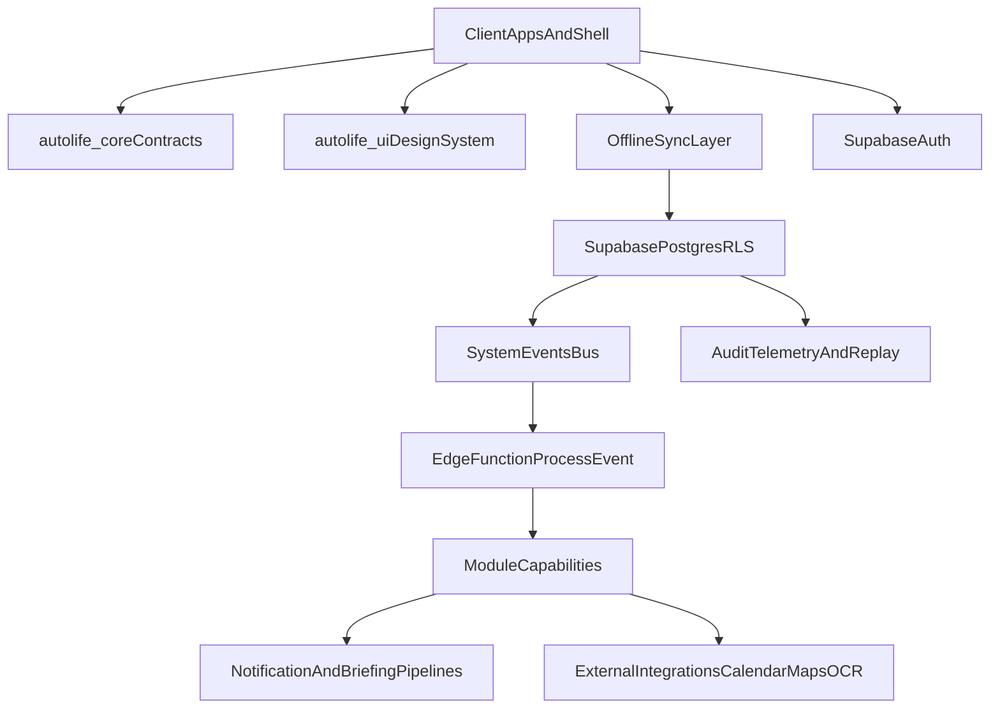

# Overarching AutoLife Architecture Plan

## Objective
Realize the vision in [Idea-Refined.md](Idea-Refined.md) as a modular, family-centric platform architecture across apps, shared packages, and Supabase services, prioritizing cross-module orchestration, data consistency, and extensibility.

## Progress Tracker (Living Companion)
Use this section as the "how far along are we?" companion. Update checkboxes as you complete sub-phases.

### Phase 1: Platform Architecture + Techstack Integration
- [ ] **1.1** Monorepo + workspace setup (Melos, pubspecs, CI) -- [phase1.1_monorepo_workspace_setup.plan.md](phase1.1_monorepo_workspace_setup.plan.md)
- [ ] **1.2** Shared domain contracts (`packages/autolife-core`: models, events, services) -- [phase1.2_autolife_core_contracts.plan.md](phase1.2_autolife_core_contracts.plan.md)
- [ ] **1.3** Shared design system (`packages/autolife-ui`: theme, tokens, components) -- [phase1.3_autolife_ui_design_system.plan.md](phase1.3_autolife_ui_design_system.plan.md)
- [ ] **1.4** Supabase baseline (DB schema, auth config, storage buckets, Edge Functions scaffold) -- [phase1.4_supabase_baseline.plan.md](phase1.4_supabase_baseline.plan.md)
- [ ] **1.5** Event bus + `process-event` worker (producer/consumer contracts, retry/DLQ) -- [phase1.5_event_bus_process_event_worker.plan.md](phase1.5_event_bus_process_event_worker.plan.md)
- [ ] **1.6** Offline/sync foundation (local cache, write queue, conflict strategy) -- [phase1.6_offline_sync_foundation.plan.md](phase1.6_offline_sync_foundation.plan.md)
- [ ] **1.7** Integration gateway scaffold (connector lifecycle, credential storage) -- [phase1.7_integration_gateway_scaffold.plan.md](phase1.7_integration_gateway_scaffold.plan.md)
- [ ] **1.8** End-to-end smoke test (one happy-path flow proving the full stack works together) -- [phase1.8_end_to_end_smoke_test.plan.md](phase1.8_end_to_end_smoke_test.plan.md)
- **Gate**: Flutter workspace + `autolife-core` + `autolife-ui` + Supabase (DB/auth/storage/functions/events/sync) work together end-to-end

### Phase 2: Security Hardening + Login
- [ ] **2.1** Auth flows (sign up, login, password reset, social/OAuth, session management) -- [phase2.1_auth_flows.plan.md](phase2.1_auth_flows.plan.md)
- [ ] **2.2** Family tenancy model (create family, invite members, membership lifecycle) -- [phase2.2_family_tenancy_model.plan.md](phase2.2_family_tenancy_model.plan.md)
- [ ] **2.3** Role + policy model (owner/partner/child/guest/babysitter matrix, approval engine) -- [phase2.3_role_policy_model.plan.md](phase2.3_role_policy_model.plan.md)
- [ ] **2.4** RLS policies (per-table, per-role, family-scoped, with test coverage) -- [phase2.4_rls_policies.plan.md](phase2.4_rls_policies.plan.md)
- [ ] **2.5** Privacy controls (biometric app-locks, sensitive data tiers, babysitter link scoping) -- [phase2.5_privacy_controls.plan.md](phase2.5_privacy_controls.plan.md)
- [ ] **2.6** Security verification + hardening (pen-test checklist, secret management, policy drift detection) -- [phase2.6_security_verification_hardening.plan.md](phase2.6_security_verification_hardening.plan.md)
- **Gate**: Auth flows are solid, tenancy/roles/RLS enforced, privacy controls functional, release-ready security baseline

### Phase 3: All Apps
Each app is its own sub-phase with its own plan. MVP apps come first, then expansion apps.

#### MVP Apps

- [ ] **3.1** `autolife-shell` (Dashboard / Home) -- [phase3.1_autolife_shell_dashboard.plan.md](phase3.1_autolife_shell_dashboard.plan.md)
- [ ] **3.2** `auto-calendar` (Smart Calendar) -- [phase3.2_auto_calendar.plan.md](phase3.2_auto_calendar.plan.md)
- [ ] **3.3** `auto-tasks` (To-Do + Task Engine) -- [phase3.3_auto_tasks.plan.md](phase3.3_auto_tasks.plan.md)
- [ ] **3.4** `auto-assets` (Purchase Tracker / Vault) -- [phase3.4_auto_assets.plan.md](phase3.4_auto_assets.plan.md)
- **MVP Gate**: Shell + Calendar + Tasks + AutoAssets are implemented to v1 and integrated

#### Expansion Apps (ordered by priority, highest first)

- [ ] **3.5** `auto-dine` (Meals, Groceries, Nutrition) -- [phase3.5_auto_dine.plan.md](phase3.5_auto_dine.plan.md)
- [ ] **3.6** `auto-health` (Medical, Wellness, Cycle) -- [phase3.6_auto_health.plan.md](phase3.6_auto_health.plan.md)
- [ ] **3.7** `auto-finance` (Budgets + Subscriptions) -- [phase3.7_auto_finance.plan.md](phase3.7_auto_finance.plan.md)
- [ ] **3.8** `auto-gallery` (Family Gallery, Files, Memories) -- [phase3.8_auto_gallery.plan.md](phase3.8_auto_gallery.plan.md)
- [ ] **3.9** `auto-mail` (Email Ingestion + AI Parsing) -- [phase3.9_auto_mail.plan.md](phase3.9_auto_mail.plan.md)
- [ ] **3.10** `auto-pets` (Pet Management) -- [phase3.10_auto_pets.plan.md](phase3.10_auto_pets.plan.md)
- [ ] **3.11** `auto-maintain` (Home + Vehicles) -- [phase3.11_auto_maintain.plan.md](phase3.11_auto_maintain.plan.md) -- *NOTE: may merge into AutoAssets instead of being its own app; decide during planning*
- [ ] **3.12** `auto-locate` (Family Safety + Location) -- [phase3.12_auto_locate.plan.md](phase3.12_auto_locate.plan.md) -- *lowest priority*

#### Cross-Cutting

- [ ] **3.13** Control Center + Settings Engine -- [phase3.13_control_center_settings.plan.md](phase3.13_control_center_settings.plan.md)
- [ ] **3.14** QoL features (omnibar, briefings, voice routing, PDF export) -- [phase3.14_qol_features.plan.md](phase3.14_qol_features.plan.md)
- **Full App Gate**: All apps + control center + QoL features implemented to v1 and integrated

---

## App UI Layouts

### 3.1 `autolife-shell` -- Home Dashboard

- **Bottom nav**: Home (active), Calendar, Tasks, Assets, Settings
- **Home screen (top to bottom)**:
  - Omnibar / universal search
  - Greeting + "Today" summary card (weather, event count, task count)
  - Family summary (colored avatars, tap to see member's day)
  - Quick Actions row: Add Event, Add Task, Scan Receipt
  - Upcoming strip (merged events + tasks, color-coded per member)
- **Floating action button**: context-aware "+" (create event/task/asset depending on active tab)
- **Adaptive**: Morning layout emphasizes weather + schedule; evening layout emphasizes tomorrow prep + chores

### 3.2 `auto-calendar` -- Smart Calendar

- **Top**: Segmented control -- Day / Week / Month (+ Agenda secondary view)
- **Month view**: Calendar grid with colored dots per family member; weather icons on days; red dot for flagged forecast changes
- **Day event list**: Time, title, location, colored left border per member
- **Special elements**: Auto-commute blocks shown as gray "travel" entries with car icon; weather overlays on day headers
- **Actions**: Floating "+" to create event; long-press to convert event to task; share babysitter read-only link from event detail

### 3.3 `auto-tasks` -- Task Engine

- **Core concept**: Multiple named task lists (e.g., "Family Wall", "Groceries", "Work", "House Projects", "Kid Chores"), each with the same full feature set
- **Left drawer / top selector**: List picker to switch between task lists; each list has its own icon, color, and sharing settings
- **Per-list view tabs**: Inbox, Today, Projects, Done (same structure in every list)
- **Task list**: Grouped by priority (High/Medium/Low), each task shows checkbox, title, due time, assignee avatar
- **Dependency indicators**: Chain icon on tasks with prerequisites; locked state until dependencies met
- **Calendar link icon**: Shows when a task was converted from an event
- **Bottom**: Quick Add bar with text input + send; floating "+"
- **Detail screen**: Checklist, sub-tasks with dependency toggles, links to calendar events and assets
- **Cross-list**: "Today" view can aggregate across all lists; each list is independently shareable with family/guests

### 3.4 `auto-assets` -- Purchase Tracker / Vault

- **Top tabs**: Vault, Scan, Timeline
- **Vault list**: Asset cards with product image, name, store, purchase date, price, warranty status badge (Protected / Expiring soon)
- **Search bar**: Filter by name, store, category
- **Scan tab**: Camera viewfinder with receipt capture, extraction preview, confirm/edit extracted fields
- **Timeline tab**: Chronological view of all asset events (purchase, warranty, claim, maintenance)
- **Bottom**: Floating camera button for quick receipt scan
- **Detail screen**: Documents, receipts, warranty/return countdown, claim/breakage timeline, linked tasks

### 3.5 `auto-dine` -- Meals, Groceries, Nutrition

- **Top tabs**: Meals, Groceries, Pantry, Recipes
- **Meals tab**: Horizontal week strip (Mon-Sun); meal cards for selected day (Breakfast/Lunch/Dinner/Snacks) with recipe name, calories, prep time
- **Groceries tab**: Smart-sorted list by store; deal/Aktion badges; out-of-stock flags from store API
- **Pantry tab**: Inventory list with expiry warnings; "Suggest recipe from expiring items" button
- **Recipes tab**: Personal recipe vault with nutrition data, servings, "Add to meal plan" and "Add ingredients to list"

### 3.6 `auto-health` -- Medical, Wellness, Cycle

- **Top tabs**: Overview, Logs, Cycle, Insights
- **Overview**: Stacked cards -- cycle phase (women only, hidden for other profiles), today's meds (checklist), workout (log or "+"), weight trend (sparkline)
- **Logs**: Symptom/mood/energy logger; custom pain tracking; product usage (pads/tampons/cups)
- **Cycle tab**: Women-only feature; hidden entirely for non-women profiles. Calendar with phase coloring and predictions; granular symptom overlay; product tracker with grocery list integration
- **Insights**: Trend charts for cycle length (women), weight, symptoms, workout history
- **Privacy**: Lock icon in header; biometric gate; granular sharing (phase-only to family calendar)
- **Profile-aware**: The app adapts its visible sections based on the user's profile (e.g., men/children don't see Cycle tab or cycle card on Overview)

### 3.7 `auto-finance` -- Budgets + Subscriptions (was 3.8)

- **Top tabs**: Overview, Subscriptions, Bills, Documents
- **Overview**: Monthly spending donut chart (categories), total spent, month-over-month change
- **Subscriptions**: Active subscription cards (service icon, price, renewal date); trial-ending warnings in red
- **Bills**: Upcoming bills with amounts and due dates
- **Documents**: Statement vault (bank statements, receipts)
- **Privacy**: Lock icon; biometric gate; explicit family sharing rules
- **Allowance**: Kid chore-linked piggy bank card (if applicable)

### 3.8 `auto-gallery` -- Family Gallery, Files, Memories

- **Top tabs**: Memories, Albums, Files, Shared
- **Memories tab**: "This Week" horizontal photo strip; "Recent Memories" masonry grid with date, caption, tagged family member avatars, favorite heart
- **Albums tab**: Auto-generated albums (by event, by person, by date range) + custom albums
- **Files tab**: General-purpose family file store (documents, PDFs, scans) with folder structure; search + filter by type
- **Shared tab**: Files/albums explicitly shared with family members or via guest links
- **Cloud sync**: Sync status indicator in header; backed up to Supabase Storage
- **Cross-module links**: Photos can be linked to calendar events, assets, pets, meals; memories auto-suggested from calendar events
- **Floating button**: Camera/upload for quick capture

### 3.9 `auto-mail` -- Email Ingestion + AI (was 3.10)

- **Top tabs**: Inbox, Parsed, Rules, Archive
- **Parsed tab**: Email items with sender, subject, and extracted action badges (Event created, Task created, Renewal detected)
- **Filter chips**: All / Events / Tasks / Renewals
- **Extracted items**: Inline preview of what was created (e.g., "Soccer Practice - Wed 4pm -> Added to Calendar")
- **Cross-links**: "View in AutoFinance", "View in Calendar" buttons on relevant items
- **Rules tab**: Rule builder (if subject contains X -> create Y)
- **Family email**: `family@auto.life` shared inbox concept

### 3.10 `auto-pets` -- Pet Management (was 3.11)

- **Top tabs (bottom nav)**: Pets, Care, Vet, Docs
- **Pets tab**: Pet profile cards with photo/icon, name, breed, age, status badges (Fed today, Walk needed, Vet appt)
- **Quick actions per pet**: Feed, Walk, Meds buttons
- **Rotate Chore**: Toggle showing today's responsible family member
- **Care tab**: Feeding/medication schedule with check-off
- **Vet tab**: Appointment history and upcoming; vaccination records
- **Docs tab**: Certificates, insurance, rabies docs

### 3.11 `auto-maintain` -- Home + Vehicles (may merge into AutoAssets)
<!-- TODO: add ../../assets/automaintain.png once created -->
- **NOTE**: This app may be absorbed into AutoAssets as a "Maintenance" tab rather than existing as a standalone app. Decide during its planning phase.
- **Top tabs**: Schedule, Assets, Providers
- **Schedule**: Upcoming maintenance cards (icon, asset name, due trigger, urgency badge)
- **Asset detail**: Maintenance type, linked asset, odometer/trigger values, provider recommendation, "Mark as Complete" / "Reschedule"
- **Assets tab**: Home and vehicle profiles with maintenance history
- **Providers tab**: Contact list with notes, ratings, video-notes attached
- **Automation**: Auto-scheduled items from weather data or mileage triggers shown with "Auto-scheduled" badge

### 3.12 `auto-locate` -- Family Safety (lowest priority)

- **NOTE**: Lowest priority expansion app. Schedule last.
- **Top tabs**: Map, People, Places, Alerts
- **Map**: Full-screen map with colored family member pins (avatar + name label); location name annotations
- **Bottom sheet**: Family member list with current location, last-updated timestamp
- **Places**: Saved locations (home, school, work) with geofence config
- **Alerts**: Geofence notification history
- **SOS button**: Large red button (bottom-right) triggers emergency protocol with GPS to parents
- **Safety**: Explicit consent model; audit log for location access

### 3.13 Control Center + Settings
- **Permissions + Role Matrix**: Role templates, approval engine toggles, chore enforcement settings
- **Privacy + Guest Config**: Cycle/health visibility, babysitter link generator with toggles, biometric lock per module
- **Automation + AI Leash**: AI intervention level slider (Manual → Autonomous), smart-switching rules
- **Notification Tuning**: Nag mode calibration, notification batching rules
- **UI + Accessibility**: Dashboard density (Command Center vs Kids Mode), color override rules (member vs category)
- **Integration Manager**: Sync hub (API tokens, one-way/two-way toggles), offline conflict rules
- **Data Backup**: "Download My Life" encrypted zip export

---

## Scope
- **In scope**
  - Platform architecture for module boundaries, shared contracts, data/event backbone, integration surfaces, and delivery phases.
  - How existing repo boundaries (`apps/`, `packages/`, `supabase/`) evolve toward the target system.
  - Cross-cutting architecture for identity, roles/privacy, offline/sync, automation/eventing, observability, and release strategy.
- **Out of scope**
  - Pixel-level UX, per-screen behavior, and endpoint-by-endpoint API detail.
  - Sprint-level task breakdown for one app (that goes in each app's dedicated plan).

## Dependency Map
- Foundational prerequisites (must come first)
  - Shared domain contracts in [packages/autolife-core](packages/autolife-core)
  - Shared design system in [packages/autolife-ui](packages/autolife-ui)
  - Auth/RLS/event schema baseline in [supabase/migrations](supabase/migrations)
- Platform orchestration dependencies
  - Event worker path in [supabase/functions/process-event](supabase/functions/process-event)
  - Bootstrap/config path in [supabase/functions/bootstrap](supabase/functions/bootstrap)
- Product shell dependency
  - Navigation/composition in [apps/autolife-shell](apps/autolife-shell)

## Target Architecture (Platform)

## Phase Plan Template (copy into each new phase/app plan)
Use this template so each plan is consistent and progress is measurable.

- **Objective**: (what this phase/app achieves)
- **In scope**: (capabilities/contracts/screens)
- **Out of scope**: (explicit exclusions)
- **Key deliverables**: (code, schemas, tests, docs)
- **Acceptance criteria (gate)**:
  - [ ] (measurable checks)
- **Dependencies**: (what must already be true)
- **Risks**: (top 3) + mitigations
- **Artifacts/links**: (PRs, docs, diagrams)

## Definition of Done
- [ ] Phase 1 gate met (architecture + stack works end-to-end)
- [ ] Phase 2 gate met (login + security + RLS enforced)
- [ ] Phase 3 MVP gate met (Shell + Calendar + Tasks + Assets implemented to v1)
- [ ] Phase 3 Full App gate met (all expansion apps + control center + QoL to v1)
- [ ] Each app has its own approved plan with acceptance criteria
- [ ] All apps run on shared platform contracts without bespoke infrastructure

## Next Step

**Mode:** Plan
**Model:** Auto
**Skill:** plan
**Prompt (ready to paste):**

> /plan Phase 1 of the AutoLife overarching architecture plan: Platform Architecture + Techstack Integration. Sub-phases: 1.1 Monorepo+workspace setup, 1.2 Shared domain contracts, 1.3 Shared design system, 1.4 Supabase baseline, 1.5 Event bus+worker, 1.6 Offline/sync foundation, 1.7 Integration gateway scaffold, 1.8 End-to-end smoke test. Gate: the full stack works together in at least one happy-path flow. Reference the overarching plan at `.cursor/plans/autolife_overarching_architecture_plan_e0168493.plan.md` for context.
