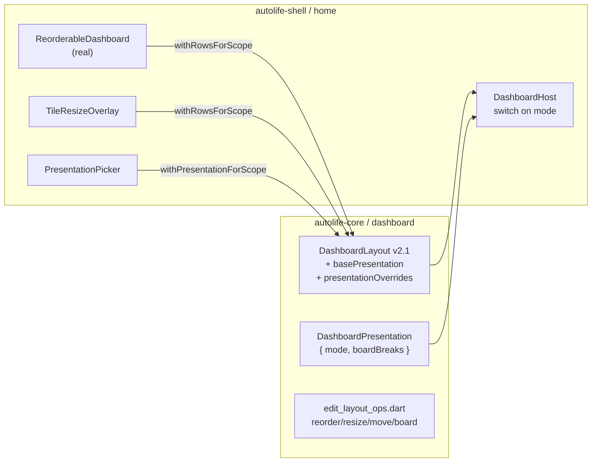

# Finish dashboard customizer: reorder, resize, presentation modes

## What is already done vs. what is missing

Already in place (works today):
- Long-press to enter edit mode, gated on `Capability.dashboardCustomizeOwn` (`_canCustomize` in [apps/autolife-shell/lib/src/screens/home/home_screen.dart](apps/autolife-shell/lib/src/screens/home/home_screen.dart)).
- Working copy + per-scope save via `DashboardLayout.withRowsForScope` in [packages/autolife-core/lib/src/dashboard/dashboard_layout.dart](packages/autolife-core/lib/src/dashboard/dashboard_layout.dart) and `_exitEditAndSave`.
- Add via `WidgetPickerSheet`, remove via X chrome in [apps/autolife-shell/lib/src/screens/home/dashboard_host.dart](apps/autolife-shell/lib/src/screens/home/dashboard_host.dart).
- Device preview, scope selector, manage overrides, presets.

Missing (what this plan delivers):
- `ReorderableDashboard` is a stub at [apps/autolife-shell/lib/src/screens/home/edit_mode/reorderable_dashboard.dart](apps/autolife-shell/lib/src/screens/home/edit_mode/reorderable_dashboard.dart) — no real reordering.
- `RowReorderHandle` defined but never referenced.
- `DashboardEditChrome.onTileResize` declared in `dashboard_host.dart` but never wired or used; no resize affordance anywhere.
- No way to choose how the dashboard handles overflow.

## Architecture additions

## Decision 1 — Scrolling model is user-chosen per scope

The user picks the overflow behavior via a new "Display mode" picker in Edit Mode. Stored per scope alongside `rowOverrides` (additive, schema v2.1, no breaking migration):

- `autoFit` (default) — current viewport-flex; if rows can't honor minimums, fall back to internal scroll plus an Edit-Mode banner "Your dashboard scrolls; resize or move widgets to fit".
- `scrollVertical` — always render as a regular vertical `SingleChildScrollView`; row heights from `heightUnits * unitPx`.
- `scrollSnap` — `PageView(scrollDirection: vertical, pageSnapping: true)`; each page is one viewport-tall slice computed from row groups.
- `boards` — `PageView(scrollDirection: horizontal)`; each board is its own auto-fit layout. New row field `boardBreaks: List<int>` (row indices where a new board starts) keeps storage flat and easy to mutate.

`DashboardHost` becomes a switch over the resolved `DashboardPresentation.mode` for the current `DashboardScope`.

## Decision 2 — Resize via drag handles + popover fallback

Primary: drag handles snapped to grid units, clamped by `DashboardWidgetSpec.minWidthUnits` / `minHeightUnits`. Popover with 1..6 chips for accessibility.

- Tile width handle: vertical bar on each tile's right edge (except last tile in row). Drag adjusts `widthUnits` on current tile and the right neighbor atomically, keeping `sum == 6`. Last-tile handle only appears when row width sum < 6 (extends until row fills).
- Row height handle: horizontal bar on each row's bottom edge; drag adjusts that row's `heightUnits` clamped to `1..6`.
- Snap visually on drag end; commit through `withRowsForScope`.

## Decision 3 — Reordering combines list-reorder + cross-row drag

- Row reorder uses `ReorderableListView` with `RowReorderHandle` as the drag grip.
- Within-row tile reorder: a horizontal `ReorderableListView.builder` keyed per row.
- Cross-row tile move: `LongPressDraggable<DashboardTile>` on the tile, `DragTarget` on every other-row tile slot, plus thin "insertion bay" drop targets between rows that create a new row at that index. Drop-on-empty-side at the row's end appends to that row.

## Files to add / change

### Core (`packages/autolife-core`)
- New [packages/autolife-core/lib/src/dashboard/dashboard_presentation.dart](packages/autolife-core/lib/src/dashboard/dashboard_presentation.dart) — `enum DashboardOverflowMode { autoFit, scrollVertical, scrollSnap, boards }` + value type `DashboardPresentation { mode, boardBreaks }` + JSON codec.
- Extend [packages/autolife-core/lib/src/dashboard/dashboard_layout.dart](packages/autolife-core/lib/src/dashboard/dashboard_layout.dart):
  - Add `DashboardPresentation basePresentation` (default `DashboardPresentation(mode: autoFit)`) and `Map<String, DashboardPresentation> presentationOverrides`.
  - Add `DashboardPresentation resolvePresentation(DashboardScope)` mirroring `resolveRows` lookup (`overrides[ff:adaptive] ?? overrides[ff:anyTime] ?? base`).
  - Add `withPresentationForScope({ presentation, scope, editAllScopes })`.
  - Bump `schemaVersion` to `2` still (additive fields tolerated by old readers; just keep `presentation` keys optional in JSON).

### Shell (`apps/autolife-shell`)
- Replace stub [apps/autolife-shell/lib/src/screens/home/edit_mode/reorderable_dashboard.dart](apps/autolife-shell/lib/src/screens/home/edit_mode/reorderable_dashboard.dart) with the real reorder widget (row-level `ReorderableListView` + per-row horizontal reorderable + cross-row `Draggable`/`DragTarget` insertion bays).
- New `apps/autolife-shell/lib/src/screens/home/edit_mode/tile_resize_overlay.dart` — drag bars for tile right edge and row bottom edge; emits `(rowIdx, tileIdx, newWidth)` / `(rowIdx, newHeight)` to the controller.
- Extend `DashboardEditChrome` in [apps/autolife-shell/lib/src/screens/home/dashboard_host.dart](apps/autolife-shell/lib/src/screens/home/dashboard_host.dart):
  - `onTileResizeWidth(int rowIdx, int tileIdx, int newWidth)`
  - `onRowResizeHeight(int rowIdx, int newHeight)`
  - `onRowReorder(int oldIdx, int newIdx)`
  - `onTileReorderInRow(int rowIdx, int oldTileIdx, int newTileIdx)`
  - `onTileMoveCrossRow(int fromRow, int fromTile, int toRow, int toTile)`
  - `onInsertNewRowAt(int rowIdx, DashboardTile tile)`
- Switch `DashboardHost.build` to render based on `resolvedPresentation.mode`:
  - `autoFit` → current logic; emit a "dashboard scrolls" event to controller when falling back so the Edit-Mode banner shows.
  - `scrollVertical` → `SingleChildScrollView` with fixed unit height (e.g. `kDashboardUnitHeight = 96`).
  - `scrollSnap` → vertical `PageView` paged by accumulated `heightUnits` chunks.
  - `boards` → horizontal `PageView`; each page is a `DashboardHost` rendering rows between consecutive `boardBreaks`.
- New `apps/autolife-shell/lib/src/screens/home/edit_mode/presentation_picker.dart` — radio list of the four modes; reachable from the existing PopupMenu in `home_screen.dart` next to "Apply preset…".
- New `apps/autolife-shell/lib/src/screens/home/edit_mode/boards_scope_controls.dart` — shown only when `mode == boards`: "Add board after this", "Remove board", board index dot indicator.
- Extend [apps/autolife-shell/lib/src/screens/home/edit_mode/edit_layout_ops.dart](apps/autolife-shell/lib/src/screens/home/edit_mode/edit_layout_ops.dart) with:
  - `reorderRow(doc, scope, oldIdx, newIdx, editAllScopes)`
  - `reorderTileInRow(doc, scope, rowIdx, oldTile, newTile, editAllScopes)`
  - `moveTileCrossRow(doc, scope, fromRow, fromTile, toRow, toTile, editAllScopes)`
  - `insertNewRowWithTile(doc, scope, atIdx, tile, editAllScopes)`
  - `resizeTileWidth(doc, scope, rowIdx, tileIdx, newWidth, editAllScopes)` — keeps `sum(widthUnits) == 6` by stealing from / giving to right neighbor; clamps by spec's `minWidthUnits`.
  - `resizeRowHeight(doc, scope, rowIdx, newHeight, editAllScopes)` — clamp 1..6 + spec `minHeightUnits`.
  - `setBoardBreaks(doc, scope, breaks, editAllScopes)` plus `addBoardAfter(rowIdx)` / `removeBoardContaining(rowIdx)`.
- Update [apps/autolife-shell/lib/src/screens/home/home_screen.dart](apps/autolife-shell/lib/src/screens/home/home_screen.dart):
  - Replace inline `_onTileDelete` style with one `_applyOp(...)` that all the new chrome callbacks delegate through to the helpers, then `withRowsForScope(...)` (or `withPresentationForScope`).
  - PopupMenu entry "Display mode…" → `showPresentationPicker`.
  - When `mode == boards`, render `BoardsScopeControls` in the existing scope-selector column.

## Acceptance criteria (additions on top of plan 3.1.5)

- Long-press → edit; drag a row by its `RowReorderHandle` to a new position; release; preview reflows; Done persists and re-resolve after invalidate shows the new order.
- Drag a tile by long-press onto a different row's slot; tiles swap; widthUnits preserved subject to row sum == 6 (steal from neighbor if needed, never overflow).
- Drag a tile onto the bay between two rows; a new row is created at that index containing only that tile (full width = 6 units).
- Drag the right edge of a tile; width snaps to nearest unit during drag; neighbor shrinks/grows atomically; cannot push below either tile's `minWidthUnits`.
- Drag the bottom of a row; row height snaps to nearest unit 1..6; cannot push below any tile-spec `minHeightUnits`.
- All five reorder/move/resize ops persist through `withRowsForScope`, respect All-scopes vs This-scope-only just like delete already does.
- Switching Display mode to `scrollVertical` makes Home a regular scroll list with constant unit height; to `boards` produces an `iOS-style` horizontal pager with a page indicator; to `scrollSnap` snaps vertically.
- Each Display-mode change is saved per-scope via `withPresentationForScope` and survives reload.
- When `autoFit` cannot fit (would shrink rows below `kDashboardMinTileHeight` or row `minHeightPx`), the edit-mode banner "Dashboard scrolls; resize or move widgets to fit" appears; view mode silently falls back to scroll.
- v2 JSON without `presentation` keys still loads (default `autoFit`, empty `boardBreaks`); v2 JSON written with presentation round-trips.
- Unit tests for every helper in `edit_layout_ops.dart` (width steal/clamp, height clamp, row reorder bounds, cross-row move with widthUnits invariant, board break insertion/removal).
- Widget golden: edit chrome with resize handles + reorder grips; one golden for each presentation mode (`autoFit`, `scrollVertical`, `scrollSnap`, `boards` with 2 boards).
- Integration: reorder rows on device A stub → device B sees the new order via existing realtime path.

## Risks + mitigations

- **Cross-row drag width invariant.** When a tile moves into a row whose `sum + tile.widthUnits > 6`, shrink the moved tile to the largest fitting width respecting its `minWidthUnits`; if even that fails, reject the drop with a haptic + snackbar. Encapsulate this in `moveTileCrossRow` so UI just calls and gets a new doc or null.
- **Drag conflicts with scroll in `scrollVertical` / `scrollSnap` modes.** Use `LongPressDraggable` (250 ms) so casual swipes still scroll; reorder grip uses an explicit handle that's always draggable.
- **Boards on phone with too many boards.** Cap board count to 5 in mobile form-factor; show "Max 5 boards on phone" in `BoardsScopeControls`.
- **Last-tile width handle ambiguity.** Only render when `sum(otherWidths) < 6`; otherwise fall back to popover for that tile.
- **Schema additive risk.** Round-trip test covers (v2 no presentation) → (read, write, read) === input.

## Out of scope (defer)

- Free-canvas (x/y) positioning; non-integer width units.
- Multi-row spans (`spanRows` already exists on `DashboardTile` but stays as today: the host treats it as 1).
- Per-board names / icons (boards are anonymous, just numbered).
- Auto-balance widths after delete (today's `removeDashboardTileAt` drops an empty row but doesn't redistribute widthUnits in the remaining row; out-of-scope here unless trivial — flag for a follow-up).
