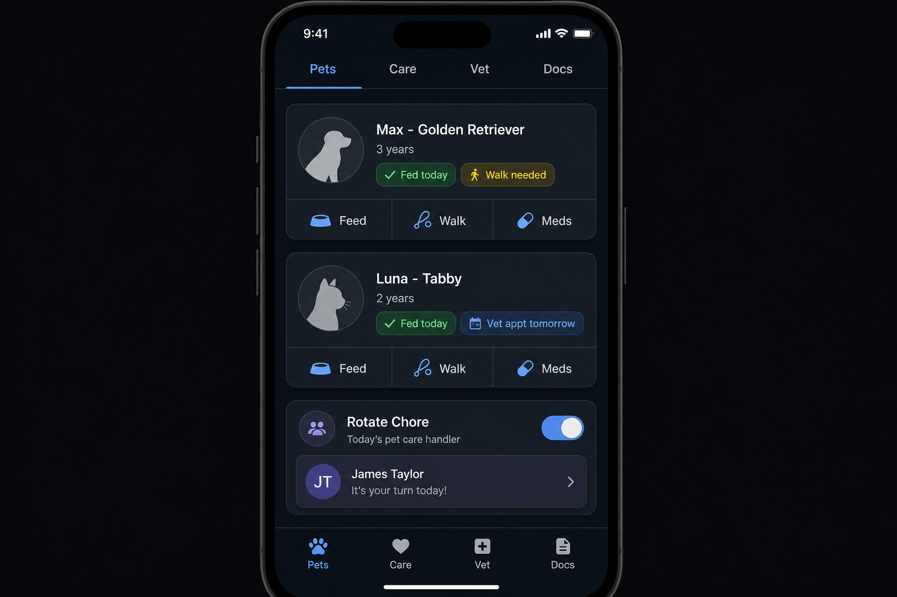

# Phase 3.10 - auto-pets (Pet Management)

## Objective
Deliver `auto-pets` as the family's shared pet operations app. Each pet has a profile (photo, breed, age, status badges), a feeding/medication schedule with check-off, vet appointment history and upcoming visits, vaccination records, and a documents tab for certificates and insurance. Daily care chores (feed, walk, meds) rotate across family members via a "Rotate Chore" toggle that emits tasks into `auto-tasks` so no one double-feeds the dog.

## UI reference

### Tabs and key surfaces (verbatim from overarching plan 3.10)
- **Top tabs (bottom nav)**: Pets, Care, Vet, Docs
- **Pets tab**: Pet profile cards with photo/icon, name, breed, age, status badges (Fed today, Walk needed, Vet appt)
- **Quick actions per pet**: Feed, Walk, Meds buttons
- **Rotate Chore**: Toggle showing today's responsible family member
- **Care tab**: Feeding/medication schedule with check-off
- **Vet tab**: Appointment history and upcoming; vaccination records
- **Docs tab**: Certificates, insurance, rabies docs

## In scope
- Pets tab with profile cards, status badges, and quick actions (Feed / Walk / Meds).
- Rotate Chore toggle that selects today's responsible family member and emits a corresponding task into `auto-tasks`.
- Care tab schedule with check-off per care item, idempotent so a second tap by a different member is rejected.
- Vet tab: upcoming and historical appointments, vaccination records with expiry alerts.
- Docs tab: pet-scoped document vault (certificates, insurance, rabies).
- Status engine: derives "Fed today", "Walk needed", "Vet appt" badges from logged actions and upcoming appointments.
- Cross-app: vet appointments mirror to `auto-calendar`, refills propose tasks in `auto-tasks`, photos link via `auto-gallery`.

## Out of scope
- Pet-specific health metrics akin to `auto-health` (weight trend stays, but no AI symptom inference for pets).
- Live GPS tracking of pets via wearables.
- Veterinary tele-consultation booking.
- Marketplace integrations (food delivery, pet pharmacies).

## Key deliverables
- `apps/auto-pets/lib/src/app.dart`.
- `apps/auto-pets/lib/src/screens/pets/pets_screen.dart`, `widgets/pet_card.dart`, `widgets/status_badge.dart`, `widgets/rotate_chore_toggle.dart`.
- `apps/auto-pets/lib/src/screens/care/care_screen.dart`, `widgets/care_check_row.dart`.
- `apps/auto-pets/lib/src/screens/vet/vet_screen.dart`, `widgets/appointment_card.dart`, `widgets/vaccination_row.dart`.
- `apps/auto-pets/lib/src/screens/docs/docs_screen.dart`.
- `apps/auto-pets/lib/src/services/{rotation_service,status_engine,pet_event_bridge}.dart`.
- `packages/autolife-core/lib/src/models/pets/{pet,care_event,vet_appointment,vaccination,pet_document}.dart`.
- `packages/autolife-core/lib/src/events/pet_events.dart` (`pet.care_logged`, `pet.chore_rotated`, `vet.appointment_due`, `vaccination.expiring`).
- `supabase/migrations/20260815_auto_pets_tables.sql`.
- `supabase/migrations/20260815_auto_pets_rls.sql` (family-scoped).
- `supabase/functions/pet-rotation-cron/index.ts` (daily; emits chore tasks and refreshes assignees).

## Dependencies
- Phase 1.2 contracts: `.cursor/plans/phase1.2_autolife_core_contracts.plan.md`.
- Phase 1.3 design system: `.cursor/plans/phase1.3_autolife_ui_design_system.plan.md`.
- Phase 1.4 Supabase baseline: `.cursor/plans/phase1.4_supabase_baseline.plan.md`.
- Phase 1.5 event bus: `.cursor/plans/phase1.5_event_bus_process_event_worker.plan.md`.
- Phase 1.6 offline foundation: `.cursor/plans/phase1.6_offline_sync_foundation.plan.md`.
- Phase 2.2 tenancy: `.cursor/plans/phase2.2_family_tenancy_model.plan.md`.
- Phase 2.3 roles: `.cursor/plans/phase2.3_role_policy_model.plan.md`.
- Phase 2.4 RLS: `.cursor/plans/phase2.4_rls_policies.plan.md`.
- Phase 3.2 `auto-calendar`: `.cursor/plans/phase3.2_auto_calendar.plan.md` (vet appointments).
- Phase 3.3 `auto-tasks`: `.cursor/plans/phase3.3_auto_tasks.plan.md` (rotational chores).
- Phase 3.8 `auto-gallery`: `.cursor/plans/phase3.8_auto_gallery.plan.md` (pet photo links).

## Acceptance criteria (gate)
- [ ] Tapping "Feed" on a pet logs a `pet.care_logged` event, updates the "Fed today" badge, and is idempotent for repeated taps within a configurable cooldown.
- [ ] Two family members tapping "Feed" on the same pet within the cooldown produce exactly one care row; the second tap shows a "Already fed by X" toast.
- [ ] Rotate Chore toggle picks today's responsible member fairly across the configured rotation set and emits a task into `auto-tasks` assigned to that member. (event-bus integration test)
- [ ] Vet appointment creation mirrors to `auto-calendar` with the correct color and the linked pet name.
- [ ] Vaccination expiring within the configured window emits `vaccination.expiring` and surfaces a banner on the Vet tab.
- [ ] Docs tab uploads land in a family-scoped Storage path with phase 2.4 RLS enforced.
- [ ] All pet tables pass the phase 2.4 RLS test harness for owner / partner / child roles.
- [ ] Daily rotation cron runs idempotently: re-running it on the same day does not duplicate tasks.

## Risks + mitigations
- **Risk**: Double-feeding because two members tap "Feed" simultaneously offline. **Mitigation**: the phase 1.6 write queue serializes the writes, the server enforces a unique constraint on `(pet_id, care_type, day_bucket)` for the cooldown window, and the UI surfaces a clear "already done" state on reconcile.
- **Risk**: Rotation feels unfair because the algorithm picks the same person too often. **Mitigation**: rotation_service uses a stable round-robin over the configured pool with skip-on-vacation respecting the phase 2.2 availability flag, plus a manual override that re-seeds the rotation.
- **Risk**: Vaccination data is stored in a way that fails RLS when a guest babysitter views the pet card. **Mitigation**: explicit `visibility` flag on vaccination rows defaulting to "family only"; guest links from phase 2.5 only see name + status, never medical fields.

## Implementation outline
1. Scaffold `apps/auto-pets` with the four-tab bottom nav.
2. Apply migrations for `pets`, `care_events`, `vet_appointments`, `vaccinations`, `pet_documents`, with phase 2.4 RLS templates.
3. Implement `packages/autolife-core` DTOs and events under `models/pets/` and `events/pet_events.dart`.
4. Build the Pets tab cards, quick actions, and status engine that derives badges from recent care events.
5. Build the Care tab schedule view and check-off flow on the phase 1.6 offline queue with idempotency keys.
6. Build the Vet tab and wire vet appointments to mirror into `auto-calendar`.
7. Build the Docs tab on a family-scoped Storage path.
8. Implement `rotation_service` and the `pet-rotation-cron` Edge Function to emit daily chore tasks into `auto-tasks`.
9. Wire vaccination expiry reminders and the `vaccination.expiring` event into the shell upcoming strip.
10. Link `auto-gallery` media items to pets via the `media_link` join with a clear UX in the pet detail.
11. Add integration tests covering double-feed prevention, rotation fairness, and the calendar mirror.
12. Run the phase 2.4 RLS harness against all new tables.

## Artifacts/links
- PR: (link once opened)
- Rotation algorithm notes: `packages/autolife-core/lib/src/pets/rotation.md`
- Cron docs: `supabase/functions/pet-rotation-cron/README.md`
- RLS harness output: `supabase/tests/rls/auto_pets.test.sql`
