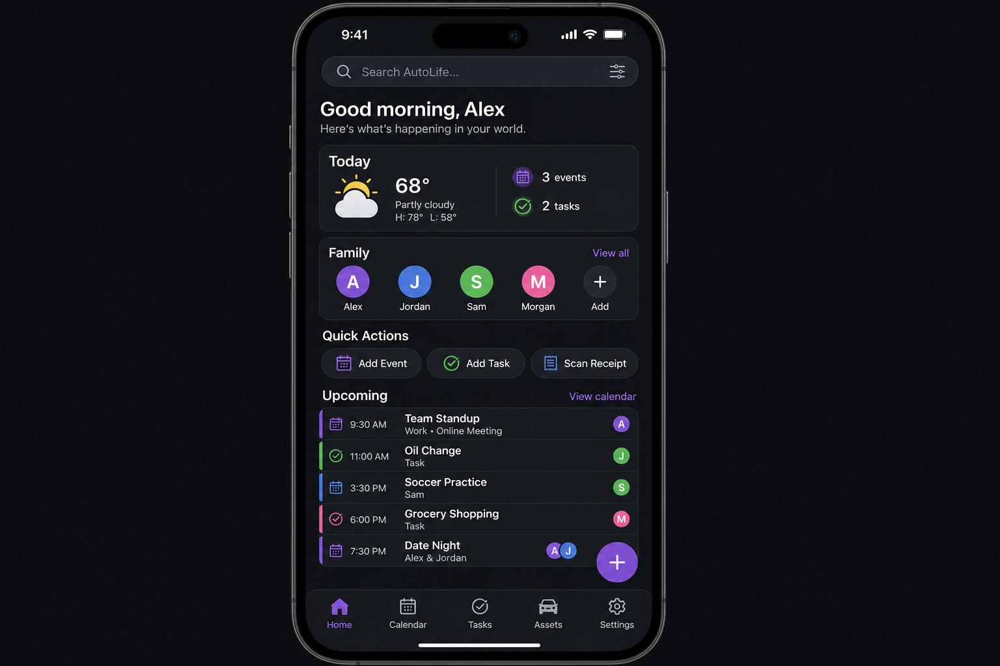

# Phase 3.1 - AutoLife Shell (Dashboard)

## Objective
Deliver the production Flutter shell that hosts the five-tab navigation, the universal omnibar, the family-aware Today summary, quick actions, and the adaptive Upcoming strip. The shell does not own any module data; it composes data from `auto-calendar`, `auto-tasks`, and `auto-assets` through shared providers backed by the offline cache and the event bus so the dashboard is correct online, offline, and across realtime updates. The home body below the omnibar is rendered by a `DashboardHost` that reads a `DashboardLayout` resolved through a `DashboardWidgetRegistry`, starting from a hardcoded `kDefaultDashboardLayout` that reproduces the screenshot order until user customization lands in `phase3.1.5_dashboard_customization.plan.md`.

## UI reference
### 3.1 `autolife-shell` -- Home Dashboard

- **Bottom nav**: Home (active), Calendar, Tasks, Assets, Settings
- **Home screen (top to bottom)**:
  - Omnibar / universal search
  - Greeting + "Today" summary card (weather, event count, task count)
  - Family summary (colored avatars, tap to see member's day)
  - Quick Actions row: Add Event, Add Task, Scan Receipt
  - Upcoming strip (merged events + tasks, color-coded per member)
- **Floating action button**: context-aware "+" (create event/task/asset depending on active tab)
- **Adaptive**: Morning layout emphasizes weather + schedule; evening layout emphasizes tomorrow prep + chores

## In scope
- Flutter app scaffold at `apps/autolife-shell/` with router, theme wiring to `packages/autolife-ui`, and providers.
- Bottom navigation with Home / Calendar / Tasks / Assets / Settings tabs and persistent state per tab.
- Home dashboard widgets: omnibar, Today summary card, family avatar strip, quick actions row, upcoming strip, activity feed.
- **Widget host foundation**: `DashboardWidgetSpec` contract in `packages/autolife-core/lib/src/dashboard/` (stable `widgetId`, title, supported `DashboardSize`s, builder taking `(BuildContext, DashboardSlot)`).
- `DashboardLayout` model + JSON codec listing placed widgets with size and slot metadata.
- `DashboardWidgetRegistry` (Riverpod-scoped), populated at app start via each module's `registerDashboardWidgets()` hook so new widgets register without shell edits beyond invoking that hook.
- `DashboardHost` laying widgets on a responsive grid (2 columns phone / 4 columns tablet) with `S=1x1`, `M=2x1`, `L=2x2`, `XL=full-row`.
- Refactor each home widget (`today_summary_card`, `family_avatar_strip`, `quick_actions_row`, `upcoming_strip`, `activity_feed_widget`, plus omnibar if modeled as a dashboard tile) to expose a `DashboardWidgetSpec` and register at startup.
- Hardcoded `kDefaultDashboardLayout` reproducing the UI reference ordering before persisted layouts exist.
- Context-aware floating action button that delegates create flows to the currently active module.
- Adaptive morning/evening layout selector keyed off an injectable clock provider.
- Aggregation providers that read from `auto-calendar`, `auto-tasks`, and `auto-assets` via repository interfaces defined in `packages/autolife-core`.
- Omnibar search service that fans into cached calendar, tasks, and assets via local FTS and degrades to Supabase remote search.
- Auth + family-tenancy gating that redirects to the Phase 2 auth flow when no session is present and to the family-onboarding flow when the user has no active family.
- Activity feed consuming `process-event` outputs over Supabase realtime.
- Offline-first reads through the `autolife-core` sync cache.

## Out of scope
- The module UIs themselves (delivered by [phase3.2_auto_calendar.plan.md](phase3.2_auto_calendar.plan.md), [phase3.3_auto_tasks.plan.md](phase3.3_auto_tasks.plan.md), [phase3.4_auto_assets.plan.md](phase3.4_auto_assets.plan.md)).
- Control Center / Settings UI (lives in `phase3.13_control_center_settings.plan.md`); the shell only reads settings.
- Voice routing, briefings, and PDF export (`phase3.14_qol_features.plan.md`).
- Push transport, retry, and DLQ (owned by `phase1.5_event_bus_process_event_worker.plan.md`).
- User-facing dashboard edit mode, widget picker, drag reorder / resize UX, layout persistence to Supabase + Drift, presets, and per-member layouts (owned by [phase3.1.5_dashboard_customization.plan.md](phase3.1.5_dashboard_customization.plan.md)).

## Key deliverables
- [`apps/autolife-shell/lib/main.dart`](../../apps/autolife-shell/lib/main.dart)
- [`apps/autolife-shell/lib/src/app.dart`](../../apps/autolife-shell/lib/src/app.dart)
- [`apps/autolife-shell/lib/src/router/app_router.dart`](../../apps/autolife-shell/lib/src/router/app_router.dart)
- [`apps/autolife-shell/lib/src/screens/home/home_screen.dart`](../../apps/autolife-shell/lib/src/screens/home/home_screen.dart)
- [`apps/autolife-shell/lib/src/screens/home/dashboard_host.dart`](../../apps/autolife-shell/lib/src/screens/home/dashboard_host.dart)
- [`apps/autolife-shell/lib/src/screens/home/default_layout.dart`](../../apps/autolife-shell/lib/src/screens/home/default_layout.dart)
- [`apps/autolife-shell/lib/src/screens/home/widgets/omnibar.dart`](../../apps/autolife-shell/lib/src/screens/home/widgets/omnibar.dart)
- [`apps/autolife-shell/lib/src/screens/home/widgets/today_summary_card.dart`](../../apps/autolife-shell/lib/src/screens/home/widgets/today_summary_card.dart)
- [`apps/autolife-shell/lib/src/screens/home/widgets/family_avatar_strip.dart`](../../apps/autolife-shell/lib/src/screens/home/widgets/family_avatar_strip.dart)
- [`apps/autolife-shell/lib/src/screens/home/widgets/quick_actions_row.dart`](../../apps/autolife-shell/lib/src/screens/home/widgets/quick_actions_row.dart)
- [`apps/autolife-shell/lib/src/screens/home/widgets/upcoming_strip.dart`](../../apps/autolife-shell/lib/src/screens/home/widgets/upcoming_strip.dart)
- [`apps/autolife-shell/lib/src/screens/home/widgets/activity_feed_widget.dart`](../../apps/autolife-shell/lib/src/screens/home/widgets/activity_feed_widget.dart)
- [`apps/autolife-shell/lib/src/screens/home/adaptive_layout_resolver.dart`](../../apps/autolife-shell/lib/src/screens/home/adaptive_layout_resolver.dart)
- [`apps/autolife-shell/lib/src/screens/home/context_aware_fab.dart`](../../apps/autolife-shell/lib/src/screens/home/context_aware_fab.dart)
- [`apps/autolife-shell/lib/src/providers/dashboard_aggregator_provider.dart`](../../apps/autolife-shell/lib/src/providers/dashboard_aggregator_provider.dart)
- [`apps/autolife-shell/lib/src/providers/family_selection_provider.dart`](../../apps/autolife-shell/lib/src/providers/family_selection_provider.dart)
- [`apps/autolife-shell/lib/src/providers/time_of_day_provider.dart`](../../apps/autolife-shell/lib/src/providers/time_of_day_provider.dart)
- [`apps/autolife-shell/lib/src/services/omnibar_search_service.dart`](../../apps/autolife-shell/lib/src/services/omnibar_search_service.dart)
- [`packages/autolife-core/lib/src/dashboard/dashboard_query.dart`](../../packages/autolife-core/lib/src/dashboard/dashboard_query.dart)
- [`packages/autolife-core/lib/src/dashboard/omnibar_search_result.dart`](../../packages/autolife-core/lib/src/dashboard/omnibar_search_result.dart)
- [`packages/autolife-core/lib/src/dashboard/dashboard_widget_spec.dart`](../../packages/autolife-core/lib/src/dashboard/dashboard_widget_spec.dart)
- [`packages/autolife-core/lib/src/dashboard/dashboard_size.dart`](../../packages/autolife-core/lib/src/dashboard/dashboard_size.dart)
- [`packages/autolife-core/lib/src/dashboard/dashboard_layout.dart`](../../packages/autolife-core/lib/src/dashboard/dashboard_layout.dart)
- [`packages/autolife-core/lib/src/dashboard/dashboard_widget_registry.dart`](../../packages/autolife-core/lib/src/dashboard/dashboard_widget_registry.dart)
- [`packages/autolife-core/lib/autolife_core.dart`](../../packages/autolife-core/lib/autolife_core.dart) — barrel exports for the dashboard registry/types above.
- [`supabase/migrations/<timestamp>_dashboard_today_view.sql`](../../supabase/migrations) - SQL view aggregating events + tasks + warranties for the active family
- [`apps/autolife-shell/test/dashboard_aggregator_test.dart`](../../apps/autolife-shell/test/dashboard_aggregator_test.dart)
- [`apps/autolife-shell/integration_test/event_bus_round_trip_test.dart`](../../apps/autolife-shell/integration_test/event_bus_round_trip_test.dart)

## Dependencies
- [phase1.2_autolife_core_contracts.plan.md](phase1.2_autolife_core_contracts.plan.md) - event envelopes and shared models the shell never redefines.
- [phase1.3_autolife_ui_design_system.plan.md](phase1.3_autolife_ui_design_system.plan.md) - theme, tokens, and shared widgets used by every screen.
- [phase1.4_supabase_baseline.plan.md](phase1.4_supabase_baseline.plan.md) - auth session, storage, and edge functions baseline.
- [phase1.5_event_bus_process_event_worker.plan.md](phase1.5_event_bus_process_event_worker.plan.md) - the bus the activity feed subscribes to and quick actions publish to.
- [phase1.6_offline_sync_foundation.plan.md](phase1.6_offline_sync_foundation.plan.md) - the local cache and write queue the dashboard reads.
- [phase1.7_integration_gateway_scaffold.plan.md](phase1.7_integration_gateway_scaffold.plan.md) - weather connector for the Today summary card.
- [phase2.2_family_tenancy_model.plan.md](phase2.2_family_tenancy_model.plan.md) - the active family the dashboard scopes every query to.
- [phase2.3_role_policy_model.plan.md](phase2.3_role_policy_model.plan.md) - role gating for quick actions and family selector.
- [phase2.4_rls_policies.plan.md](phase2.4_rls_policies.plan.md) - RLS templates the shell relies on for cross-module reads.
- [phase2.5_privacy_controls.plan.md](phase2.5_privacy_controls.plan.md) - biometric gates the shell respects before opening sensitive modules.
- [phase3.2_auto_calendar.plan.md](phase3.2_auto_calendar.plan.md) - event repository the dashboard aggregates.
- [phase3.3_auto_tasks.plan.md](phase3.3_auto_tasks.plan.md) - task repository the dashboard aggregates.
- [phase3.4_auto_assets.plan.md](phase3.4_auto_assets.plan.md) - asset/warranty signals the dashboard surfaces.
- [phase3.1.5_dashboard_customization.plan.md](phase3.1.5_dashboard_customization.plan.md) - edit-mode customization layered after this foundation ships.

Reference only; do not redefine event schema, tenancy, RLS templates, offline queue, design tokens, or integration interfaces here.

## Acceptance criteria (gate)
- [ ] Home renders by composing registered dashboard widgets through `DashboardHost`; `home_screen.dart` must not hardcode a bespoke `Column` of widget classes beyond omnibar/shell chrome — body tiles flow from `DashboardLayout` + registry.
- [ ] Every registered widget declares a stable `widgetId` and the supported `DashboardSize` set; if layout requests an unsupported size, the host falls back to the widget's smallest declared size.
- [ ] Adding a new module-provided widget requires only `registry.register(spec)` inside that module's `registerDashboardWidgets()`; `autolife-shell` changes are limited to invoking the module registration hook at startup (no per-widget imports).
- [ ] Bottom navigation switches between Home, Calendar, Tasks, Assets, and Settings via `GoRouter` with deep-link support and preserved per-tab scroll state.
- [ ] Today summary card renders event count, task count, and weather for the active family within 500 ms on warm cache.
- [ ] Family avatar strip filters the dashboard by tapped member, persists selection across cold starts, and respects role visibility from `phase2.3`.
- [ ] Omnibar returns ranked cross-module results (events, tasks, assets) under 300 ms on cached data and degrades gracefully to remote search when offline cache misses.
- [ ] Upcoming strip merges events and tasks color-coded per member and refreshes within 5 s of a `process-event` realtime update.
- [ ] Quick action / FAB emits `event.created`, `task.created`, or `asset.created` envelopes onto the event bus that are consumed by the relevant module (cross-module event emission/consumption verified by integration test).
- [ ] Adaptive layout switches between morning (06:00-11:59) and evening (18:00-23:59) presets via an injectable clock provider with unit-tested boundary cases.
- [ ] Shell renders the full home dashboard with the network disabled, reading entirely from the `autolife-core` offline cache.
- [ ] Widget golden tests cover Today card, upcoming strip, omnibar, and family selector in both morning and evening layouts.
- [ ] Activity feed displays a new entry within 5 s of a `process-event` write under the integration test harness.

## Risks + mitigations
1. Cross-module aggregation drifts into tight coupling. Mitigation: ship a single `DashboardQuery` contract in `autolife-core` and forbid the shell from importing any module-internal types; enforce with an import-lint rule.
2. Registry / module decoupling drift (shell importing calendar/tasks/asset internals). Mitigation: widgets cross the boundary only via `DashboardWidgetSpec` exported from `autolife-core`; modules register builders without leaking private models into `autolife-shell`.
3. Adaptive morning/evening logic feels flaky around midnight and DST. Mitigation: drive presets from one injectable `Clock` provider, write unit tests for every hour boundary, and expose a manual override in the developer menu.
4. Omnibar fan-out latency on large datasets. Mitigation: back the local cache with sqlite FTS, debounce input to 150 ms, cap remote search to 25 results per source, and short-circuit when the user is typing fewer than two characters.

## Implementation outline
1. Add `supabase/migrations/<timestamp>_dashboard_today_view.sql` exposing a family-scoped SQL view that joins events, tasks, and warranty signals, protected by the RLS templates from `phase2.4`.
2. Define `DashboardQuery`, `DashboardSummary`, and `OmnibarSearchResult` in `packages/autolife-core/lib/src/dashboard/` and export them from the package barrel.
3. Wire `dashboard_aggregator_provider.dart` and `omnibar_search_service.dart` against the `autolife-core` offline cache (from `phase1.6`) and Supabase realtime channels.
4. Build the shell scaffold (`app.dart`, `app_router.dart`) with the five tabs, a context-aware FAB, and deep-link routes that allow Calendar/Tasks/Assets to push back into Home with filters preserved.
5. Define `DashboardWidgetSpec`, `DashboardSize`, `DashboardLayout`, and `DashboardWidgetRegistry` in `packages/autolife-core/lib/src/dashboard/`, export via `autolife_core.dart`, and wire module `registerDashboardWidgets()` hooks during bootstrap.
6. Implement `default_layout.dart` with `kDefaultDashboardLayout` mirroring the screenshot, then build `dashboard_host.dart` to lay out registry widgets on the responsive grid.
7. Implement the home widgets: `omnibar`, `today_summary_card`, `family_avatar_strip`, `quick_actions_row`, `upcoming_strip`, and `activity_feed_widget` using the `autolife-ui` design system, each registering a `DashboardWidgetSpec`.
8. Wire the adaptive layout through `time_of_day_provider` and `adaptive_layout_resolver`, including a developer override.
9. Wire quick actions and the FAB to emit `event.created`, `task.created`, and `asset.created` envelopes onto the event bus from `phase1.5` and confirm `process-event` consumes them in the integration test.
10. Add an auth + family gate at the router level that redirects to the `phase2.1` auth flow or the `phase2.2` family onboarding when needed.
11. Add widget golden tests for each home component in both morning and evening layouts plus unit tests for the aggregator and registry resolution edge cases (unsupported sizes).
12. Add the `event_bus_round_trip_test.dart` integration test that boots the shell with module repository stubs, triggers a quick action, and asserts the consuming module receives the bus envelope.
13. Run an offline smoke test (network disabled) and capture screenshots in the artifact bundle to prove cache-only rendering works.

## Artifacts/links
- [PR placeholder]
- [Design tokens reference]
- [Event envelope reference]
- [Offline smoke test recording]
