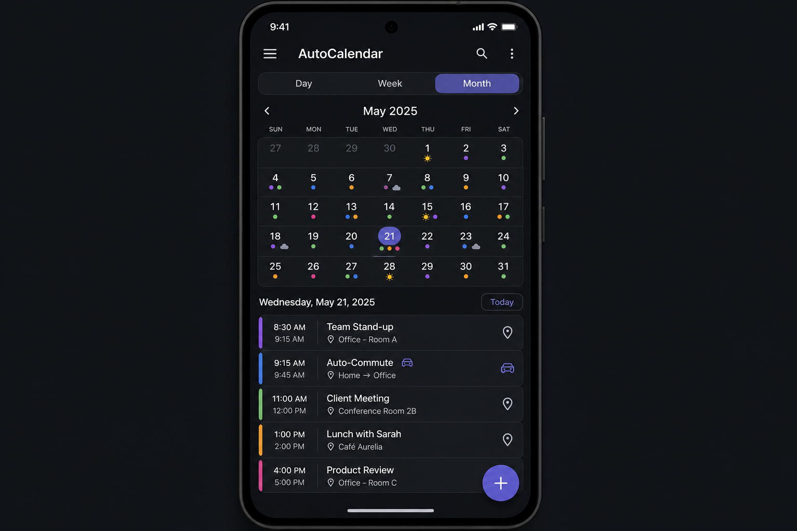
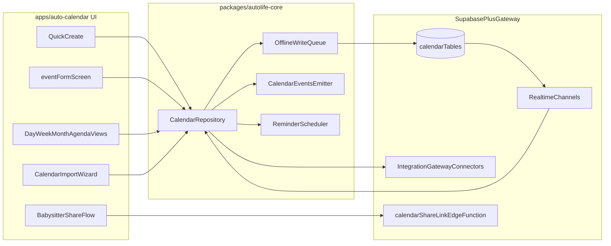

# Phase 3.2 - Auto-Calendar (Smart Calendar)

## Objective
Build the AutoLife smart calendar that families can rely on daily: fast event capture, Day/Week/Month/Agenda views, advanced recurrence (including exceptions), notes, member tagging, cross-platform reminders (mobile/tablet/desktop/web-capable surfaces), weather overlays, auto-commute travel blocks computed via the integration gateway, and calendar import (`.ics` + provider imports). The app continues to participate in the cross-module event bus by accepting `event.convert_to_task` from `auto-tasks` and emitting `event.created`, `event.updated`, and `event.deleted` envelopes that other modules consume.

## UI reference
### 3.2 `auto-calendar` -- Smart Calendar

- **Top**: Segmented control -- Day / Week / Month (+ Agenda secondary view)
- **Month view**: Calendar grid with colored dots per family member, `+N more` overflow for dense days, weather icons on days, red dot for flagged forecast changes
- **Day event list**: Time, title, location, tagged member chips, colored left border per member
- **Special elements**: Auto-commute blocks shown as gray "travel" entries with car icon; weather overlays on day headers
- **Actions**: Floating "+" for Quick Create, long-press to convert event to task, share babysitter read-only link from event detail, import calendars from file/provider settings sheet

## Architecture

## Interaction + UX contracts
- Quick Create is the default add path: title + time + member/tag + save, with advanced fields behind progressive disclosure.
- Event editing supports "this occurrence", "this and following", and "all events in series" for recurring series.
- Conflict awareness appears before save and offers at least 2 actionable alternative time suggestions.
- Dense month cells never jitter; overflow is handled through stable `+N more` affordance.
- Share links always include recipient preview, clear scope summary, and immediate revoke action.
- Import flow always includes preview counts, dedupe outcome summary, and unsupported-field disclosure.

## In scope
- Flutter app at `apps/auto-calendar/` runnable standalone and embeddable in the shell.
- Day, Week, Month, and Agenda views with member-color borders, recurrence rendering, `+N more` overflow behavior, and timezone-correct rendering.
- Quick Create plus full event create / edit / delete flows with location, attendees, tagged family members, notes, reminders, and recurrence.
- Advanced recurrence patterns (daily/weekly/monthly/custom intervals, weekday rules, end conditions) and recurrence exception editing (`this`, `this+following`, `all`).
- Event notes as first-class content with optional snippet rendering in Day and Agenda lists.
- Family member tagging (chips/avatars) and member-based filtering in Day and Agenda views.
- Reminder notification scheduling and delivery strategy across mobile/tablet/desktop/web-capable surfaces, with dedupe policy and timezone/DST safety.
- Weather overlay on day headers and red-dot flag when a forecast change crosses a configurable threshold (e.g. precipitation > 50 percent).
- Auto-commute blocks: virtual gray entries computed from the integration gateway Maps connector and inserted around events with a location, gated by a Control Center toggle.
- Two-way sync with Google Calendar, Apple Calendar, and Outlook via the integration gateway connectors with deterministic external-id mapping and conflict policy.
- Calendar import:
  - one-time `.ics` import with preview, mapping summary, and dedupe
  - provider import onboarding with Google first, Apple/Outlook following
  - idempotent re-import based on stable source identifiers
- Long-press menu to convert an event into a task by emitting `event.convert_to_task` onto the event bus.
- Babysitter share-link generator (scope toggles + duration) with recipient preview, revoke action, and projection-backed visibility controls.
- Offline-first reads and writes through the `autolife-core` write queue with reconciliation on reconnect.
- Realtime updates over Supabase channels.
- Desktop/web keyboard shortcuts for create/edit/delete/navigation/today and minimum accessibility baseline (focus order + semantic labels).

## Out of scope
- Task UI (delivered by [phase3.3_auto_tasks.plan.md](phase3.3_auto_tasks.plan.md)).
- Settings UI for commute / weather toggles (lives in `phase3.13_control_center_settings.plan.md`; this app reads the flags only).
- Inbound email parsing to create events (`phase3.9_auto_mail.plan.md`).
- Full-screen map view; the calendar shows only a small location thumbnail.
- Enterprise resource booking workflows (meeting room policy engines beyond simple availability checks).
- Full natural-language event parsing parity with third-party dedicated calendar apps.

## Key deliverables
- [`apps/auto-calendar/lib/main.dart`](../../apps/auto-calendar/lib/main.dart)
- [`apps/auto-calendar/lib/src/calendar_module.dart`](../../apps/auto-calendar/lib/src/calendar_module.dart)
- [`apps/auto-calendar/lib/src/screens/calendar/calendar_screen.dart`](../../apps/auto-calendar/lib/src/screens/calendar/calendar_screen.dart)
- [`apps/auto-calendar/lib/src/screens/calendar/views/day_view.dart`](../../apps/auto-calendar/lib/src/screens/calendar/views/day_view.dart)
- [`apps/auto-calendar/lib/src/screens/calendar/views/week_view.dart`](../../apps/auto-calendar/lib/src/screens/calendar/views/week_view.dart)
- [`apps/auto-calendar/lib/src/screens/calendar/views/month_view.dart`](../../apps/auto-calendar/lib/src/screens/calendar/views/month_view.dart)
- [`apps/auto-calendar/lib/src/screens/calendar/views/agenda_view.dart`](../../apps/auto-calendar/lib/src/screens/calendar/views/agenda_view.dart)
- [`apps/auto-calendar/lib/src/screens/calendar/widgets/event_card.dart`](../../apps/auto-calendar/lib/src/screens/calendar/widgets/event_card.dart)
- [`apps/auto-calendar/lib/src/screens/calendar/widgets/weather_overlay.dart`](../../apps/auto-calendar/lib/src/screens/calendar/widgets/weather_overlay.dart)
- [`apps/auto-calendar/lib/src/screens/calendar/widgets/commute_block.dart`](../../apps/auto-calendar/lib/src/screens/calendar/widgets/commute_block.dart)
- [`apps/auto-calendar/lib/src/screens/calendar/widgets/conflict_bar.dart`](../../apps/auto-calendar/lib/src/screens/calendar/widgets/conflict_bar.dart)
- [`apps/auto-calendar/lib/src/screens/calendar/event_form_screen.dart`](../../apps/auto-calendar/lib/src/screens/calendar/event_form_screen.dart)
- [`apps/auto-calendar/lib/src/screens/calendar/event_detail_screen.dart`](../../apps/auto-calendar/lib/src/screens/calendar/event_detail_screen.dart)
- [`apps/auto-calendar/lib/src/screens/calendar/quick_create_sheet.dart`](../../apps/auto-calendar/lib/src/screens/calendar/quick_create_sheet.dart)
- [`apps/auto-calendar/lib/src/screens/calendar/recurrence_editor_sheet.dart`](../../apps/auto-calendar/lib/src/screens/calendar/recurrence_editor_sheet.dart)
- [`apps/auto-calendar/lib/src/screens/calendar/import/calendar_import_screen.dart`](../../apps/auto-calendar/lib/src/screens/calendar/import/calendar_import_screen.dart)
- [`apps/auto-calendar/lib/src/screens/calendar/import/calendar_import_preview_screen.dart`](../../apps/auto-calendar/lib/src/screens/calendar/import/calendar_import_preview_screen.dart)
- [`apps/auto-calendar/lib/src/screens/calendar/babysitter_link_screen.dart`](../../apps/auto-calendar/lib/src/screens/calendar/babysitter_link_screen.dart)
- [`apps/auto-calendar/lib/src/providers/calendar_providers.dart`](../../apps/auto-calendar/lib/src/providers/calendar_providers.dart)
- [`apps/auto-calendar/lib/src/providers/external_sync_provider.dart`](../../apps/auto-calendar/lib/src/providers/external_sync_provider.dart)
- [`apps/auto-calendar/lib/src/providers/reminder_notification_provider.dart`](../../apps/auto-calendar/lib/src/providers/reminder_notification_provider.dart)
- [`apps/auto-calendar/lib/src/services/commute_planner_service.dart`](../../apps/auto-calendar/lib/src/services/commute_planner_service.dart)
- [`apps/auto-calendar/lib/src/services/babysitter_link_service.dart`](../../apps/auto-calendar/lib/src/services/babysitter_link_service.dart)
- [`apps/auto-calendar/lib/src/services/external_calendar_sync_service.dart`](../../apps/auto-calendar/lib/src/services/external_calendar_sync_service.dart)
- [`apps/auto-calendar/lib/src/services/calendar_import_service.dart`](../../apps/auto-calendar/lib/src/services/calendar_import_service.dart)
- [`apps/auto-calendar/lib/src/services/reminder_notification_service.dart`](../../apps/auto-calendar/lib/src/services/reminder_notification_service.dart)
- [`packages/autolife-core/lib/src/calendar/calendar_event.dart`](../../packages/autolife-core/lib/src/calendar/calendar_event.dart)
- [`packages/autolife-core/lib/src/calendar/calendar_repository.dart`](../../packages/autolife-core/lib/src/calendar/calendar_repository.dart)
- [`packages/autolife-core/lib/src/calendar/calendar_events_emitter.dart`](../../packages/autolife-core/lib/src/calendar/calendar_events_emitter.dart)
- [`packages/autolife-core/lib/src/calendar/calendar_recurrence.dart`](../../packages/autolife-core/lib/src/calendar/calendar_recurrence.dart)
- [`packages/autolife-core/lib/src/calendar/calendar_reminder.dart`](../../packages/autolife-core/lib/src/calendar/calendar_reminder.dart)
- [`packages/autolife-core/lib/src/calendar/calendar_import_batch.dart`](../../packages/autolife-core/lib/src/calendar/calendar_import_batch.dart)
- [`supabase/migrations/<timestamp>_calendar_events.sql`](../../supabase/migrations)
- [`supabase/migrations/<timestamp>_calendar_sync_links.sql`](../../supabase/migrations)
- [`supabase/migrations/<timestamp>_babysitter_links.sql`](../../supabase/migrations)
- [`supabase/migrations/<timestamp>_calendar_import_batches.sql`](../../supabase/migrations)
- [`supabase/functions/calendar-share-link/index.ts`](../../supabase/functions/calendar-share-link/index.ts)
- [`supabase/functions/calendar-import-normalizer/index.ts`](../../supabase/functions/calendar-import-normalizer/index.ts)
- [`apps/auto-calendar/test/views/calendar_view_test.dart`](../../apps/auto-calendar/test/views/calendar_view_test.dart)
- [`apps/auto-calendar/test/services/commute_planner_service_test.dart`](../../apps/auto-calendar/test/services/commute_planner_service_test.dart)
- [`apps/auto-calendar/test/services/calendar_import_service_test.dart`](../../apps/auto-calendar/test/services/calendar_import_service_test.dart)
- [`apps/auto-calendar/test/services/reminder_notification_service_test.dart`](../../apps/auto-calendar/test/services/reminder_notification_service_test.dart)
- [`apps/auto-calendar/integration_test/external_sync_round_trip_test.dart`](../../apps/auto-calendar/integration_test/external_sync_round_trip_test.dart)
- [`apps/auto-calendar/integration_test/calendar_import_idempotency_test.dart`](../../apps/auto-calendar/integration_test/calendar_import_idempotency_test.dart)

## Dependencies
- [phase1.2_autolife_core_contracts.plan.md](phase1.2_autolife_core_contracts.plan.md) - the canonical `CalendarEvent` envelope and event bus contracts.
- [phase1.3_autolife_ui_design_system.plan.md](phase1.3_autolife_ui_design_system.plan.md) - colors, type ramp, and shared widgets used across the views.
- [phase1.4_supabase_baseline.plan.md](phase1.4_supabase_baseline.plan.md) - DB / storage / edge function baseline.
- [phase1.5_event_bus_process_event_worker.plan.md](phase1.5_event_bus_process_event_worker.plan.md) - the bus on which we emit and consume calendar envelopes.
- [phase1.6_offline_sync_foundation.plan.md](phase1.6_offline_sync_foundation.plan.md) - offline write queue and conflict rules.
- [phase1.7_integration_gateway_scaffold.plan.md](phase1.7_integration_gateway_scaffold.plan.md) - Google Maps, weather, and external calendar connectors.
- [phase2.2_family_tenancy_model.plan.md](phase2.2_family_tenancy_model.plan.md) - the active family scoping every query.
- [phase2.3_role_policy_model.plan.md](phase2.3_role_policy_model.plan.md) - approval engine for who can create or edit events.
- [phase2.4_rls_policies.plan.md](phase2.4_rls_policies.plan.md) - RLS templates for events, sync links, and babysitter links.
- [phase2.5_privacy_controls.plan.md](phase2.5_privacy_controls.plan.md) - babysitter scoping rules the share link enforces.
- [phase3.13_control_center_settings.plan.md](phase3.13_control_center_settings.plan.md) - reminder defaults, quiet hours, and commute/weather feature flags read by calendar UX.

Reference only; do not redefine event schema, tenancy, RLS templates, offline queue, design tokens, or integration interfaces here.

## Acceptance criteria (gate)
- [ ] Day, Week, Month, and Agenda views render seeded family events with correct member-color borders and timezone handling.
- [ ] Quick Create can save a valid event (title + time + member/tag) without opening advanced form fields.
- [ ] Month view handles dense days with stable row height and `+N more` overflow without layout jitter.
- [ ] Events support notes and tagged family members; notes and tags are visible in detail screens and can be filtered by tagged member in Day and Agenda views.
- [ ] Recurrence supports daily/weekly/monthly/custom patterns and edits for `this`, `this+following`, and `all`, with no exception loss after offline replay.
- [ ] Reminder notifications fire on supported mobile/tablet/desktop/web surfaces with no duplicate dispatch per reminder identifier.
- [ ] Reminder scheduling is timezone-correct and passes DST boundary tests.
- [ ] Weather overlay icons appear on day headers and a forecast change crossing the configured threshold flips the day to a red dot.
- [ ] Creating an event with a location automatically inserts a gray commute block computed via the integration gateway Maps connector (deterministic mock ETA used in tests) and removes the block when the location is cleared.
- [ ] Two-way sync with at least Google Calendar round-trips create / update / delete within 30 s and recovers idempotently after a forced reconnect.
- [ ] Calendar import supports `.ics` and at least one provider import path with preview step (counts/date range/conflicts), explicit dedupe outcomes, and idempotent re-import behavior.
- [ ] Import flow surfaces unsupported fields in a post-import summary; unsupported data is never silently dropped.
- [ ] Long-pressing an event emits `event.convert_to_task` onto the event bus and `auto-tasks` consumes it to produce a corresponding task (cross-module event emission/consumption verified by integration test).
- [ ] Creating any event emits an `event.created` envelope that the shell activity feed and `auto-tasks` cross-module consumers see.
- [ ] Babysitter share-link generator includes recipient preview, scope summary, revoke action, and token states (`active`, `expired`, `revoked`); expired/revoked tokens return 403.
- [ ] Offline create / edit / delete queues through the `autolife-core` write queue and reconciles without dropping recurrence exceptions on reconnect.
- [ ] RLS prevents non-family viewers; babysitter token reads only the scoped projection.
- [ ] Desktop/web keyboard shortcuts support create/edit/delete/today/next/previous period and pass baseline accessibility focus-order tests.
- [ ] Widget and integration tests cover view switching, commute insertion, import idempotency, recurrence exceptions, notification dedupe, external sync conflict cases, and bus round-trips.

## Reliability + telemetry gates
- [ ] Event creation funnel metrics track `quick_create_opened`, `quick_create_saved`, `full_form_opened`, `full_form_saved`.
- [ ] Import metrics track `import_started`, `import_completed`, `import_cancelled`, and duplicate/skip/error rates by source.
- [ ] Reminder metrics track schedule failures and dispatch failures with provider/surface labels.

## Risks + mitigations
1. External calendar sync produces duplicates or loses events on conflict. Mitigation: use a deterministic `external_uid` per provider, idempotent upserts keyed on it, last-write-wins guarded by `updated_at`, and a reconciler dry-run logger before any destructive write.
2. Commute computation hits Google Maps rate limits or quota. Mitigation: cache directions per `(origin, destination, arrival_hour_bucket)` for 30 minutes, batch identical lookups, and degrade to manual padding when the gateway returns 429.
3. Babysitter link leaks sensitive fields. Mitigation: the link is a server-rendered projection from `calendar-share-link` using an allowlisted column set, validated by RLS tests in the `phase2.4` harness; tokens are signed, scoped, time-bound, and revocable.
4. Recurrence exceptions are lost across sync/offline replay. Mitigation: model recurrence exception entities explicitly and add mandatory integration tests for offline edit/reconnect and provider round-trip.
5. Notification behavior diverges by device/OS. Mitigation: maintain a capability matrix by platform, expose graceful fallback to in-app alerts, and enforce dedupe keys per reminder delivery.
6. Importing legacy calendars floods users with duplicates/noise. Mitigation: preview + dry-run, source-id based idempotency, fuzzy duplicate heuristics, and one-click rollback for latest import batch.
7. Event form complexity harms capture speed. Mitigation: make Quick Create default, keep advanced fields collapsed, and persist smart defaults.

## Implementation outline
1. **Milestone A - Core UX foundations**
   - Build Day/Week/Month/Agenda skeletons plus `+N more` month overflow and stable density behavior.
   - Implement Quick Create sheet with smart defaults (last duration/reminder/member context).
   - Extend event model and UI for notes and family member tags.
2. **Milestone B - Recurrence quality**
   - Add recurrence model + editor with custom intervals, end conditions, and weekday rules.
   - Implement recurrence exception edit modes (`this`, `this+following`, `all`) with explicit storage semantics.
3. **Milestone C - Notifications and reminders**
   - Implement reminder scheduling service, dedupe keys, and platform-capability branching.
   - Integrate quiet-hours/default reminder settings from Control Center read-only flags.
4. **Milestone D - Weather, commute, and confidence UX**
   - Add weather overlay and forecast change marker.
   - Add commute planner insertion/removal with cache and 429 fallback behavior.
   - Add pre-save conflict bar and alternative slot suggestions.
5. **Milestone E - External sync and import**
   - Implement Google-first provider sync and conflict/dry-run reconciler.
   - Add `.ics` + provider import wizard with preview, mapping summary, dedupe, and idempotent re-import.
   - Add import batch history and rollback metadata.
6. **Milestone F - Sharing, bus, and hardening**
   - Implement recipient-previewable babysitter share flow with revoke support and scoped projection.
   - Wire event bus emits plus `event.convert_to_task` long-press action.
   - Complete widget/unit/integration tests for recurrence, notifications, import, sync conflicts, and bus round-trips.

## Artifacts/links
- [PR placeholder]
- [External sync conflict matrix]
- [Babysitter link projection spec]
- [Commute caching strategy doc]
- [Recurrence exception model spec]
- [Notification capability matrix by platform]
- [Calendar import mapping + dedupe policy]
