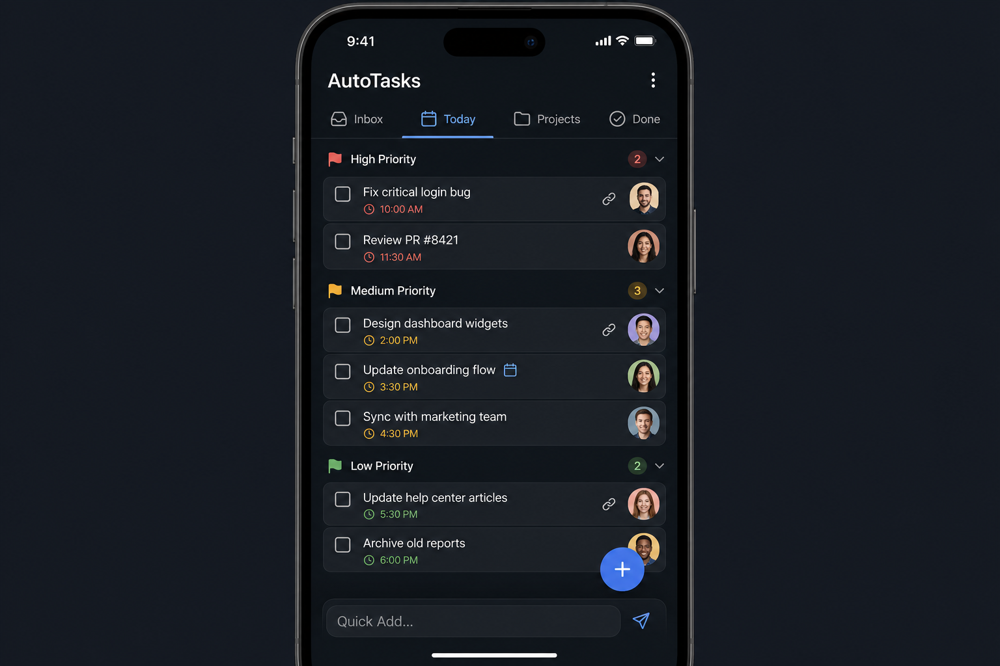

# Phase 3.3 - Auto-Tasks (Task Engine)

## Objective
Ship the AutoLife task engine that supports many named lists per family (e.g. "Family Wall", "Groceries", "Work", "House Projects", "Kid Chores"), each with the full feature set: Inbox / Today / Projects / Done tabs, dependency locking, priority grouping, assignee avatars, a quick-add bar, and per-list sharing. The app fully participates in the cross-module event bus by consuming `event.convert_to_task` from `auto-calendar` and emitting `task.promote_to_event`, `task.created`, `task.completed`, and `task.unblocked` envelopes for the shell, calendar, and assets to consume.

## UI reference
### 3.3 `auto-tasks` -- Task Engine

- **Core concept**: Multiple named task lists (e.g., "Family Wall", "Groceries", "Work", "House Projects", "Kid Chores"), each with the same full feature set
- **Left drawer / top selector**: List picker to switch between task lists; each list has its own icon, color, and sharing settings
- **Per-list view tabs**: Inbox, Today, Projects, Done (same structure in every list)
- **Task list**: Grouped by priority (High/Medium/Low), each task shows checkbox, title, due time, assignee avatar
- **Dependency indicators**: Chain icon on tasks with prerequisites; locked state until dependencies met
- **Calendar link icon**: Shows when a task was converted from an event
- **Bottom**: Quick Add bar with text input + send; floating "+"
- **Detail screen**: Checklist, sub-tasks with dependency toggles, links to calendar events and assets
- **Cross-list**: "Today" view can aggregate across all lists; each list is independently shareable with family/guests

## In scope
- Flutter app at `apps/auto-tasks/` runnable standalone and embeddable in the shell.
- Named task lists with icon, color, default assignee, and sharing scope.
- Per-list view tabs: Inbox, Today, Projects, Done.
- Task model with priority (High/Medium/Low), assignee, due-at, checklist sub-items, and links to calendar events and assets.
- Dependency engine that locks a task until prerequisites complete and unlocks dependents on completion.
- Event-to-task switching: consume `event.convert_to_task` from `auto-calendar`.
- Task-to-event switching: emit `task.promote_to_event` consumed by `auto-calendar`.
- Quick-add bar with natural-language due parsing (e.g. "buy milk tomorrow 5pm").
- Cross-list "Today" view aggregating across every visible list.
- Per-list sharing with family members and guest links per `phase2.3` role policy.
- Offline-first writes through the `autolife-core` queue with conflict resolution that preserves dependency state.

## Out of scope
- Calendar UI (delivered by [phase3.2_auto_calendar.plan.md](phase3.2_auto_calendar.plan.md)); we only emit / consume on the bus.
- Asset link UI beyond a clickable badge that opens the asset detail in `auto-assets`.
- Nag-mode notification UI and batching (lives in `phase3.13_control_center_settings.plan.md` and `phase3.14_qol_features.plan.md`).
- AI inbox auto-parsing (`phase3.9_auto_mail.plan.md`).
- Approval workflows (defined in `phase2.3`; this app respects them).

## Key deliverables
- [`apps/auto-tasks/lib/main.dart`](../../apps/auto-tasks/lib/main.dart)
- [`apps/auto-tasks/lib/src/tasks_module.dart`](../../apps/auto-tasks/lib/src/tasks_module.dart)
- [`apps/auto-tasks/lib/src/screens/tasks/task_lists_screen.dart`](../../apps/auto-tasks/lib/src/screens/tasks/task_lists_screen.dart)
- [`apps/auto-tasks/lib/src/screens/tasks/list_picker_drawer.dart`](../../apps/auto-tasks/lib/src/screens/tasks/list_picker_drawer.dart)
- [`apps/auto-tasks/lib/src/screens/tasks/tabs/inbox_tab.dart`](../../apps/auto-tasks/lib/src/screens/tasks/tabs/inbox_tab.dart)
- [`apps/auto-tasks/lib/src/screens/tasks/tabs/today_tab.dart`](../../apps/auto-tasks/lib/src/screens/tasks/tabs/today_tab.dart)
- [`apps/auto-tasks/lib/src/screens/tasks/tabs/projects_tab.dart`](../../apps/auto-tasks/lib/src/screens/tasks/tabs/projects_tab.dart)
- [`apps/auto-tasks/lib/src/screens/tasks/tabs/done_tab.dart`](../../apps/auto-tasks/lib/src/screens/tasks/tabs/done_tab.dart)
- [`apps/auto-tasks/lib/src/screens/tasks/widgets/task_row.dart`](../../apps/auto-tasks/lib/src/screens/tasks/widgets/task_row.dart)
- [`apps/auto-tasks/lib/src/screens/tasks/widgets/dependency_chip.dart`](../../apps/auto-tasks/lib/src/screens/tasks/widgets/dependency_chip.dart)
- [`apps/auto-tasks/lib/src/screens/tasks/widgets/quick_add_bar.dart`](../../apps/auto-tasks/lib/src/screens/tasks/widgets/quick_add_bar.dart)
- [`apps/auto-tasks/lib/src/screens/tasks/task_detail_screen.dart`](../../apps/auto-tasks/lib/src/screens/tasks/task_detail_screen.dart)
- [`apps/auto-tasks/lib/src/screens/tasks/today_aggregate_screen.dart`](../../apps/auto-tasks/lib/src/screens/tasks/today_aggregate_screen.dart)
- [`apps/auto-tasks/lib/src/screens/tasks/list_settings_screen.dart`](../../apps/auto-tasks/lib/src/screens/tasks/list_settings_screen.dart)
- [`apps/auto-tasks/lib/src/providers/task_providers.dart`](../../apps/auto-tasks/lib/src/providers/task_providers.dart)
- [`apps/auto-tasks/lib/src/providers/today_aggregate_provider.dart`](../../apps/auto-tasks/lib/src/providers/today_aggregate_provider.dart)
- [`apps/auto-tasks/lib/src/services/dependency_resolver.dart`](../../apps/auto-tasks/lib/src/services/dependency_resolver.dart)
- [`apps/auto-tasks/lib/src/services/event_task_bridge.dart`](../../apps/auto-tasks/lib/src/services/event_task_bridge.dart)
- [`apps/auto-tasks/lib/src/services/quick_add_parser.dart`](../../apps/auto-tasks/lib/src/services/quick_add_parser.dart)
- [`packages/autolife-core/lib/src/tasks/task.dart`](../../packages/autolife-core/lib/src/tasks/task.dart)
- [`packages/autolife-core/lib/src/tasks/task_list.dart`](../../packages/autolife-core/lib/src/tasks/task_list.dart)
- [`packages/autolife-core/lib/src/tasks/task_dependency.dart`](../../packages/autolife-core/lib/src/tasks/task_dependency.dart)
- [`packages/autolife-core/lib/src/tasks/task_repository.dart`](../../packages/autolife-core/lib/src/tasks/task_repository.dart)
- [`supabase/migrations/<timestamp>_task_lists.sql`](../../supabase/migrations)
- [`supabase/migrations/<timestamp>_tasks.sql`](../../supabase/migrations)
- [`supabase/migrations/<timestamp>_task_dependencies.sql`](../../supabase/migrations)
- [`supabase/migrations/<timestamp>_task_list_shares.sql`](../../supabase/migrations)
- [`apps/auto-tasks/test/services/dependency_resolver_test.dart`](../../apps/auto-tasks/test/services/dependency_resolver_test.dart)
- [`apps/auto-tasks/test/services/quick_add_parser_test.dart`](../../apps/auto-tasks/test/services/quick_add_parser_test.dart)
- [`apps/auto-tasks/integration_test/event_task_bridge_test.dart`](../../apps/auto-tasks/integration_test/event_task_bridge_test.dart)

## Dependencies
- [phase1.2_autolife_core_contracts.plan.md](phase1.2_autolife_core_contracts.plan.md) - canonical task and event envelopes the app reads and writes.
- [phase1.3_autolife_ui_design_system.plan.md](phase1.3_autolife_ui_design_system.plan.md) - theme + components.
- [phase1.4_supabase_baseline.plan.md](phase1.4_supabase_baseline.plan.md) - DB + storage + functions baseline.
- [phase1.5_event_bus_process_event_worker.plan.md](phase1.5_event_bus_process_event_worker.plan.md) - the bus for `event.convert_to_task`, `task.promote_to_event`, and `task.*` envelopes.
- [phase1.6_offline_sync_foundation.plan.md](phase1.6_offline_sync_foundation.plan.md) - offline cache + write queue.
- [phase1.7_integration_gateway_scaffold.plan.md](phase1.7_integration_gateway_scaffold.plan.md) - referenced for guest-link delivery channels.
- [phase2.2_family_tenancy_model.plan.md](phase2.2_family_tenancy_model.plan.md) - per-family scoping of lists and shares.
- [phase2.3_role_policy_model.plan.md](phase2.3_role_policy_model.plan.md) - role gating for list mutations and the approval engine.
- [phase2.4_rls_policies.plan.md](phase2.4_rls_policies.plan.md) - RLS templates for tasks, dependencies, and shares.
- [phase2.5_privacy_controls.plan.md](phase2.5_privacy_controls.plan.md) - applied when sharing lists to guests / babysitters.

Reference only; do not redefine event schema, tenancy, RLS templates, offline queue, design tokens, or integration interfaces here.

## Acceptance criteria (gate)
- [ ] A user can create N task lists each with icon, color, default assignee, and sharing scope.
- [ ] Inbox / Today / Projects / Done tabs render correctly per list, grouped by priority and showing checkbox, title, due time, and assignee avatar.
- [ ] Dependency engine prevents checking off a task with unmet prerequisites, shows the locked state with chain icon, and automatically unblocks dependents when prerequisites complete (emitting `task.unblocked`).
- [ ] Long-press on a task offers "Promote to event" and emits `task.promote_to_event` onto the event bus that `auto-calendar` consumes; an `event.convert_to_task` envelope from `auto-calendar` creates a corresponding task with a `source_event_id` link (cross-module event emission/consumption verified by integration test).
- [ ] Quick-add bar accepts free text, parses natural-language due dates, and creates the task within one frame of submit.
- [ ] Cross-list "Today" view aggregates tasks across every visible list ordered by due time and respects per-list visibility.
- [ ] Sharing a list grants a family member or guest read or write access per `phase2.3` role policy, enforced by `phase2.4` RLS templates.
- [ ] Offline create, edit, and check-off queues through the `autolife-core` write queue and reconciles without losing dependency state.
- [ ] Dependency resolver rejects cyclic graphs with a typed error and renders an actionable message in the UI.
- [ ] Widget + unit tests cover the dependency resolver, quick-add parser, and today aggregator.

## Risks + mitigations
1. Circular dependencies brick a list. Mitigation: `dependency_resolver` runs cycle detection on every write, rejects with a typed error, and a dedicated unit test suite covers self-cycles, two-node, and N-node cycles.
2. Event-to-task and task-to-event flows generate duplicates because both sides emit. Mitigation: store `source_event_id` and `source_task_id`, treat both directions as idempotent on those keys, and add an integration test that creates 100 round-trips and asserts exactly one entity per source.
3. Cross-list Today aggregation degrades on large families. Mitigation: index `(family_id, due_at)`, limit Today to a 14-day window with server-side paging, and cache the aggregate in `today_aggregate_provider` with realtime invalidation.

## Implementation outline
1. Add migrations for `task_lists`, `tasks`, `task_dependencies`, and `task_list_shares` with the RLS templates from `phase2.4` and indices for `(family_id, due_at)` and `(list_id, status)`.
2. Define `Task`, `TaskList`, `TaskDependency`, and `TaskRepository` in `packages/autolife-core/lib/src/tasks/` and export them from the package barrel.
3. Implement the repository against the `autolife-core` sync queue (`phase1.6`) and Supabase realtime.
4. Build the `dependency_resolver` service with cycle detection, locked-state computation, and propagation of `task.unblocked` envelopes onto the event bus.
5. Implement the `list_picker_drawer` and `task_lists_screen` that host the four per-list tabs.
6. Build `task_row`, `dependency_chip`, `quick_add_bar`, and `task_detail_screen` against the design system from `phase1.3`.
7. Implement `today_aggregate_provider` and `today_aggregate_screen` that union tasks across visible lists, used by both this app and the shell dashboard.
8. Implement `event_task_bridge` that consumes `event.convert_to_task` from the bus (`phase1.5`) and emits `task.promote_to_event`, `task.created`, `task.completed`, and `task.unblocked` envelopes.
9. Implement `quick_add_parser` with natural-language due parsing and a fallback "today, no time" rule, fully unit tested.
10. Build `list_settings_screen` that configures sharing scope using the role policy matrix from `phase2.3`.
11. Add widget + unit tests for the dependency resolver, quick-add parser, and today aggregator plus the `event_task_bridge_test.dart` integration test that drives a full bus round-trip.

## Artifacts/links
- [PR placeholder]
- [Dependency model diagram]
- [Quick-add parser grammar reference]
- [Event-task bridge contract]
