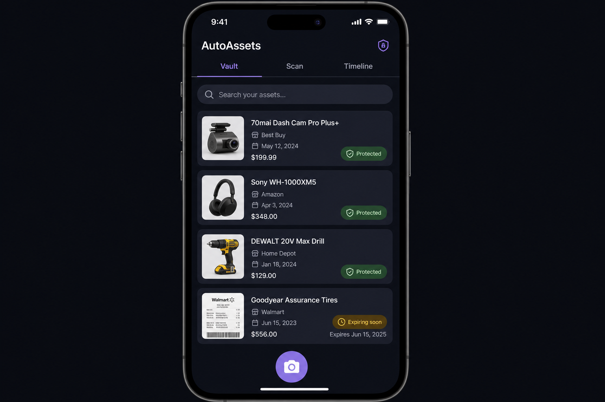

# Phase 3.4 - Auto-Assets (Purchase Tracker / Vault)

## Objective
Deliver the AutoAssets module that lets a family scan receipts to record purchases, store linked documents, track warranty and return windows, view a chronological claim/breakage timeline, and automatically inject reminders into `auto-calendar` and follow-up tasks into `auto-tasks`. Receipt OCR runs through the integration gateway Google Cloud Vision connector. Manual PDF auto-download is gated by a Control Center setting (off by default). The app participates in the event bus by emitting `asset.created`, `asset.warranty_updated`, `asset.return_window_started`, and `asset.claim_logged` envelopes.

## UI reference
### 3.4 `auto-assets` -- Purchase Tracker / Vault

- **Top tabs**: Vault, Scan, Timeline
- **Vault list**: Asset cards with product image, name, store, purchase date, price, warranty status badge (Protected / Expiring soon)
- **Search bar**: Filter by name, store, category
- **Scan tab**: Camera viewfinder with receipt capture, extraction preview, confirm/edit extracted fields
- **Timeline tab**: Chronological view of all asset events (purchase, warranty, claim, maintenance)
- **Bottom**: Floating camera button for quick receipt scan
- **Detail screen**: Documents, receipts, warranty/return countdown, claim/breakage timeline, linked tasks

## In scope
- Flutter app at `apps/auto-assets/` runnable standalone and embeddable in the shell.
- Three top-level tabs: Vault, Scan, Timeline.
- Vault tab: asset cards with image, name, store, purchase date, price, and warranty status badge (Protected / Expiring soon).
- Search bar that filters by name, store, and category against the local FTS cache.
- Scan tab: camera capture, OCR via the integration gateway Vision connector, and an extraction review screen for store, date, total, line items, and serial/IMEI.
- Timeline tab: chronological view of every asset event (purchase, warranty start/end, return window end, claim, maintenance) across the family.
- Asset detail screen with documents, receipts, warranty + return countdown, claim/breakage timeline, and linked tasks/events.
- Auto-generated calendar reminders for 1-year warranty expiry and 14-day return-window-end via the event bus into `auto-calendar`.
- Setting-gated manual PDF auto-download executed server-side via an edge function (default off).
- Storage of receipt images and manuals in Supabase Storage with per-family paths.
- Offline-first reads through the `autolife-core` cache.

## Out of scope
- Insurance API integrations (post-MVP).
- Maintenance scheduling for home/vehicles (handled by `phase3.11_auto_maintain.plan.md`; may later merge here).
- Finance / budget views (`phase3.7_auto_finance.plan.md`).
- Bulk receipt import from email (`phase3.9_auto_mail.plan.md`).
- Authoring Control Center toggles; the app only reads them (`phase3.13_control_center_settings.plan.md`).

## Key deliverables
- [`apps/auto-assets/lib/main.dart`](../../apps/auto-assets/lib/main.dart)
- [`apps/auto-assets/lib/src/assets_module.dart`](../../apps/auto-assets/lib/src/assets_module.dart)
- [`apps/auto-assets/lib/src/screens/assets/vault_list_screen.dart`](../../apps/auto-assets/lib/src/screens/assets/vault_list_screen.dart)
- [`apps/auto-assets/lib/src/screens/assets/scan/receipt_capture_screen.dart`](../../apps/auto-assets/lib/src/screens/assets/scan/receipt_capture_screen.dart)
- [`apps/auto-assets/lib/src/screens/assets/scan/receipt_review_screen.dart`](../../apps/auto-assets/lib/src/screens/assets/scan/receipt_review_screen.dart)
- [`apps/auto-assets/lib/src/screens/assets/timeline_screen.dart`](../../apps/auto-assets/lib/src/screens/assets/timeline_screen.dart)
- [`apps/auto-assets/lib/src/screens/assets/asset_detail_screen.dart`](../../apps/auto-assets/lib/src/screens/assets/asset_detail_screen.dart)
- [`apps/auto-assets/lib/src/screens/assets/asset_form_screen.dart`](../../apps/auto-assets/lib/src/screens/assets/asset_form_screen.dart)
- [`apps/auto-assets/lib/src/screens/assets/widgets/asset_card.dart`](../../apps/auto-assets/lib/src/screens/assets/widgets/asset_card.dart)
- [`apps/auto-assets/lib/src/screens/assets/widgets/warranty_badge.dart`](../../apps/auto-assets/lib/src/screens/assets/widgets/warranty_badge.dart)
- [`apps/auto-assets/lib/src/screens/assets/widgets/timeline_entry_widget.dart`](../../apps/auto-assets/lib/src/screens/assets/widgets/timeline_entry_widget.dart)
- [`apps/auto-assets/lib/src/providers/asset_providers.dart`](../../apps/auto-assets/lib/src/providers/asset_providers.dart)
- [`apps/auto-assets/lib/src/services/receipt_ocr_service.dart`](../../apps/auto-assets/lib/src/services/receipt_ocr_service.dart)
- [`apps/auto-assets/lib/src/services/warranty_calculator.dart`](../../apps/auto-assets/lib/src/services/warranty_calculator.dart)
- [`apps/auto-assets/lib/src/services/manual_fetcher_service.dart`](../../apps/auto-assets/lib/src/services/manual_fetcher_service.dart)
- [`apps/auto-assets/lib/src/services/asset_event_publisher.dart`](../../apps/auto-assets/lib/src/services/asset_event_publisher.dart)
- [`packages/autolife-core/lib/src/assets/asset.dart`](../../packages/autolife-core/lib/src/assets/asset.dart)
- [`packages/autolife-core/lib/src/assets/asset_event.dart`](../../packages/autolife-core/lib/src/assets/asset_event.dart)
- [`packages/autolife-core/lib/src/assets/asset_repository.dart`](../../packages/autolife-core/lib/src/assets/asset_repository.dart)
- [`supabase/migrations/<timestamp>_assets.sql`](../../supabase/migrations)
- [`supabase/migrations/<timestamp>_asset_events.sql`](../../supabase/migrations)
- [`supabase/migrations/<timestamp>_asset_documents.sql`](../../supabase/migrations)
- [`supabase/functions/asset-manual-fetcher/index.ts`](../../supabase/functions/asset-manual-fetcher/index.ts)
- [`apps/auto-assets/test/services/receipt_ocr_service_test.dart`](../../apps/auto-assets/test/services/receipt_ocr_service_test.dart)
- [`apps/auto-assets/test/services/warranty_calculator_test.dart`](../../apps/auto-assets/test/services/warranty_calculator_test.dart)
- [`apps/auto-assets/integration_test/asset_warranty_round_trip_test.dart`](../../apps/auto-assets/integration_test/asset_warranty_round_trip_test.dart)

## Dependencies
- [phase1.2_autolife_core_contracts.plan.md](phase1.2_autolife_core_contracts.plan.md) - canonical asset and asset-event envelopes.
- [phase1.3_autolife_ui_design_system.plan.md](phase1.3_autolife_ui_design_system.plan.md) - theme + components.
- [phase1.4_supabase_baseline.plan.md](phase1.4_supabase_baseline.plan.md) - DB + storage buckets + edge function baseline.
- [phase1.5_event_bus_process_event_worker.plan.md](phase1.5_event_bus_process_event_worker.plan.md) - bus for emitted `asset.*` envelopes consumed by calendar and tasks.
- [phase1.6_offline_sync_foundation.plan.md](phase1.6_offline_sync_foundation.plan.md) - offline cache and write queue.
- [phase1.7_integration_gateway_scaffold.plan.md](phase1.7_integration_gateway_scaffold.plan.md) - Google Cloud Vision OCR connector and the optional manual-fetcher HTTP connector.
- [phase2.2_family_tenancy_model.plan.md](phase2.2_family_tenancy_model.plan.md) - per-family scoping for assets and storage paths.
- [phase2.3_role_policy_model.plan.md](phase2.3_role_policy_model.plan.md) - role gating for purchases beyond the per-role spend limits.
- [phase2.4_rls_policies.plan.md](phase2.4_rls_policies.plan.md) - RLS templates for assets, events, documents, and storage.
- [phase2.5_privacy_controls.plan.md](phase2.5_privacy_controls.plan.md) - biometric gate when opening AutoAssets if the user enabled it.

Reference only; do not redefine event schema, tenancy, RLS templates, offline queue, design tokens, or integration interfaces here.

## Acceptance criteria (gate)
- [ ] Vault tab renders seeded assets with image, store, price, purchase date, and warranty status badge (Protected / Expiring soon).
- [ ] Search filters across name, store, and category in under 300 ms on cached data.
- [ ] Scan flow captures a receipt, sends it to Google Cloud Vision through the integration gateway, and presents the extracted store / date / total / line items / serial for review and edit.
- [ ] Saving an asset emits `asset.created` and `asset.warranty_updated` envelopes onto the event bus; `auto-calendar` consumes them and creates a warranty-expiry event and a return-window-end event (cross-module event emission/consumption verified by integration test).
- [ ] Timeline tab shows purchase, warranty, claim, and maintenance entries in chronological order with the correct family scoping.
- [ ] Manual PDF auto-download honors the Control Center toggle (default off) and only runs server-side via the `asset-manual-fetcher` edge function.
- [ ] Linked tasks created from an asset (e.g. "File warranty claim") appear in `auto-tasks` via a `task.created` envelope and include a `source_asset_id` link.
- [ ] Receipt images and manuals are stored in Supabase Storage under a per-family path and only readable to the family per RLS.
- [ ] Asset detail screen renders the warranty and return countdowns and updates within 5 s of a realtime update.
- [ ] Widget + unit tests cover the receipt OCR adapter, warranty calculator, timeline ordering, and the setting-gated manual fetcher.

## Risks + mitigations
1. Receipt OCR accuracy varies wildly across stores and receipt types. Mitigation: always require an explicit review screen, mark low-confidence fields visually, log them for a nag-list follow-up, and capture diagnostic samples to a private analytics bucket.
2. Manual auto-fetch raises copyright and abuse concerns. Mitigation: route through the `asset-manual-fetcher` edge function with an allowlist of trusted manufacturer domains, cache fetched PDFs in Storage, and keep the default off with a clear Control Center disclosure.
3. Cross-module warranty events drift from asset edits and produce stale calendar reminders. Mitigation: the publisher writes idempotent `asset.warranty_updated` envelopes keyed by `asset_id`; the calendar consumer upserts on that key, so editing an asset always replaces the prior reminders.

## Implementation outline
1. Add migrations for `assets`, `asset_events`, and `asset_documents` with the RLS templates from `phase2.4` and indices for `(family_id, occurred_at)` and `(family_id, store)`.
2. Define `Asset`, `AssetEvent`, and `AssetRepository` in `packages/autolife-core/lib/src/assets/` and export them from the package barrel.
3. Implement the repository against the `autolife-core` sync queue (`phase1.6`) and Supabase realtime; configure per-family Storage paths for receipts and manuals.
4. Build `vault_list_screen` with search/filter, `asset_card`, and `warranty_badge` against the design system from `phase1.3`.
5. Build `receipt_capture_screen` and `receipt_review_screen` calling `receipt_ocr_service`, which talks to the integration gateway Vision connector from `phase1.7`.
6. Implement `warranty_calculator` (1-year default, configurable) and `asset_form_screen` / `asset_detail_screen` with documents and linked tasks/events.
7. Build `timeline_screen` reading `asset_events` ordered by `occurred_at` and supporting per-asset filtering.
8. Implement `asset_event_publisher` emitting `asset.created`, `asset.warranty_updated`, `asset.return_window_started`, and `asset.claim_logged` envelopes onto the event bus (`phase1.5`).
9. Add the `asset-manual-fetcher` edge function plus the Control Center setting plumbing that gates it; default off with explicit user opt-in.
10. Add widget + unit tests for OCR adapter, warranty calculator, timeline ordering, and the manual fetcher; add `asset_warranty_round_trip_test.dart` integration test that creates an asset and asserts `auto-calendar` receives the warranty and return-window events on the bus.

## Artifacts/links
- [PR placeholder]
- [OCR extraction confidence rubric]
- [Manual fetcher allowlist policy]
- [Storage path + RLS spec]
