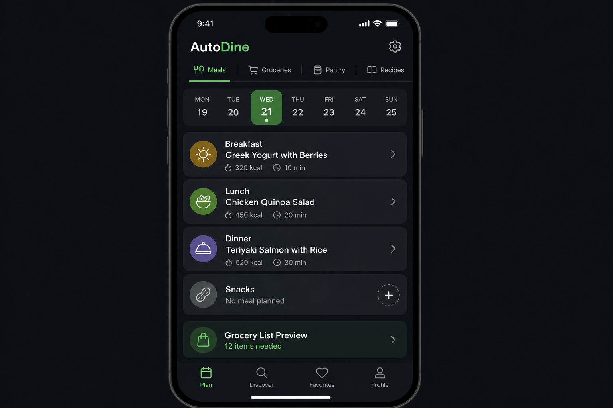

# Phase 3.5 - auto-dine (Meals, Groceries, Nutrition)

## Objective
Deliver the `auto-dine` app as a first-class expansion module that gives a family one place to plan meals, generate store-aware grocery lists, track pantry/freezer inventory, and maintain a personal recipe + nutrition vault. The app must integrate with Coop and Migros for product catalog and inventory, support OCR ingestion of nutrition labels, and emit/consume `system_events` so meals and groceries cross-link cleanly with `auto-tasks`, `auto-finance`, and `auto-calendar`.

## UI reference

### Tabs and key surfaces (verbatim from overarching plan 3.5)
- **Top tabs**: Meals, Groceries, Pantry, Recipes
- **Meals tab**: Horizontal week strip (Mon-Sun); meal cards for selected day (Breakfast/Lunch/Dinner/Snacks) with recipe name, calories, prep time
- **Groceries tab**: Smart-sorted list by store; deal/Aktion badges; out-of-stock flags from store API
- **Pantry tab**: Inventory list with expiry warnings; "Suggest recipe from expiring items" button
- **Recipes tab**: Personal recipe vault with nutrition data, servings, "Add to meal plan" and "Add ingredients to list"

## In scope
- Meals tab with weekly planner, drag-to-reorder slots, copy-week, and per-meal nutrition rollup.
- Groceries tab with per-store sort ordering, "Aktion" deal badges, out-of-stock indicators, and check-off offline support.
- Pantry tab with expiry tracking, low-stock thresholds, and "Suggest recipe from expiring items" call to the recipe matcher.
- Recipes vault with ingredient lists, nutrition macros, servings, prep time, and one-tap "Add to meal plan" / "Add ingredients to list".
- Store connectors (Coop, Migros) registered through the integration gateway with product catalog sync, deal feed, and stock lookup.
- OCR pipeline for nutrition labels (camera capture -> Edge Function -> normalized nutrition record).
- Event-bus integration: emit `meal.planned`, `grocery.item_added`, `pantry.item_low`, `deal.detected`; consume `task.completed` (shopping done) to mark grocery items.

## Out of scope
- Direct online ordering / checkout against Coop or Migros (catalog + inventory read only in v1).
- Calorie coaching, macro goals, or workout-linked nutrition advice (owned by `auto-health` insights).
- Restaurant booking, delivery integrations, or menu OCR for restaurants.
- Barcode scanning at scale (deferred; v1 supports OCR labels + manual product picker).

## Key deliverables
- `apps/auto-dine/lib/src/app.dart` (router, tab scaffold, theme wiring to `packages/autolife-ui`).
- `apps/auto-dine/lib/src/screens/meals/meal_planner_screen.dart`, `widgets/week_strip.dart`, `widgets/meal_slot_card.dart`.
- `apps/auto-dine/lib/src/screens/groceries/grocery_list_screen.dart`, `widgets/store_section.dart`, `widgets/deal_badge.dart`.
- `apps/auto-dine/lib/src/screens/pantry/pantry_screen.dart`, `widgets/expiry_warning_chip.dart`.
- `apps/auto-dine/lib/src/screens/recipes/recipe_vault_screen.dart`, `screens/recipes/recipe_detail_screen.dart`, `widgets/nutrition_panel.dart`.
- `apps/auto-dine/lib/src/services/store_connector_service.dart` (delegates to `packages/autolife-core` integration gateway).
- `apps/auto-dine/lib/src/services/ocr_label_service.dart` (calls `supabase/functions/parse-nutrition-label`).
- `packages/autolife-core/lib/src/models/dine/{meal_plan,grocery_item,pantry_item,recipe,nutrition_facts}.dart` (DTOs + JSON).
- `packages/autolife-core/lib/src/events/dine_events.dart` (event payloads bound to the schema from phase 1.2 / 1.5).
- `supabase/migrations/20260601_auto_dine_tables.sql` (meal_plans, meal_slots, grocery_items, pantry_items, recipes, store_products, store_deals).
- `supabase/migrations/20260601_auto_dine_rls.sql` (family-scoped policies derived from phase 2.4 templates).
- `supabase/functions/parse-nutrition-label/index.ts` (OCR -> normalized nutrition).
- `supabase/functions/store-sync/index.ts` (cron-triggered Coop/Migros catalog + deal refresh).

## Dependencies
- Phase 1.2 contracts: `.cursor/plans/phase1.2_autolife_core_contracts.plan.md` (event schema, shared DTOs).
- Phase 1.3 design system: `.cursor/plans/phase1.3_autolife_ui_design_system.plan.md` (tokens, list widgets, badges).
- Phase 1.4 Supabase baseline: `.cursor/plans/phase1.4_supabase_baseline.plan.md` (DB scaffolding, storage buckets for label captures).
- Phase 1.5 event bus: `.cursor/plans/phase1.5_event_bus_process_event_worker.plan.md` (producer/consumer + retry/DLQ contract).
- Phase 1.6 offline foundation: `.cursor/plans/phase1.6_offline_sync_foundation.plan.md` (grocery check-off and pantry edits must work offline).
- Phase 1.7 integration gateway: `.cursor/plans/phase1.7_integration_gateway_scaffold.plan.md` (Coop / Migros connector lifecycle, credential storage).
- Phase 2.2 tenancy: `.cursor/plans/phase2.2_family_tenancy_model.plan.md`.
- Phase 2.3 roles: `.cursor/plans/phase2.3_role_policy_model.plan.md` (who can edit shared lists vs. read only).
- Phase 2.4 RLS: `.cursor/plans/phase2.4_rls_policies.plan.md`.
- Phase 3.3 `auto-tasks`: `.cursor/plans/phase3.3_auto_tasks.plan.md` (grocery -> shopping task cross-link).
- Phase 3.2 `auto-calendar`: `.cursor/plans/phase3.2_auto_calendar.plan.md` (meal plan summary surfaced on the day).
- Phase 3.7 `auto-finance` (later): receives `grocery.purchase_completed` events for budget rollups.

## Acceptance criteria (gate)
- [ ] Family member can plan a full week of meals, copy it to next week, and see per-day nutrition totals from the recipe vault.
- [ ] Adding a recipe to a meal slot offers "Add missing ingredients to grocery list" and produces the correct delta against the pantry.
- [ ] Grocery list sorts items by the selected default store (Coop or Migros) using catalog category ordering returned by the connector.
- [ ] At least one grocery item per active deal feed shows an "Aktion" badge with the discounted price and source store.
- [ ] Connector returns an out-of-stock flag for a seeded SKU and the item is rendered with an out-of-stock indicator in the list.
- [ ] OCR of a sample nutrition label produces a normalized `NutritionFacts` record (kcal, protein, carbs, fat, sugar, sodium) with manual edit before save.
- [ ] Pantry expiry warnings fire for items within the configured window and "Suggest recipe from expiring items" returns at least one match when data exists.
- [ ] Event-bus integration test: completing the auto-generated shopping task in `auto-tasks` marks the corresponding grocery items as purchased and emits `grocery.purchase_completed`.
- [ ] All grocery, pantry, recipe, and meal-plan tables pass the phase 2.4 RLS test harness for owner / partner / child / guest roles.

## Risks + mitigations
- **Risk**: Coop / Migros provide no stable public API and scraping is fragile or terms-of-service hostile. **Mitigation**: route all store access through the phase 1.7 integration gateway behind a `StoreConnector` interface with a swappable adapter; ship a manual-import fallback (CSV / OCR receipt) and feature-flag live inventory.
- **Risk**: OCR mis-extracts nutrition values and silently corrupts the user's personal nutrition vault. **Mitigation**: every OCR result lands in a "review" state with side-by-side image + extracted fields and is only persisted on explicit confirm; log a `nutrition.ocr_reviewed` event with diffs.
- **Risk**: Offline grocery edits collide when two family members shop simultaneously. **Mitigation**: use the phase 1.6 write-queue with last-writer-wins on `quantity` + set-merge on `purchased_by`, plus a "merge conflict" indicator in the UI when both touched the same row.

## Implementation outline
1. Scaffold `apps/auto-dine` from the shared app template; wire `autolife-ui` theme, navigation tabs, and dependency injection.
2. Land phase 1 migrations for `meal_plans`, `meal_slots`, `recipes`, `recipe_ingredients`, `grocery_items`, `pantry_items`, `store_products`, `store_deals` with RLS policies seeded from phase 2.4 templates.
3. Implement `packages/autolife-core` DTOs and event payloads under `models/dine/` and `events/dine_events.dart`.
4. Build the Recipes tab end to end (CRUD + nutrition panel) since meals and groceries both depend on recipes.
5. Build the Meals tab: week strip, slot cards, drag/reorder, copy-week, per-day nutrition rollup.
6. Build the Groceries tab on top of the offline write-queue; integrate store-sort ordering and check-off events.
7. Implement the Coop and Migros connectors behind the integration gateway, including credential rotation and rate-limit handling.
8. Implement the `store-sync` Edge Function to refresh catalog + deals on a cron; surface deal badges in the grocery UI.
9. Implement the `parse-nutrition-label` Edge Function and OCR review flow; wire it to the Recipes "Add from photo" entry point.
10. Add the Pantry tab and the "Suggest recipe from expiring items" matcher using the recipe ingredient index.
11. Wire event-bus producers/consumers (`meal.planned`, `grocery.item_added`, `pantry.item_low`, `deal.detected`, `task.completed`, `grocery.purchase_completed`) per phase 1.5.
12. Run the phase 2.4 RLS test harness against the new tables and add integration tests for the cross-module flows.

## Artifacts/links
- PR: (link once opened)
- Design tokens reference: `packages/autolife-ui/lib/src/tokens.dart`
- Integration gateway docs: `packages/autolife-core/lib/src/integrations/README.md`
- RLS harness output: `supabase/tests/rls/auto_dine.test.sql`
