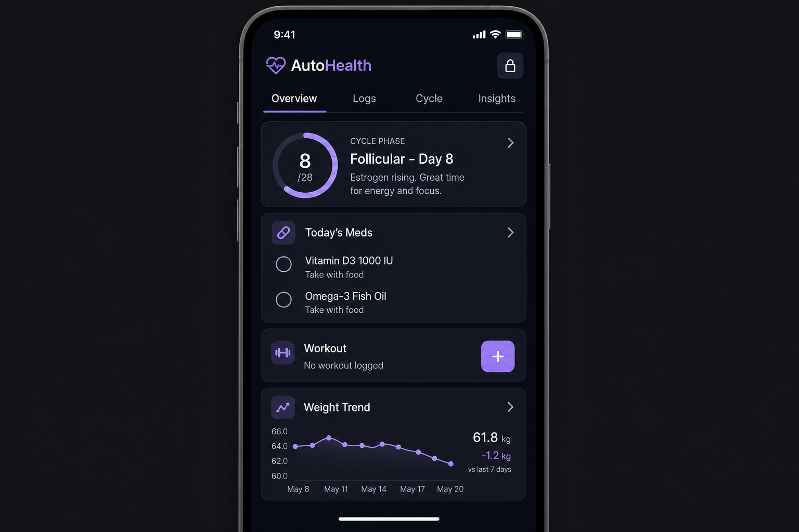

# Phase 3.6 - auto-health (Medical, Wellness, Cycle)

## Objective
Deliver `auto-health` as a privacy-critical expansion app that gives each family member a personal, profile-aware health surface: ML-assisted cycle tracking (women-only), a granular symptom and mood logger, product usage tracking that cross-links to `auto-dine`, workout + dynamic calorie tracking, a medication tracker with a refill task loop into `auto-tasks`, and a secure medical passport. The app must enforce biometric gating and the phase 2.5 privacy tiers: by default nothing is shared, and users can opt in to share at most a "phase only" pill to the shared family calendar.

**Privacy contract (Phase 2.5):** Canonical tier meanings, babysitter `babysitter_scope` resource keys, and the biometric lock telemetry contract are documented in [docs/privacy-tiers.md](../../docs/privacy-tiers.md).

## UI reference

### Tabs and key surfaces (verbatim from overarching plan 3.6)
- **Top tabs**: Overview, Logs, Cycle, Insights
- **Overview**: Stacked cards -- cycle phase (women only, hidden for other profiles), today's meds (checklist), workout (log or "+"), weight trend (sparkline)
- **Logs**: Symptom/mood/energy logger; custom pain tracking; product usage (pads/tampons/cups)
- **Cycle tab**: Women-only feature; hidden entirely for non-women profiles. Calendar with phase coloring and predictions; granular symptom overlay; product tracker with grocery list integration
- **Insights**: Trend charts for cycle length (women), weight, symptoms, workout history
- **Privacy**: Lock icon in header; biometric gate; granular sharing (phase-only to family calendar)
- **Profile-aware**: The app adapts its visible sections based on the user's profile (e.g., men/children don't see Cycle tab or cycle card on Overview)

## In scope
- Profile-aware tab and card visibility driven by the phase 2.2 profile (sex / age / capabilities flags).
- Cycle tracker (women-only): logged periods, ML-based phase predictions, custom pain inputs, product tracker.
- Symptom + mood + energy logger with custom pain entries and freeform tags.
- Workout tracker with dynamic calorie estimation (exercise type + duration + current logged weight).
- Medication tracker: daily schedule, check-off, refill threshold that emits a `task.create_requested` for `auto-tasks`.
- Medical passport: blood type, allergies, vaccination PDFs, emergency notes (encrypted at rest).
- Privacy controls: per-app biometric gate, granular sharing toggles (phase-only to calendar, hide all symptoms, etc.).
- Product usage -> grocery list bridge: heavy product usage emits `grocery.item_suggested` consumed by `auto-dine`.

## Out of scope
- Pairing with wearables (Apple Watch, Garmin, Fitbit) -- deferred to a later phase.
- Clinical diagnostic claims, doctor portals, or telehealth.
- Lab result ingestion via HL7 / FHIR (only manual PDF upload to the passport in v1).
- Sharing health data with extended family / non-tenancy accounts.

## Key deliverables
- `apps/auto-health/lib/src/app.dart` (router, profile-aware tab builder, biometric gate wrapper).
- `apps/auto-health/lib/src/screens/overview/overview_screen.dart`, `widgets/cycle_phase_card.dart`, `widgets/meds_checklist_card.dart`, `widgets/workout_card.dart`, `widgets/weight_trend_card.dart`.
- `apps/auto-health/lib/src/screens/logs/log_screen.dart`, `widgets/symptom_picker.dart`, `widgets/custom_pain_entry.dart`, `widgets/product_usage_picker.dart`.
- `apps/auto-health/lib/src/screens/cycle/cycle_screen.dart`, `widgets/cycle_calendar.dart`, `widgets/phase_legend.dart`.
- `apps/auto-health/lib/src/screens/insights/insights_screen.dart`, `widgets/trend_chart.dart`.
- `apps/auto-health/lib/src/screens/passport/medical_passport_screen.dart`.
- `apps/auto-health/lib/src/services/biometric_gate.dart` (wraps phase 2.5 primitive).
- `apps/auto-health/lib/src/services/cycle_prediction_service.dart` (calls Edge Function and falls back to on-device heuristic).
- `apps/auto-health/lib/src/services/calorie_estimator.dart`.
- `packages/autolife-core/lib/src/models/health/{cycle_entry,symptom_log,workout_entry,medication,medical_record}.dart`.
- `packages/autolife-core/lib/src/events/health_events.dart` (`cycle.phase_changed`, `product.usage_high`, `medication.low_stock`).
- `supabase/migrations/20260615_auto_health_tables.sql`.
- `supabase/migrations/20260615_auto_health_rls.sql` (per-user owner-only RLS, hardened beyond family default).
- `supabase/functions/cycle-predict/index.ts` (server-side ML inference).

## Dependencies
- Phase 1.2 contracts: `.cursor/plans/phase1.2_autolife_core_contracts.plan.md`.
- Phase 1.3 design system: `.cursor/plans/phase1.3_autolife_ui_design_system.plan.md`.
- Phase 1.4 Supabase baseline: `.cursor/plans/phase1.4_supabase_baseline.plan.md`.
- Phase 1.5 event bus: `.cursor/plans/phase1.5_event_bus_process_event_worker.plan.md`.
- Phase 1.6 offline foundation: `.cursor/plans/phase1.6_offline_sync_foundation.plan.md`.
- Phase 2.2 tenancy + profile model: `.cursor/plans/phase2.2_family_tenancy_model.plan.md`.
- Phase 2.3 role policy: `.cursor/plans/phase2.3_role_policy_model.plan.md`.
- Phase 2.4 RLS: `.cursor/plans/phase2.4_rls_policies.plan.md`.
- Phase 2.5 privacy controls (biometric + sensitive tiers): `.cursor/plans/phase2.5_privacy_controls.plan.md` -- MANDATORY.
- Phase 3.2 `auto-calendar`: `.cursor/plans/phase3.2_auto_calendar.plan.md` (phase-only pill on shared calendar).
- Phase 3.3 `auto-tasks`: `.cursor/plans/phase3.3_auto_tasks.plan.md` (refill task creation).
- Phase 3.5 `auto-dine`: `.cursor/plans/phase3.5_auto_dine.plan.md` (product usage -> grocery suggestions).

## Acceptance criteria (gate)
- [ ] Biometric gate: opening the app on a configured device requires FaceID / fingerprint and a failed attempt locks the app per phase 2.5 policy. (privacy-critical test)
- [ ] Profile-aware visibility: a male / child / non-women profile sees no Cycle tab and no cycle card on Overview; a women profile sees both.
- [ ] Cycle predictions: after 3 logged cycles, the model returns predicted phases with a confidence indicator and a "learning" disclaimer.
- [ ] Granular sharing: toggling "share phase only" surfaces a non-sensitive phase pill on the shared family calendar; toggling off removes it immediately and emits an audit row.
- [ ] Heavy product usage in 24h emits `grocery.item_suggested` that `auto-dine` consumes and adds to the active grocery list. (event-bus integration test)
- [ ] Medication tracker triggers an `auto-tasks` refill task when stock drops at or below the configured threshold.
- [ ] Workout entry produces a calorie estimate that recomputes when the user updates their current logged weight.
- [ ] Medical passport stores attachments in an owner-only Supabase Storage bucket and downloads are gated by biometric re-auth on cold open.
- [ ] All health tables pass the phase 2.4 RLS test harness with owner-only access for sensitive rows and explicit shared-pill rules for cycle phase.

## Risks + mitigations
- **Risk**: Sensitive health data leaks to other family members through misconfigured RLS or stale cached state. **Mitigation**: every health table starts with `owner_only` RLS in phase 2.4 plus a per-row sharing flag; client cache key is namespaced by user id and cleared on profile switch; add a dedicated test suite for cross-account reads.
- **Risk**: Cycle predictions are inaccurate for users with low data and erode trust. **Mitigation**: gate predictions behind a minimum-data threshold, always show a "learning" label and confidence, and let the user override predicted dates without retraining cost.
- **Risk**: Biometric gate is bypassed because the device lacks support or the user disables OS biometrics. **Mitigation**: fall back to a strong app PIN required to enter the app, force biometric on devices that support it, and surface a status banner if the user disables both.

## Implementation outline
1. Scaffold `apps/auto-health`, wire the biometric gate from phase 2.5 as a root route guard.
2. Apply migrations for `cycle_entries`, `symptom_logs`, `workouts`, `medications`, `medication_logs`, `medical_records`, with strict owner-only RLS.
3. Implement `packages/autolife-core` DTOs and events under `models/health/` and `events/health_events.dart`.
4. Build the Overview tab with profile-aware card composition and the privacy lock icon in the header.
5. Build the Logs tab including custom pain entries and the product usage picker.
6. Build the Cycle tab (hidden via profile gate); implement the cycle calendar widget and the prediction service client.
7. Implement the `cycle-predict` Edge Function with a documented input/output contract and a graceful fallback to an on-device heuristic when offline.
8. Build the medication tracker with the refill-loop event emitting into the phase 1.5 event bus.
9. Build the workout tracker and dynamic calorie estimator, plus the weight trend sparkline.
10. Build the Medical Passport screen and wire it to an owner-only Supabase Storage bucket; require biometric re-auth on download.
11. Wire granular sharing toggles: cycle-phase pill to `auto-calendar` and product-usage suggestion to `auto-dine`.
12. Run the phase 2.4 RLS test harness and add integration tests covering biometric gate, profile gating, and cross-module event emissions.

## Artifacts/links
- PR: (link once opened)
- Privacy controls reference: `.cursor/plans/phase2.5_privacy_controls.plan.md`
- Cycle prediction notes: `supabase/functions/cycle-predict/README.md`
- RLS harness output: `supabase/tests/rls/auto_health.test.sql`
