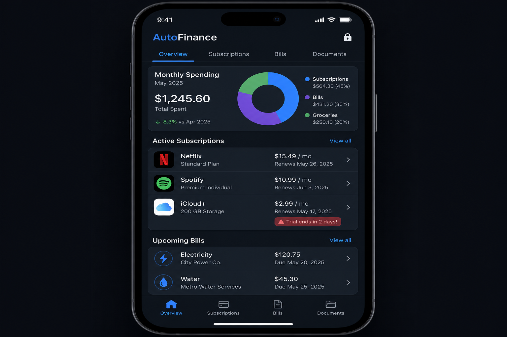

# Phase 3.7 - auto-finance (Budgets + Subscriptions)

## Objective
Deliver `auto-finance` as a privacy-critical expansion app that gives the family a single surface for monthly spending, subscriptions and free trials, recurring bills, and a document vault. It ships the "free-trial killer" alarm, kid allowance pegged to completed chores in `auto-tasks`, and a Splitwise-inspired expense splitter with currency translation. All sensitive surfaces sit behind the phase 2.5 biometric gate, and visibility is governed by explicit family sharing rules.

## UI reference

### Tabs and key surfaces (verbatim from overarching plan 3.7)
- **Top tabs**: Overview, Subscriptions, Bills, Documents
- **Overview**: Monthly spending donut chart (categories), total spent, month-over-month change
- **Subscriptions**: Active subscription cards (service icon, price, renewal date); trial-ending warnings in red
- **Bills**: Upcoming bills with amounts and due dates
- **Documents**: Statement vault (bank statements, receipts)
- **Privacy**: Lock icon; biometric gate; explicit family sharing rules
- **Allowance**: Kid chore-linked piggy bank card (if applicable)

## In scope
- Overview with category donut, total spent, month-over-month delta, configurable categorization rules.
- Subscription tracking: service icon resolution, renewal date, free-trial deadline alarm with cancellation URL, "ending soon" badge.
- Bills list with due-date reminders and pay/marked-paid state.
- Document vault for statements, receipts, and PDFs; biometric-gated downloads.
- Allowance: per-child piggy bank wired to `task.completed` events from `auto-tasks` (chore -> credit).
- Shared expense splitter: groups, balances, settle-up, currency conversion via integration gateway.
- Biometric gate at app entry, explicit per-card sharing toggle visible to the owner.
- Optional bank/email statement parsing via the `auto-mail` parser pipeline (consumer only in v1).

## Out of scope
- Direct bank account connections (Plaid, Tink) -- deferred. v1 supports manual entry and `auto-mail` parsed receipts.
- Investment tracking, tax filing, or net-worth dashboards.
- Cryptocurrency wallets or DeFi integrations.
- Sending money / payment rails. The splitter only tracks balances and records settle-ups.

## Key deliverables
- `apps/auto-finance/lib/src/app.dart` with biometric gate at root.
- `apps/auto-finance/lib/src/screens/overview/overview_screen.dart`, `widgets/category_donut.dart`, `widgets/spend_summary_card.dart`.
- `apps/auto-finance/lib/src/screens/subscriptions/subscriptions_screen.dart`, `widgets/subscription_card.dart`, `widgets/trial_killer_banner.dart`.
- `apps/auto-finance/lib/src/screens/bills/bills_screen.dart`, `widgets/bill_card.dart`.
- `apps/auto-finance/lib/src/screens/documents/document_vault_screen.dart`.
- `apps/auto-finance/lib/src/screens/allowance/allowance_screen.dart`, `widgets/piggy_bank_card.dart`.
- `apps/auto-finance/lib/src/screens/splitter/{group_list_screen,group_detail_screen,settle_up_screen}.dart`.
- `apps/auto-finance/lib/src/services/{trial_alarm_service,currency_service,allowance_service}.dart`.
- `packages/autolife-core/lib/src/models/finance/{subscription,bill,expense,split_group,allowance_account}.dart`.
- `packages/autolife-core/lib/src/events/finance_events.dart` (`subscription.trial_ending`, `bill.due_soon`, `allowance.credited`, `expense.split_created`).
- `supabase/migrations/20260701_auto_finance_tables.sql`.
- `supabase/migrations/20260701_auto_finance_rls.sql` (owner-only by default, opt-in sharing rules).
- `supabase/functions/currency-rates/index.ts` (cached FX rates from a configured provider).
- `supabase/functions/trial-killer-cron/index.ts` (scheduled push for trials ending in <= 48h).

## Dependencies
- Phase 1.2 contracts: `.cursor/plans/phase1.2_autolife_core_contracts.plan.md`.
- Phase 1.3 design system: `.cursor/plans/phase1.3_autolife_ui_design_system.plan.md`.
- Phase 1.4 Supabase baseline: `.cursor/plans/phase1.4_supabase_baseline.plan.md`.
- Phase 1.5 event bus: `.cursor/plans/phase1.5_event_bus_process_event_worker.plan.md`.
- Phase 1.6 offline foundation: `.cursor/plans/phase1.6_offline_sync_foundation.plan.md`.
- Phase 1.7 integration gateway (FX provider, optional bank-statement parsers): `.cursor/plans/phase1.7_integration_gateway_scaffold.plan.md`.
- Phase 2.2 tenancy: `.cursor/plans/phase2.2_family_tenancy_model.plan.md`.
- Phase 2.3 roles + approval engine (kid allowance approvals): `.cursor/plans/phase2.3_role_policy_model.plan.md`.
- Phase 2.4 RLS: `.cursor/plans/phase2.4_rls_policies.plan.md`.
- Phase 2.5 privacy controls (biometric gate): `.cursor/plans/phase2.5_privacy_controls.plan.md` -- MANDATORY.
- Phase 3.3 `auto-tasks`: `.cursor/plans/phase3.3_auto_tasks.plan.md` (chore completion -> allowance credit).
- Phase 3.4 `auto-assets`: `.cursor/plans/phase3.4_auto_assets.plan.md` (receipts mirrored to document vault).
- Phase 3.9 `auto-mail`: `.cursor/plans/phase3.9_auto_mail.plan.md` (parsed renewals -> subscription suggestions).

## Acceptance criteria (gate)
- [ ] Biometric gate: cold-open of the app on a supported device forces biometric auth; three failures fall back to the phase 2.5 PIN policy. (privacy-critical test)
- [ ] Overview donut renders correct category totals and month-over-month delta for a seeded dataset across at least 6 categories.
- [ ] Free-trial killer: a subscription with `trial_ends_at` <= 48h triggers a push notification and a banner with a working cancellation URL.
- [ ] Allowance: completing a chore in `auto-tasks` emits `task.completed` that increments the assigned child's piggy bank by the configured amount within 5 seconds. (event-bus integration test)
- [ ] Expense splitter: creating a split across two currencies converts via the FX service and balances reconcile to zero after a recorded settle-up.
- [ ] Document vault downloads require biometric re-auth on cold session, audit-logged with user, file, and timestamp.
- [ ] Bills due within the configurable window appear at the top of the Bills tab and emit `bill.due_soon`.
- [ ] All finance tables pass the phase 2.4 RLS test harness, including the owner-only default and explicit per-row sharing toggles.
- [ ] Currency FX provider failure does not block UI; cached rates are used and a stale-data banner is shown.

## Risks + mitigations
- **Risk**: Financial data leaks across family members because sharing toggles are confusing or default-open. **Mitigation**: ship "owner-only" as the default for every new entity, surface a clear "Shared with X" pill on every row, and add an RLS test that the default state is invisible to non-owners.
- **Risk**: FX provider rate limits or outages corrupt splitter balances. **Mitigation**: cache rates per day per currency, snapshot the rate onto every split row at creation time, and never recompute historic splits on later rate refreshes.
- **Risk**: Trial-killer cron misses a renewal due to time-zone drift and the user is charged. **Mitigation**: store `trial_ends_at` in UTC plus the user's timezone, run the cron at a 12h cadence with idempotent keys, and surface a "no recent check" banner if the cron has not run in 24h.

## Implementation outline
1. Scaffold `apps/auto-finance` and wrap the root in the phase 2.5 biometric gate.
2. Apply migrations for `subscriptions`, `bills`, `expenses`, `split_groups`, `split_members`, `allowance_accounts`, `documents`, with owner-default RLS.
3. Implement `packages/autolife-core` DTOs and events under `models/finance/` and `events/finance_events.dart`.
4. Build the Overview tab with the category donut and month-over-month computation.
5. Build the Subscriptions tab and the `trial-killer-cron` Edge Function with idempotent reminders.
6. Build the Bills tab and the `bill.due_soon` reminder flow that surfaces in the shell home upcoming strip.
7. Build the Documents vault on Supabase Storage with biometric-gated downloads and audit rows.
8. Implement the allowance piggy-bank wiring: subscribe to `task.completed` from `auto-tasks`, apply rules, emit `allowance.credited`.
9. Build the Expense Splitter (groups, members, split entries, settle-up) and integrate the FX service.
10. Implement the `currency-rates` Edge Function with daily caching and snapshot-on-create behavior.
11. Hook `auto-mail` parsed renewals: `subscription.suggested` events render as actionable cards in the Subscriptions tab.
12. Run the phase 2.4 RLS harness and integration tests covering biometric gate, trial cron, allowance, and splitter currency reconciliation.

## Artifacts/links
- PR: (link once opened)
- Privacy controls reference: `.cursor/plans/phase2.5_privacy_controls.plan.md`
- FX provider docs: `supabase/functions/currency-rates/README.md`
- RLS harness output: `supabase/tests/rls/auto_finance.test.sql`
