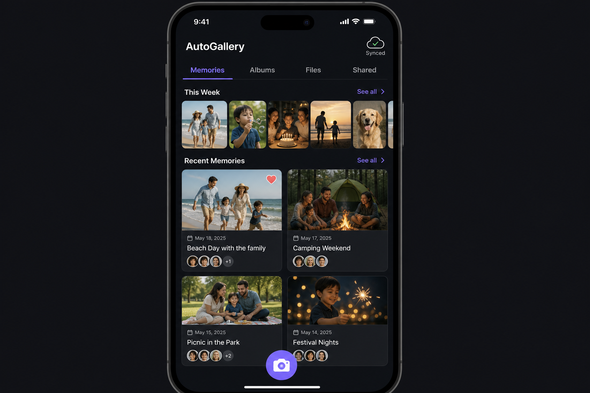

# Phase 3.8 - auto-gallery (Family Gallery, Files, Memories)

## Objective
Deliver `auto-gallery` as the family's shared visual and document memory: a Memories feed, auto-generated and custom Albums, a general-purpose Files store, and a Shared surface for guest links. All media lives in Supabase Storage with strict tenancy-scoped RLS. The gallery is the canonical place that other modules link photos to: events in `auto-calendar`, assets in `auto-assets`, pets in `auto-pets`, meals/recipes in `auto-dine`. Memories are auto-suggested from calendar events and emit cross-module events.

## UI reference

### Tabs and key surfaces (verbatim from overarching plan 3.8)
- **Top tabs**: Memories, Albums, Files, Shared
- **Memories tab**: "This Week" horizontal photo strip; "Recent Memories" masonry grid with date, caption, tagged family member avatars, favorite heart
- **Albums tab**: Auto-generated albums (by event, by person, by date range) + custom albums
- **Files tab**: General-purpose family file store (documents, PDFs, scans) with folder structure; search + filter by type
- **Shared tab**: Files/albums explicitly shared with family members or via guest links
- **Cloud sync**: Sync status indicator in header; backed up to Supabase Storage
- **Cross-module links**: Photos can be linked to calendar events, assets, pets, meals; memories auto-suggested from calendar events
- **Floating button**: Camera/upload for quick capture

## In scope
- Memories tab with "This Week" strip, masonry "Recent Memories" grid, favorite heart, captions, member tagging.
- Albums tab with auto-generated albums (by event, by person, by date range) and user-curated albums.
- Files tab with folder hierarchy, search, MIME-type filters, and bulk select.
- Shared tab listing items shared with members or via guest links; guest link generation reuses phase 2.5 babysitter-scoped link primitive.
- Cross-module linking primitive: `media_link` rows binding a media item to one event/asset/pet/meal/recipe.
- Memory suggestion engine: scheduled job that proposes memory rollups for calendar events.
- Offline capture: photos taken in the field upload via the phase 1.6 write queue and appear immediately as local placeholders.

## Out of scope
- Native image editor (crop/filter/markup) beyond a thin captioning UI.
- Face recognition / auto-tagging of people (only manual member tagging in v1).
- Video editing or stitching beyond playback.
- Migration importers from Google Photos / iCloud (manual upload only in v1).

## Key deliverables
- `apps/auto-gallery/lib/src/app.dart`.
- `apps/auto-gallery/lib/src/screens/memories/memories_screen.dart`, `widgets/week_strip.dart`, `widgets/memory_tile.dart`.
- `apps/auto-gallery/lib/src/screens/albums/{album_list_screen,album_detail_screen}.dart`, `widgets/album_cover.dart`.
- `apps/auto-gallery/lib/src/screens/files/{file_browser_screen,folder_view.dart}.dart`, `widgets/file_row.dart`.
- `apps/auto-gallery/lib/src/screens/shared/shared_screen.dart`.
- `apps/auto-gallery/lib/src/screens/detail/media_detail_screen.dart` (link/unlink panel surfacing target modules).
- `apps/auto-gallery/lib/src/services/{upload_service,thumbnail_service,memory_suggester_client}.dart`.
- `packages/autolife-core/lib/src/models/gallery/{media_item,album,media_link,share_grant}.dart`.
- `packages/autolife-core/lib/src/events/gallery_events.dart` (`media.added`, `media.linked`, `memory.suggested`, `album.generated`).
- `supabase/migrations/20260715_auto_gallery_tables.sql` (media_items, albums, album_items, media_links, share_grants).
- `supabase/migrations/20260715_auto_gallery_storage.sql` (Storage bucket + RLS).
- `supabase/functions/memory-suggester/index.ts` (cron-driven; matches photos to events).
- `supabase/functions/thumbnail-worker/index.ts` (on-upload trigger; writes thumbnails to a derived path).

## Dependencies
- Phase 1.2 contracts: `.cursor/plans/phase1.2_autolife_core_contracts.plan.md`.
- Phase 1.3 design system: `.cursor/plans/phase1.3_autolife_ui_design_system.plan.md`.
- Phase 1.4 Supabase baseline (Storage buckets): `.cursor/plans/phase1.4_supabase_baseline.plan.md`.
- Phase 1.5 event bus: `.cursor/plans/phase1.5_event_bus_process_event_worker.plan.md`.
- Phase 1.6 offline foundation (upload queue, conflict policy): `.cursor/plans/phase1.6_offline_sync_foundation.plan.md`.
- Phase 2.2 tenancy: `.cursor/plans/phase2.2_family_tenancy_model.plan.md`.
- Phase 2.3 roles: `.cursor/plans/phase2.3_role_policy_model.plan.md` (who can delete shared media).
- Phase 2.4 RLS: `.cursor/plans/phase2.4_rls_policies.plan.md`.
- Phase 2.5 privacy controls (guest link scoping): `.cursor/plans/phase2.5_privacy_controls.plan.md`.
- Phase 3.2 `auto-calendar`: `.cursor/plans/phase3.2_auto_calendar.plan.md` (event -> memory linking).
- Phase 3.4 `auto-assets`: `.cursor/plans/phase3.4_auto_assets.plan.md` (asset photos).
- Phase 3.5 `auto-dine`: `.cursor/plans/phase3.5_auto_dine.plan.md` (recipe / meal photos).
- Phase 3.10 `auto-pets`: `.cursor/plans/phase3.10_auto_pets.plan.md` (pet photos).

## Acceptance criteria (gate)
- [ ] Uploading a photo offline shows an immediate local thumbnail and reconciles to a server URL once online without duplicate rows.
- [ ] The thumbnail worker produces a thumbnail within 60 seconds of upload for the standard image MIME types.
- [ ] Auto-generated "by event" albums appear within 24h of a calendar event end, with at least the photos captured during the event window.
- [ ] Linking a media item to an asset surfaces it on the asset detail screen via the `media_link` join. (event-bus integration test)
- [ ] Generating a guest link surfaces only the explicitly granted albums or items and respects expiry from phase 2.5.
- [ ] Files tab search returns results filtered by MIME type and folder path for a seeded dataset of >= 50 mixed items.
- [ ] All gallery tables and the Storage bucket pass the phase 2.4 RLS test harness for owner / partner / child / guest roles.
- [ ] Deleting a media item moves it to a 30-day soft-delete window with restore, never hard-delete on first request.

## Risks + mitigations
- **Risk**: Storage costs balloon as families upload large photo/video sets. **Mitigation**: enforce per-family quota with phase 1.4 settings, generate thumbnails server-side, and add a settings toggle for "originals on Wi-Fi only" upload.
- **Risk**: Cross-module links go stale when the linked entity is deleted, leaving orphaned media references. **Mitigation**: `media_links` use FK with `on delete cascade` only for the link row (not the media), and a nightly job reconciles orphans.
- **Risk**: Guest links leak sensitive context (e.g., a photo captioned with location details). **Mitigation**: guest links default to view-only, scrub EXIF on share, and require explicit per-album selection through the phase 2.5 scoping primitive.

## Implementation outline
1. Scaffold `apps/auto-gallery` with the tab layout and floating capture button.
2. Land migrations for `media_items`, `albums`, `album_items`, `media_links`, `share_grants` with phase 2.4 RLS templates.
3. Create the `gallery` Storage bucket with the RLS rules from the migration; configure derived `thumbnails/` path.
4. Implement `packages/autolife-core` DTOs and events under `models/gallery/` and `events/gallery_events.dart`.
5. Build the upload service on the phase 1.6 queue and local placeholder rendering.
6. Build the Memories tab (week strip + masonry grid + favorite + captions).
7. Build the Albums tab and a curator for custom albums.
8. Implement the `memory-suggester` Edge Function (cron) and surface suggestions in Memories with accept/dismiss.
9. Implement the `thumbnail-worker` Edge Function on Storage upload trigger.
10. Build the Files tab with folder hierarchy, search, and MIME filters.
11. Build the Shared tab and integrate the phase 2.5 guest-link generator with EXIF scrubbing.
12. Wire cross-module link UI in the media detail screen and emit `media.linked` events; add integration tests for asset/event/pet/meal linking.

## Artifacts/links
- PR: (link once opened)
- Storage bucket policy: `supabase/migrations/20260715_auto_gallery_storage.sql`
- Memory suggester docs: `supabase/functions/memory-suggester/README.md`
- RLS harness output: `supabase/tests/rls/auto_gallery.test.sql`
