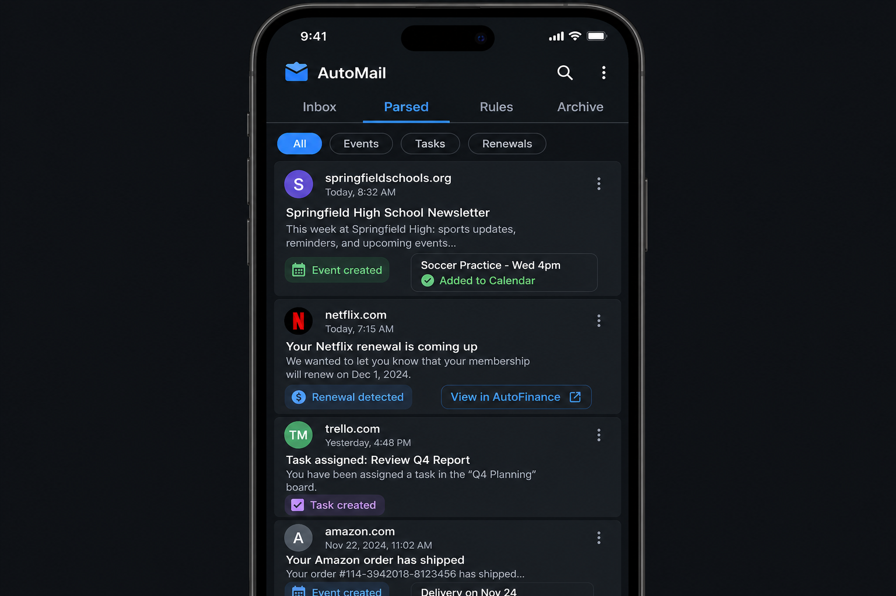

# Phase 3.9 - auto-mail (Email Ingestion + AI Parsing)

## Objective
Deliver `auto-mail` as the AI ingestion layer for the family's shared inbox concept (`family@auto.life`). Incoming mail is parsed by an Edge Function pipeline that produces structured proposals -- calendar events, tasks, subscription renewals, bills, asset receipts -- with confidence scores and "review or auto-accept" behavior controlled by the phase 2.3 approval engine. Users can build forwarding rules, archive, and audit every parsed action.

## UI reference

### Tabs and key surfaces (verbatim from overarching plan 3.9)
- **Top tabs**: Inbox, Parsed, Rules, Archive
- **Parsed tab**: Email items with sender, subject, and extracted action badges (Event created, Task created, Renewal detected)
- **Filter chips**: All / Events / Tasks / Renewals
- **Extracted items**: Inline preview of what was created (e.g., "Soccer Practice - Wed 4pm -> Added to Calendar")
- **Cross-links**: "View in AutoFinance", "View in Calendar" buttons on relevant items
- **Rules tab**: Rule builder (if subject contains X -> create Y)
- **Family email**: `family@auto.life` shared inbox concept

## In scope
- Inbox view of incoming mail (raw or stripped HTML), with sender, subject, snippet.
- Parsed tab with extracted-action badges, filter chips, and cross-link buttons to target apps.
- Rule builder: if-this-then-that across sender, subject regex, body keywords -> outputs (create event/task/finance row, archive, label).
- Archive with restore and search.
- Inbound mail ingestion path: SMTP receive -> Supabase Storage raw store -> `parse-email` Edge Function.
- AI parsing pipeline producing typed proposals with confidence and provenance.
- Auto-accept threshold per family controlled by the phase 2.3 approval engine ("Manual" vs "Autonomous" from phase 2.5 / 3.13).
- Audit trail: every parsed action records origin email id, model version, fields extracted.

## Out of scope
- Outbound mail composition or reply UI.
- IMAP / Exchange / Gmail OAuth pulls from existing personal mailboxes (deferred; v1 uses the shared `family@auto.life` ingestion path).
- Spam filtering beyond the upstream provider's defaults.
- Attachment OCR beyond detecting receipts and forwarding to `auto-assets` parser (which lives in phase 3.4).

## Key deliverables
- `apps/auto-mail/lib/src/app.dart`.
- `apps/auto-mail/lib/src/screens/inbox/inbox_screen.dart`, `widgets/email_row.dart`.
- `apps/auto-mail/lib/src/screens/parsed/parsed_screen.dart`, `widgets/parsed_card.dart`, `widgets/action_badge.dart`, `widgets/filter_chips.dart`.
- `apps/auto-mail/lib/src/screens/rules/rules_screen.dart`, `widgets/rule_editor.dart`.
- `apps/auto-mail/lib/src/screens/archive/archive_screen.dart`.
- `apps/auto-mail/lib/src/services/mail_repository.dart`, `services/rule_engine.dart`.
- `packages/autolife-core/lib/src/models/mail/{email,parsed_action,rule,parser_run}.dart`.
- `packages/autolife-core/lib/src/events/mail_events.dart` (`mail.received`, `mail.parsed`, `mail.action_proposed`, `mail.action_accepted`).
- `supabase/migrations/20260801_auto_mail_tables.sql` (emails, parsed_actions, rules, parser_runs).
- `supabase/migrations/20260801_auto_mail_rls.sql`.
- `supabase/functions/mail-inbound/index.ts` (HTTPS endpoint registered with the SMTP relay; writes raw payload to Storage and enqueues a parse job).
- `supabase/functions/parse-email/index.ts` (calls the LLM/parsing pipeline; emits `mail.action_proposed`).
- `supabase/functions/rules-apply/index.ts` (runs user rules against new emails before AI parsing).

## Dependencies
- Phase 1.2 contracts: `.cursor/plans/phase1.2_autolife_core_contracts.plan.md`.
- Phase 1.3 design system: `.cursor/plans/phase1.3_autolife_ui_design_system.plan.md`.
- Phase 1.4 Supabase baseline (Storage bucket for raw mail): `.cursor/plans/phase1.4_supabase_baseline.plan.md`.
- Phase 1.5 event bus + DLQ: `.cursor/plans/phase1.5_event_bus_process_event_worker.plan.md`.
- Phase 1.6 offline foundation: `.cursor/plans/phase1.6_offline_sync_foundation.plan.md`.
- Phase 1.7 integration gateway (SMTP provider credentials, LLM provider): `.cursor/plans/phase1.7_integration_gateway_scaffold.plan.md`.
- Phase 2.2 tenancy: `.cursor/plans/phase2.2_family_tenancy_model.plan.md`.
- Phase 2.3 roles + approval engine (auto-accept thresholds): `.cursor/plans/phase2.3_role_policy_model.plan.md`.
- Phase 2.4 RLS: `.cursor/plans/phase2.4_rls_policies.plan.md`.
- Phase 2.5 privacy controls (AI leash level): `.cursor/plans/phase2.5_privacy_controls.plan.md`.
- Phase 3.2 `auto-calendar`: `.cursor/plans/phase3.2_auto_calendar.plan.md` (target for event proposals).
- Phase 3.3 `auto-tasks`: `.cursor/plans/phase3.3_auto_tasks.plan.md` (target for task proposals).
- Phase 3.4 `auto-assets`: `.cursor/plans/phase3.4_auto_assets.plan.md` (receipt attachment hand-off).
- Phase 3.7 `auto-finance`: `.cursor/plans/phase3.7_auto_finance.plan.md` (renewal / bill proposals).

## Acceptance criteria (gate)
- [ ] A test email sent to the configured `family@auto.life` endpoint appears in Inbox within 60 seconds and produces a `mail.received` event.
- [ ] The parser proposes the correct type (event / task / renewal / bill) on at least 8 of 10 fixture emails covering school notices, subscription renewals, dentist confirmations, and shop receipts.
- [ ] Manual AI mode: the parsed item lands as a proposal that requires a user tap to accept before any cross-app row is created.
- [ ] Autonomous AI mode: the parsed item is auto-accepted above the configured confidence threshold and an audit row is written.
- [ ] Accepting an event proposal creates a row in `auto-calendar` and the parsed card surfaces a working "View in Calendar" button. (event-bus integration test)
- [ ] Rule engine: a user-defined rule that matches subject "Aktion" archives the email before AI parsing and records a `rule.applied` audit row.
- [ ] Parser failure routes the email to the phase 1.5 DLQ with a structured error and the UI shows a "parse failed" state with a retry control.
- [ ] All mail tables pass the phase 2.4 RLS test harness; raw mail in Storage is owner-only by tenancy.

## Risks + mitigations
- **Risk**: AI parser hallucinates fields (wrong date, wrong amount) and creates incorrect rows in other apps. **Mitigation**: default the family to Manual AI mode, require explicit per-action confirmation, attach a "parser confidence + original snippet" panel on every proposal, and log model version for replay.
- **Risk**: Inbound mail volume from marketing senders floods the inbox and exhausts the LLM budget. **Mitigation**: rule engine runs before parsing, ships with sensible defaults (auto-archive bulk senders), and the parser is rate-limited per family with a daily quota visible in Settings.
- **Risk**: Sensitive content (medical, financial) sits in raw email storage longer than needed. **Mitigation**: raw mail bucket has a configurable retention (default 30 days) with a hard delete cron; parsed actions retain only the snippet needed for the audit trail.

## Implementation outline
1. Scaffold `apps/auto-mail` with the four-tab layout and shared theme.
2. Stand up the inbound HTTPS endpoint (`mail-inbound`) and the SMTP relay registration through the phase 1.7 integration gateway.
3. Apply migrations for `emails`, `parsed_actions`, `rules`, `parser_runs` with phase 2.4 RLS.
4. Implement `packages/autolife-core` DTOs and events under `models/mail/` and `events/mail_events.dart`.
5. Build the Inbox screen and the email detail view.
6. Implement the `rules-apply` Edge Function and the Rules tab UI with a rule editor.
7. Implement the `parse-email` Edge Function: prompt template, JSON schema-constrained output, confidence score.
8. Build the Parsed tab with badges, filter chips, and cross-app navigation.
9. Wire approval-engine integration: read the family's AI leash level from phase 2.5/3.13 settings and branch between Manual and Autonomous flows.
10. Wire `mail.action_accepted` consumers in `auto-calendar`, `auto-tasks`, `auto-finance`, `auto-assets`.
11. Implement DLQ retry UI and a "re-parse" action on individual emails.
12. Run the phase 2.4 RLS harness and write integration tests for the full receive -> parse -> accept -> downstream-row flow.

## Artifacts/links
- PR: (link once opened)
- SMTP inbound docs: `supabase/functions/mail-inbound/README.md`
- Prompt + schema: `supabase/functions/parse-email/prompt.md`
- RLS harness output: `supabase/tests/rls/auto_mail.test.sql`
