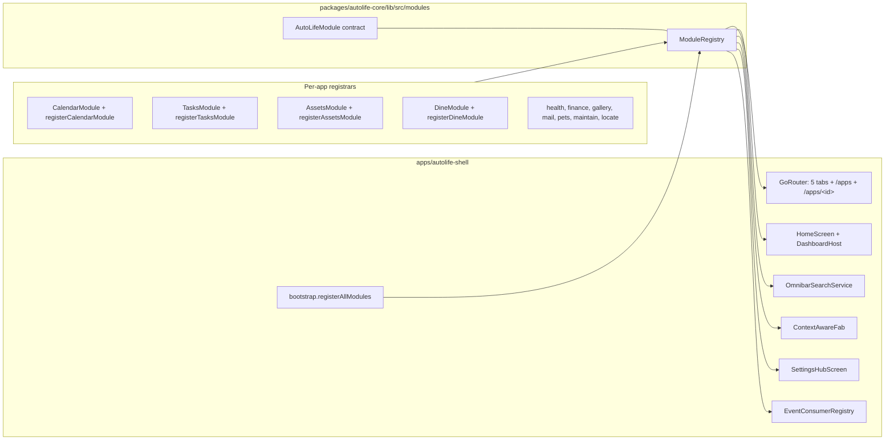

---
name: phase4_autolife_integration
overview: Compose every phase 3.x module into apps/autolife-shell through a single AutoLifeModule contract so AutoLife becomes one cohesive Flutter app with cross-module dashboard, navigation, omnibar, FAB, settings, and event-bus integration.
isProject: true
---

# Phase 4 — AutoLife Integration (All Apps Together)

## Objective
Make the standalone module apps (`apps/auto-calendar`, `apps/auto-tasks`, `apps/auto-assets`, `apps/auto-dine`, `apps/auto-health`, `apps/auto-finance`, `apps/auto-gallery`, `apps/auto-mail`, `apps/auto-pets`, `apps/auto-maintain`, `apps/auto-locate`) behave as **one product**, hosted by [`apps/autolife-shell`](apps/autolife-shell). All cross-module behaviour described in phase 3.x plans (events fanning from auto-assets into auto-calendar, chore completion crediting auto-finance allowances, meal plans surfacing on the calendar, mail draft confirmations creating events, etc.) must run inside the shell against the real Supabase backend and the real Drift offline cache, gated by phase 2.x auth + tenancy + capabilities. No module-specific UI is rewritten — the shell only orchestrates already-built `XModule` widgets and contributes routing, an Apps launcher, dashboard wiring, omnibar fan-out, FAB delegation, settings tiles, and the event-consumer registry.

Additionally, each signed-in member personalizes the **three middle bottom-nav slots** (positions 2, 3, 4). Slot 1 (`Home`) and slot 5 (`Settings`) are fixed; the user picks any three other registered `AutoLifeModule`s they have capability to view (defaulting to Calendar, Tasks, Assets to match phase 3.1). Selection is persisted per profile and survives sign-out/sign-in.

## Architecture



## In scope
- A single **module-registration contract** in `autolife-core` (`AutoLifeModule` + `ModuleRegistry`) covering: route entries, dashboard widget specs, omnibar search sources, FAB create-action, settings tiles, event-consumer handlers, integration connectors, capability requirements.
- Per-app top-level registrars (one function per app, e.g. `registerCalendarModule(ModuleRegistry, Ref)`), living in each `apps/auto-*/lib/src/<name>_module.dart` next to the existing embeddable widget.
- **Shell bootstrap** that invokes every `registerXModule` once at startup, after auth + tenancy resolve, and wires the resulting registry into the shell's existing providers.
- **Router** changes: keep five tabs (`/home` and `/settings` fixed at positions 1 and 5); replace [`ModulePlaceholderScreen`](apps/autolife-shell/lib/src/screens/shell/module_placeholder_screen.dart) so the three middle branches resolve dynamically to whatever modules the current member has pinned (default Calendar, Tasks, Assets). Add `/apps` (launcher) and `/apps/:moduleId` sub-routes auto-populated from the registry so any module — pinned to a tab or not — is also reachable by deep link.
- **Personalized bottom nav**: a per-user preference (`UserTabPreferences`) chooses 3 modules for slots 2/3/4 out of `ModuleRegistry.modules`, excluding the fixed Home/Settings. The user reorders or replaces them from a "Personalize tabs" sheet (entry points: long-press on a middle nav destination, App Launcher overflow, and a Settings tile). Selection is capability-filtered; modules whose `viewCapability` is no longer granted to the member's role fall back to the default trio with a one-time toast.
- **App Launcher screen** (`apps/autolife-shell/lib/src/screens/apps/app_launcher_screen.dart`): tile grid of all secondary modules, gated by `RolePolicyService.userMayUseCapability`, sorted by registration order or user pin.
- **Dashboard**: extend [`registerShellDashboardWidgets`](apps/autolife-shell/lib/src/registration/dashboard_registration.dart) to also iterate `ModuleRegistry.modules` and call each module's `registerDashboardWidgets(registry)`; extend `kDefaultDashboardLayout` to include one representative widget per module (or pull from each module's `defaultDashboardSlots`).
- **Omnibar fan-out**: refactor `omnibar_search_service.dart` so it merges results from each module's `OmnibarSource` registered via the contract.
- **Context-aware FAB**: [`ContextAwareFab`](apps/autolife-shell/lib/src/screens/home/context_aware_fab.dart) delegates to the active module's `quickCreateAction` instead of publishing stub `SystemEvent`s.
- **Event consumers**: each module registers its `SystemEventHandler`s into the shell's `EventConsumerRegistry` (using the existing [`EventConsumerRegistry`](packages/autolife-core/lib/src/services/event_consumer.dart) contract) so `process-event` fan-out reaches the right module inside the shell process. Realtime subscriber added in the shell that pulls new `system_event` rows and dispatches via the registry (no `RealtimeChannel` use exists yet in shell).
- **Settings**: extend [`SettingsHubScreen`](apps/autolife-shell/lib/src/screens/settings/settings_hub_screen.dart) to render module-contributed setting tiles (AI leash per module, integrations, notifications per channel) sourced from the registry.
- **Capabilities**: every contributed tab/launcher tile/FAB action/widget spec carries a `Capability` requirement; the shell hides or disables surfaces when `RolePolicyService.userMayUseCapability` is false.
- **Cross-module integration tests** moved/added under `apps/autolife-shell/integration_test/` for the canonical round-trips already promised by phase 3.x plans (assets→calendar warranty event, tasks→finance allowance credit, mail draft→calendar event, dine meal plan→calendar day strip).
- Update each module pubspec already wired against `autolife_core`/`autolife_ui` (no API changes there).
- Documentation update to [README.md](README.md) reflecting that AutoLife now runs as a single shell app embedding every module.

## Out of scope
- Reimplementing any module UI, repository, or service (each is owned by its phase 3.x plan).
- Building new modules not on the phase 3.x list.
- Push notification transport (owned by `phase1.5_event_bus_process_event_worker.plan.md`); we only consume events in-app.
- Dashboard customization UX (owned by `phase3.1.5` and `phase3.1.5.1`); Phase 4 only contributes new widget specs to the registry.
- Voice routing, briefings, PDF export (owned by `phase3.14_qol_features.plan.md`).

## Key deliverables

### `packages/autolife-core` — the contract
- `packages/autolife-core/lib/src/modules/auto_life_module.dart` — `abstract class AutoLifeModule` with hooks:
  - `String get moduleId;` (e.g. `'calendar'`, `'dine'`)
  - `String get title;`
  - `Capability get viewCapability;`
  - `ModuleRoute get primaryRoute;` (`path`, `iconBuilder`, `pageBuilder(BuildContext, String familyId)`)
  - `List<DashboardWidgetSpec> dashboardWidgets();`
  - `List<OmnibarSource> omnibarSources();`
  - `QuickCreateAction? quickCreateAction;`
  - `List<SettingsTile> settingsTiles();`
  - `void registerEventConsumers(EventConsumerRegistry);` (uses existing [`EventConsumerRegistry`](packages/autolife-core/lib/src/services/event_consumer.dart))
  - `List<IntegrationConnector> connectors();`
- `packages/autolife-core/lib/src/modules/module_registry.dart` — `ModuleRegistry` holding `List<AutoLifeModule>`, with `byId`, `withCapability(role)`, `allDashboardSpecs()`, `allOmnibarSources()`.
- Supporting types in the same folder: `ModuleRoute`, `OmnibarSource` (signature `Future<List<OmnibarSearchResult>> search(query, familyId)`), `QuickCreateAction`, `SettingsTile`.
- Barrel export added to [`packages/autolife-core/lib/autolife_core.dart`](packages/autolife-core/lib/autolife_core.dart).

### Per-app registrars (one per app)
Each `apps/auto-*/lib/src/<name>_module.dart` adds, alongside the existing `XModule` widget (see the existing [`CalendarModule`](apps/auto-calendar/lib/src/calendar_module.dart) shape):
```dart
class CalendarAutoLifeModule extends AutoLifeModule { ... }
AutoLifeModule registerCalendarModule() => CalendarAutoLifeModule();
```
- `apps/auto-calendar/lib/src/calendar_module.dart` — extend with `CalendarAutoLifeModule`.
- `apps/auto-tasks/lib/src/tasks_module.dart` — `TasksAutoLifeModule`.
- `apps/auto-assets/lib/src/assets_module.dart` — `AssetsAutoLifeModule`.
- `apps/auto-dine/lib/src/dine_module.dart` — `DineAutoLifeModule`.
- `apps/auto-health/lib/src/health_module.dart` — `HealthAutoLifeModule`.
- `apps/auto-finance/lib/src/finance_module.dart` — `FinanceAutoLifeModule`.
- `apps/auto-gallery/lib/src/gallery_module.dart` — `GalleryAutoLifeModule`.
- `apps/auto-mail/lib/src/mail_module.dart` — `MailAutoLifeModule`.
- `apps/auto-pets/lib/src/pets_module.dart` — `PetsAutoLifeModule`.
- `apps/auto-maintain/lib/src/maintain_module.dart` — `MaintainAutoLifeModule`.
- `apps/auto-locate/lib/src/locate_module.dart` — `LocateAutoLifeModule`.

### `apps/autolife-shell` — wiring
- `apps/autolife-shell/pubspec.yaml` — add `path:` deps for all 11 module packages.
- `apps/autolife-shell/lib/src/modules/module_bootstrap.dart` — function `buildModuleRegistry()` calls every `registerXModule()` and returns a `ModuleRegistry`.
- `apps/autolife-shell/lib/src/providers/module_registry_provider.dart` — `moduleRegistryProvider = Provider((ref) => buildModuleRegistry())`.
- `apps/autolife-shell/lib/src/registration/dashboard_registration.dart` — extend `registerShellDashboardWidgets(registry, modules)` to register module widgets too.
- `apps/autolife-shell/lib/src/registration/event_consumer_registration.dart` — new file; calls `module.registerEventConsumers(consumerRegistry)` for every module.
- `apps/autolife-shell/lib/src/services/realtime_event_dispatcher.dart` — new file; subscribes to Supabase realtime on `system_event` for the active tenant + family, dispatches each row through `EventConsumerRegistry.dispatchTo`.
- `apps/autolife-shell/lib/src/router/app_router.dart` — refactor to a 5-branch `StatefulShellRoute.indexedStack`: branch 0 = `/home`, branch 4 = `/settings`, branches 1/2/3 are **module slots** whose body is built by watching `userTabPreferencesProvider` and rendering `module.primaryRoute.pageBuilder(context, familyId)` for the resolved module. URL paths for the middle branches use the resolved module id (e.g. `/m/calendar`, `/m/dine`) so deep links stay stable across personalization changes. Keep top-level `/apps` and `/apps/:moduleId` reachable independently of nav slots so every module remains addressable.
- `apps/autolife-shell/lib/src/screens/apps/app_launcher_screen.dart` — grid built from `moduleRegistryProvider.modules` excluding the four already pinned to tabs; gated by `RolePolicyService.userMayUseCapability(viewCapability)`.
- `apps/autolife-shell/lib/src/screens/shell/dashboard_shell_scaffold.dart` — keep five `NavigationDestination`s; slots 1 and 5 are hard-coded Home/Settings, slots 2/3/4 are built from `userTabPreferencesProvider` resolved against `moduleRegistryProvider`. Long-press on a middle destination opens the personalize sheet. Add an app-bar action that navigates to `/apps`.
- `apps/autolife-shell/lib/src/providers/user_tab_preferences_provider.dart` — `StateNotifierProvider<UserTabPreferencesNotifier, UserTabPreferences>` keyed by the signed-in profile id. Persists via `SharedPreferences` under `phase4.shell.tabs.<profileId>` (mirroring the pattern of `selectedHouseholdMemberIdProvider`). Defaults to `['calendar', 'tasks', 'assets']`. Exposes `setSlot(int slotIndex, String moduleId)`, `reorder(int from, int to)`, `resetToDefault()`. Filters out any `moduleId` whose `viewCapability` is not granted under `RolePolicyService.userMayUseCapability`.
- `packages/autolife-core/lib/src/modules/user_tab_preferences.dart` — model (`List<String> moduleIds` with length 3, `schemaVersion`, JSON codec) + `kDefaultTabModuleIds = ['calendar', 'tasks', 'assets']`. Lives in `autolife-core` so other surfaces (App Launcher highlighting current pins, future Supabase-synced preferences) can reuse it.
- `apps/autolife-shell/lib/src/screens/shell/personalize_tabs_sheet.dart` — modal sheet with three "slot pickers" (drag handles + dropdown of remaining capability-eligible modules), live preview of the resulting bottom nav, "Reset to defaults" button. Uses `AutoLifeEmptyState` if fewer than three eligible modules exist for the role.
- `apps/autolife-shell/lib/src/screens/settings/settings_hub_screen.dart` — add a top-level "Personalize tabs" tile that opens the same sheet (in addition to the module-contributed tiles already planned).
- `apps/autolife-shell/lib/src/screens/apps/app_launcher_screen.dart` — show a small "Pinned to tab" badge on modules currently in slots 2/3/4; tapping a non-pinned module offers "Open" or "Pin to a tab" (the latter opens the personalize sheet preselected on the next empty slot).
- `apps/autolife-shell/lib/src/screens/home/context_aware_fab.dart` — replace stub `SystemEvent` emission with delegation: read current branch index → resolve to the module currently occupying that slot via `userTabPreferencesProvider` + `moduleRegistry` → invoke `quickCreateAction?.invoke(context, ref, familyId)` (Home/Settings slots show no FAB or the global "+ create" menu).
- `apps/autolife-shell/lib/src/services/omnibar_search_service.dart` — fan-out to every registered `OmnibarSource` in parallel, merge by score, deduplicate by `(moduleId, entityId)`.
- `apps/autolife-shell/lib/src/screens/settings/settings_hub_screen.dart` — append a `Modules` section that lists every `module.settingsTiles()`.
- `apps/autolife-shell/lib/src/screens/home/default_layout.dart` — replace the shell-only `kDefaultDashboardLayout` with a layout assembled from each `module.defaultDashboardSlots` (or hard-coded ordering per UI reference but referencing module widget IDs).
- `apps/autolife-shell/lib/main.dart` — once after `tenancyServiceProvider` resolves, call `event_consumer_registration` and start `realtime_event_dispatcher`.

### Tests (in `apps/autolife-shell`)
- `apps/autolife-shell/test/modules/module_registry_test.dart` — every module is registered exactly once, capabilities are non-null, widget ids are unique across modules.
- `apps/autolife-shell/integration_test/cross_module_assets_to_calendar_test.dart` — create asset in `AssetsModule` → assert `auto-calendar` shows warranty/return-window events.
- `apps/autolife-shell/integration_test/cross_module_tasks_to_finance_test.dart` — child completes chore → allowance credit appears in `FinanceModule`.
- `apps/autolife-shell/integration_test/cross_module_mail_to_calendar_test.dart` — confirm mail-draft suggestion → calendar event created.
- `apps/autolife-shell/integration_test/omnibar_fanout_test.dart` — query hits results from at least three modules.
- `apps/autolife-shell/integration_test/app_launcher_capability_gate_test.dart` — a `child` role does not see modules requiring `family.manage_policy`.
- `apps/autolife-shell/test/screens/personalize_tabs_sheet_test.dart` — picker only offers eligible modules, blocks duplicates across slots, and persists via `SharedPreferences`.
- `apps/autolife-shell/integration_test/tab_personalization_test.dart` — replace slot 2 (`/m/calendar`) with Dine; verify bottom nav re-renders, FAB invokes Dine's `quickCreateAction`, deep link `/m/calendar` still works, and the change survives app restart.
- `apps/autolife-shell/test/providers/user_tab_preferences_test.dart` — defaults to `[calendar, tasks, assets]`; falls back to defaults when a previously pinned module loses its `viewCapability`; emits exactly one change per `setSlot`/`reorder` call.

### Docs
- [README.md](README.md) — replace the "Run the shell app" snippet to reflect the single-app reality (one `flutter run` covers everything; module packages no longer need standalone run instructions for end users).
- New section in README listing the 11 modules and how to add a 12th by implementing `AutoLifeModule`.

## Dependencies
- All `phase3.x_auto_*.plan.md` modules implemented and emitting / consuming the envelopes documented in their plans.
- Phase 2.1 auth, phase 2.3 capabilities (`RolePolicyService`), phase 2.4 RLS harness, phase 2.5 privacy gating are live.
- Phase 1.5 `process-event` worker reachable for the realtime dispatcher to receive `system_event` rows.
- Phase 3.1 `DashboardWidgetRegistry`, `DashboardLayout` (see existing [`dashboard_widget_spec.dart`](packages/autolife-core/lib/src/dashboard/dashboard_widget_spec.dart) and [`dashboard_widget_registry.dart`](packages/autolife-core/lib/src/dashboard/dashboard_widget_registry.dart)).
- Phase 3.1.5 / 3.1.5.1 customization respected — Phase 4 only adds specs; user layouts still override.

## Acceptance criteria
- [ ] `apps/autolife-shell/pubspec.yaml` lists path deps for all 11 module packages; `dart run melos bootstrap` succeeds.
- [ ] `melos run test:shell` passes, including the new `module_registry_test.dart` and all `integration_test/cross_module_*` files.
- [ ] Starting the shell signed in with an `owner` role exposes 5 tabs (Home + 3 personalized module slots + Settings) + an `/apps` launcher containing the remaining 8 modules.
- [ ] Default personalized tabs for a brand-new profile are Calendar / Tasks / Assets, rendered by the real `CalendarModule`/`TasksModule`/`AssetsModule` scoped to `shellWorkspaceProvider.activeFamilyId` — `ModulePlaceholderScreen` is no longer referenced from the router.
- [ ] Long-press on a middle nav destination opens the personalize sheet; replacing slot 2 with Dine swaps the live bottom nav, updates the FAB's create action, and persists across an app restart for that profile only (a second profile on the same device retains its own selection).
- [ ] Personalization respects capabilities: a `child` role only sees capability-granted modules in the picker; revoking a pinned module's capability auto-falls-back to a safe default with a toast.
- [ ] Deep links to a module (`/m/<moduleId>` or `/apps/<moduleId>`) work whether or not that module is pinned to the user's tabs.
- [ ] Default dashboard layout contains one widget from each module; long-pressing into edit mode shows every module's specs in the picker.
- [ ] Omnibar query for a known asset, event, task, recipe, and email surfaces results from each respective module.
- [ ] Context-aware FAB on each of the 5 tabs invokes the active module's `quickCreateAction` (no stub `SystemEvent` left).
- [ ] Cross-module integration tests prove asset→calendar, tasks→finance, mail→calendar, dine→calendar round-trips inside the shell process against a local Supabase stack.
- [ ] A `child` role's `/apps` view hides modules requiring elevated capabilities; settings hub respects the same gating.
- [ ] Adding a hypothetical 12th module requires only: (a) creating `apps/auto-foo`, (b) implementing `AutoLifeModule`, (c) adding the pubspec dep and `registerFooModule()` call in `module_bootstrap.dart`. No router/dashboard/omnibar edits in the shell.

## Risks
- **Module Riverpod scope clashes** — every module currently builds its own `ProviderScope` overrides (e.g. `MemoryCalendarRepository` seed in [`CalendarModule`](apps/auto-calendar/lib/src/calendar_module.dart)). Mitigation: standardize a `ModuleProviderOverrides` block on `AutoLifeModule` so the shell composes overrides into the root `ProviderScope` and the module reads from shared services (real Supabase repos) when embedded; the `seed/demo` paths remain only when no Supabase configured.
- **Widget id collisions** in the dashboard registry — `DashboardWidgetRegistry.register` already throws on duplicates. Mitigation: enforce `moduleId/widgetId` namespacing (`calendar.today_summary`) in the contract and a registry test that fails fast.
- **Capability drift** — a module may request a capability that no role grants, hiding the module entirely. Mitigation: `module_registry_test.dart` asserts every `viewCapability` has at least one role default in `Capability.defaultsFor`.
- **Pubspec bloat / cold start** — 11 path deps pulls a lot of transitive code into the shell. Mitigation: keep modules narrow; share via `autolife_core` and `autolife_ui`; verify cold start under DevTools after wiring.
- **Realtime dispatcher overlap with sync engine** — the existing [`SyncEngine`](packages/autolife-core/lib/src/sync/sync_engine.dart) already pulls events into the Drift cache. Mitigation: realtime dispatcher reads from `system_event_cache` rather than directly from Supabase, so there is one source of truth; or treat dispatcher as a thin wrapper over `SyncEngine` notifications.
- **Integration tests requiring Supabase local stack** — phase 1.8 already established the pattern. Mitigation: reuse the CI service container; fail-fast and retry once on Supabase startup race.
- **Tab personalization vs deep links** — go_router branches today use `/calendar` etc. Letting slots 2/3/4 render arbitrary modules could break in-flight deep links. Mitigation: middle branches use `/m/:moduleId` paths whose content is module-driven (not slot-driven), and the router resolves any registered module id regardless of pin order. Keep `/apps/:moduleId` as the always-available fallback.
- **Personalization data loss on role change / module removal** — if a member loses access or a module is uninstalled, their saved pin becomes invalid. Mitigation: `UserTabPreferencesNotifier` validates against `moduleRegistry` and `RolePolicyService` on every read, substitutes the first eligible default, and shows a one-time toast.
- **Multiple users on one device** — preferences must not bleed across accounts. Mitigation: namespace the `SharedPreferences` key by signed-in profile id; clear nothing on sign-out (preferences persist for that user's next session).

## Sequencing
1. Add `AutoLifeModule` + `ModuleRegistry` + supporting types to `autolife-core`; barrel-export.
2. Implement `CalendarAutoLifeModule` in `apps/auto-calendar` (smallest, most mature). Add a single shell registrar call. Replace `/calendar` placeholder. Land + ship behind a feature flag.
3. Implement remaining 10 `XAutoLifeModule`s in parallel with their respective owners (one PR per module, all green against `module_registry_test.dart`).
4. Replace `/tasks` and `/assets` placeholders. Add `/apps` launcher and `/apps/:moduleId` deep links.
4a. Introduce `UserTabPreferences` model in `autolife-core`, `userTabPreferencesProvider` in the shell, and refactor the router so middle branches resolve via `/m/:moduleId`. Default trio (Calendar/Tasks/Assets) keeps existing behaviour unchanged for current users.
4b. Build `PersonalizeTabsSheet`; wire entry points (long-press destination, Settings tile, App Launcher pin action). Add unit + integration tests for personalization and capability fallback.
5. Wire `EventConsumerRegistry` + realtime dispatcher; remove FAB stub event publishes.
6. Refactor omnibar to fan-out across registered sources; remove shell-side calendar/tasks/assets special cases.
7. Extend `SettingsHubScreen` with module tiles; remove duplicated control-center entries that now live behind module hooks.
8. Update `kDefaultDashboardLayout` to reference module widget ids; verify edit-mode picker shows every module's specs.
9. Author the four cross-module integration tests; run against local Supabase in CI.
10. Update [README.md](README.md) and remove standalone-run docs from per-app READMEs.
11. Lift the feature flag; remove `ModulePlaceholderScreen` and the `Smoke` tab if no longer needed.
