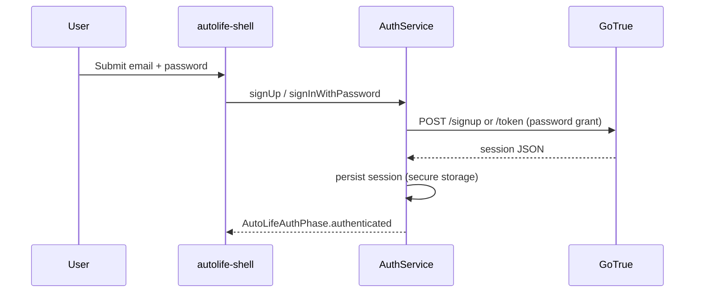
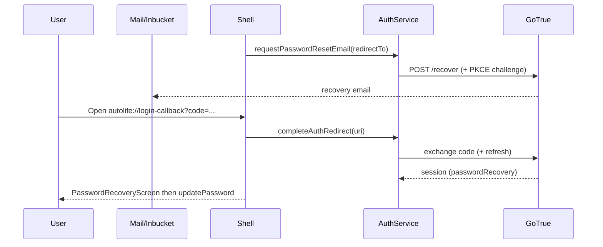

# AutoLife authentication

This runbook covers the Phase 2.1 auth stack: GoTrue (Supabase Auth) on the server,
[`AuthService`](../packages/autolife-core/lib/src/auth/auth_service.dart) in
`autolife-core`, and the Flutter shell under `apps/autolife-shell`.

## Sequences

### Email / password (signup + login)

### Password recovery (PKCE deep link)

### OAuth (Google / Apple)

1. Shell calls `oauthAuthorizeUrl` with `skip_http_redirect=true` so the OS browser receives the `/authorize` URL.
2. Provider redirects to `redirect_to`, which **must** exactly match an entry in `[auth] additional_redirect_urls` (see `supabase/config.toml`; default includes `autolife://login-callback`).
3. The OS re-opens the app via the Android intent filter / iOS URL scheme; [`ShellAuthDeepLinks`](../apps/autolife-shell/lib/src/widgets/shell_auth_deep_links.dart) forwards the URI to `getSessionFromUrl`.

### Log out scopes

| UX action | GoTrue call |
| --- | --- |
| This device | `signOut(scope: local)` |
| Everywhere | `signOut(scope: global)` (invalidates all refresh tokens) |

## Local secrets and keys

| Dart define | Purpose |
| --- | --- |
| `SUPABASE_URL` | Project API URL (`http://127.0.0.1:54321` locally). |
| `AUTOLIFE_SUPABASE_ANON_KEY` | **Preferred** publishable key for client auth. |
| `SUPABASE_SERVICE_ROLE_KEY` | Fallback for legacy smoke paths; never ship to production clients. |
| `AUTOLIFE_OAUTH_REDIRECT` | Overrides default `autolife://login-callback` when your platform needs a different URI. |

Integration tests:

- Phase 1 smoke sets `AUTOLIFE_SMOKE_INTEGRATION_TEST=true` to **skip** the sign-in gate while still using the Supabase-backed stack.
- Phase 2.1 auth passes **only** anon key + URL (no smoke bypass) to exercise the happy-path UI.

## Provider setup (Google / Apple)

1. Create OAuth client IDs in Google Cloud / Apple Developer.
2. Paste client id + secret placeholders into `supabase/config.toml` under `[auth.external.google]` / `[auth.external.apple]` with `env(...)` for real secrets.
3. Add every production and staging redirect URI to `additional_redirect_urls` (comma-separated in TOML arrays).
4. Android: `intent-filter` plus `android:scheme` / `android:host` in [`AndroidManifest.xml`](../apps/autolife-shell/android/app/src/main/AndroidManifest.xml).
5. iOS: [`CFBundleURLSchemes`](../apps/autolife-shell/ios/Runner/Info.plist) includes the `autolife` scheme.

## Apple App Store checklist (short)

- Provide **Sign in with Apple** capability and the same `client_id` / service id Supabase expects.
- Capture `full_name` only on first authorization; cache in `user_metadata` (the shell sends `full_name` on signup already).
- Hosted projects need a signing secret (.p8) visible to Supabase Auth; local dev may keep Apple disabled until secrets exist.

## Persistence and refresh

- Sessions are JSON-serialized (`Session.toJson`) into Flutter Secure Storage (`SecurePersistentAuthSessionRepository`).
- Cold start calls `recoverSession`; GoTrue periodic auto-refresh handles near-expiry rotations. The shell exposes a "Silent refresh probe" in Settings for QA.
- Concurrent refresh is single-flighted inside GoTrue; `refreshSessionExplicit` surfaces a `refreshing` UX phase.

## Database hook

Migration file `supabase/migrations/20260512000050_auth_metadata.sql` mirrors `auth.users`
into `public.profile` (stub table) on insert / metadata updates until Phase 2.2 expands tenancy.
