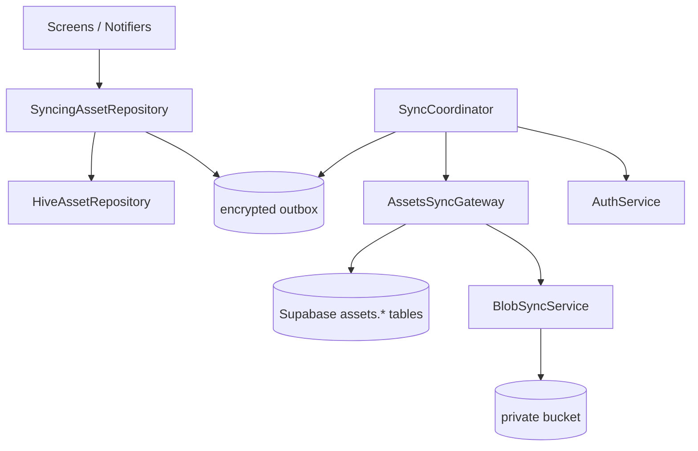
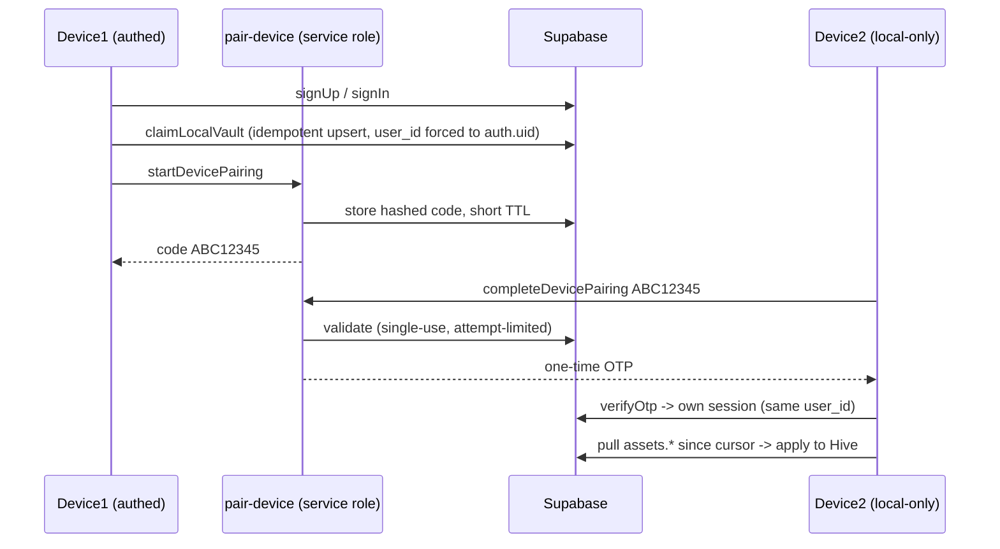

# Sync architecture

How AutoLife apps stay **local-first** yet optionally sync across devices through
Supabase. AutoAssets is the pilot module; the same seam scales to future modules
(calendar, tasks, …) without changing the core.

- Dart platform: [`packages/autolife_platform`](../packages/autolife_platform)
- Backend (SQL + Edge Function): [`platform/supabase`](../platform/supabase)
- Pilot gateway: `apps/assets/lib/src/sync/`

## Principles

1. **Hive is the source of truth.** The UI never blocks on the network. With sync
   off, the app behaves exactly like the standalone build — outbox entries simply
   accumulate and the coordinator no-ops.
2. **Mirror, don't reshape.** Remote rows store the model JSON in a `payload jsonb`
   column plus sync metadata, so "synced data == local data".
3. **One project, many clients.** Standalone AutoAssets and the AutoLife shell
   read/write the same `assets.*` tables under the same `user_id`.

## Components



- **SyncingAssetRepository / SyncingCategoryTypeRepository** — decorators over the
  Hive repos that enqueue a `SyncMutation` on every save/delete and kick a sync.
- **OutboxStore** — encrypted Hive box; coalesces repeated edits per entity (the
  record id is the idempotency key) so retries are safe.
- **SyncCoordinator** — on connectivity + auth, runs `pushOutbox()` then `pullAll()`
  across all registered gateways; owns per-module cursors and the `SyncStatus`.
- **ModuleSyncGateway** — the expandable seam. Maps records ↔ rows, stamps/reads
  `schema_version`, applies last-write-wins.
- **AuthService** — email/password (primary) + optional device pairing.
- **BlobSyncService** — uploads/downloads file paths embedded in payloads to a
  private Storage bucket; payload paths become `blob://{key}` keys when synced.

## The gateway contract

```dart
abstract class ModuleSyncGateway {
  String get moduleId;
  int get schemaVersion;
  Future<void> pushMutations(List<SyncMutation> mutations);
  Future<DateTime?> pullSince(DateTime? cursor,
      {required void Function(SyncMutation) onRemoteChange});
  Future<void> applyRemoteChanges(List<SyncMutation> changes);
  Future<List<SyncMutation>> collectLocalState();
}
```

Each app implements one gateway and registers it at startup. The AutoLife shell
registers every composed module's gateway against a single auth session.

## Sync lifecycle (per save)

1. `SyncingAssetRepository.save()` writes Hive immediately (offline-safe).
2. A `SyncMutation` (full JSON payload + `schemaVersion`) is enqueued in the outbox.
3. If authenticated + online → `pushOutbox()` upserts to `assets.items` in batches;
   the row id is the idempotency key, so retries are safe.
4. Blob paths → `BlobSyncService.upload()` before the row push.
5. On resume / kick → `pullSince(lastServerUpdatedAt)` (paginated) → apply remote
   changes to Hive (LWW on model `updated_at`) → advance the cursor to the max
   `server_updated_at` seen → notifiers reload.

**Deletes** are soft (`deleted_at`): the remote row is tombstoned, the local row is
removed, and the tombstone prevents resurrection on the next pull.

## Conflict resolution

Last-write-wins on the model `updated_at`. On an exact tie the remote write is
preferred for a deterministic cross-device outcome. (Per-device tie-break is
recorded as `device_id` on the row for diagnostics.)

## The pull cursor (why server time)

The cursor pages on `server_updated_at`, assigned by a DB trigger (`now()`), **not**
the client clock. This makes paging immune to device clock skew, which would
otherwise drop or duplicate records.

## Schema versioning (forward/backward safety)

Every payload carries `schema_version`. Because an older standalone build and a
newer shell build may write the same rows:

- Readers **upgrade-on-read** older payloads (`AssetsSyncSchema.upgradePayload`).
- Readers **refuse** payloads newer than they understand (surface "update the app
  to sync this item") instead of silently corrupting them.

## Auth & device linking



**Security properties**

- Pairing codes are high-entropy, short-lived, single-use, stored **hashed**;
  redemption is attempt-limited and only via the service-role Edge Function.
- The client never holds the service-role key and never mints sessions.
- The outbox + cached payloads live in an **encrypted** Hive box (key in
  `flutter_secure_storage`).
- Local data is never deleted on sign-out.

## Standalone ↔ AutoLife migration

- **Synced users:** install the other app, sign in → it pulls `assets.*` into
  local Hive. Standalone ignores `calendar.*`/`tasks.*`; those rows stay in the
  cloud for when the shell is used.
- **Offline-only users:** use **Backup & restore** — a portable
  `autoassets-backup.json` bundle (`assets.json` + base64 blobs, stamped with
  `schema_version`) the other app imports.

## Configuration

Supply Supabase config at build time (never the service-role key):

```sh
flutter run \
  --dart-define=SUPABASE_URL=https://xyz.supabase.co \
  --dart-define=SUPABASE_ANON_KEY=eyJ...
```

With no config the app runs fully local-only. See
[`platform/supabase/README.md`](../platform/supabase/README.md) for local dev.

## Adding a new module (checklist)

1. Add tables under a new schema (same `payload jsonb` + `schema_version` +
   `server_updated_at` trigger + RLS pattern).
2. Implement `XSyncGateway`, exported from that app's public API.
3. Register it in the app's `main.dart`.
4. In the AutoLife shell: one `AutolifePlatform.initialize()`, register all
   gateways — one auth session syncs everything. No `SyncCoordinator` changes.
