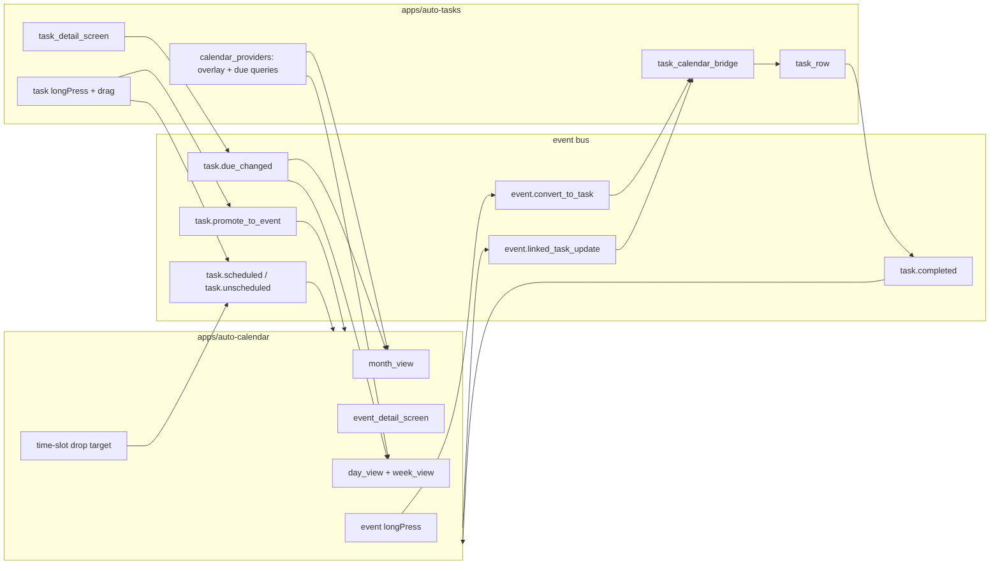

# Phase 3.3 — Auto-Tasks (implementation spec)

This document mirrors the approved **Tasks Plan Rewrite** for engineering reference. Do not duplicate into `.cursor/plans` when updating code; edit this file or the phase plan as the product owner prefers.

## Why this rewrite

The baseline task engine (lists, dependencies, quick-add) needed mainstream parity and **two-way** calendar awareness: due dates and task blocks on `apps/auto-calendar`, conversions with stable back-links, and schedule/move semantics on the bus. The rewrite also reuses calendar primitives (`CalendarRecurrenceRule`, `CalendarReminder`, attachment/link shapes) so we do not redefine recurrence or reminders in tasks.

## Objective

Ship the AutoLife task engine with named per-family lists, smart tabs (**My Day**, Important, Planned, Assigned to me), **Inbox** / **Projects** / **Done**, dependency locking, NL quick-add, cross-list aggregation, per-list sharing, and full event-bus integration with `auto-calendar` (convert, promote, schedule, linked task blocks, due chips on calendar views).

## Architecture

## Data model (in scope)

### Task fields

- **Priority** (`TaskPriority`) and **`importance`** (To-Do “star”; independent of priority).
- **`dueAt`**, **`scheduledFor`**, **`estimatedDuration`** — deadline vs “when I plan to work on it.”
- **`myDayDate`** — day bucket (local midnight semantics); cleared on rollover.
- **`reminders`**: `List<TaskReminder>` — aligned with `CalendarReminder` (absolute / due-relative; dedupe keys; quiet-hours aware in production).
- **`recurrenceRule`**: `CalendarRecurrenceRule?` — on complete, spawn next occurrence.
- **`seriesId`**, exception metadata — parity with calendar series semantics.
- **`steps`**: `List<TaskStep>` — in-task checklist; **non-blocking** (unlike `dependsOn`).
- **`tags`**: `List<String>` — cross-cutting labels, separate from list membership.
- **`attachments` / `links`** — shapes aligned with `CalendarEventAttachment` / `CalendarEventLink`.
- **`assigneeIds`**: `List<String>` — multi-assignee.
- **`commentsCount`** (denormalized) + `task_comments` table.
- **`relatedAssetIds`**, **`relatedEventIds`** — cross-module references.
- **`sourceEventId`** — set when created from `event.convert_to_task`.
- **`scheduledEventId`** — calendar block from `task.scheduled`.
- **`sourceModule`** (`mail`, `health`, `maintain`, …) — smart-list / provenance.
- **`completedAt` / `completedBy`**, **`canceledAt` / `canceledBy`**, **`color`**.
- **`dependsOn`**, **`requiresApproval`**.

### TaskList

- **`isSmart`**, **`smartRule`** (typed JSON filter spec), **`position`**, **`archived`**, icon/color, default assignee, sharing.

### Persistence (Supabase)

Tables include: `task_lists`, `tasks`, `task_dependencies`, `task_list_shares`, `task_templates`, `task_template_versions`, `task_comments`, `task_my_day_history`, `task_completion_reactions`. Calendar linkage: `calendar_events.linked_task_id`, `calendar_events.is_task_block` (see migration `supabase/migrations/20260513100000_tasks_phase_3_3.sql`).

Smart tabs are virtual reads (repository + `SmartListEvaluator`) rather than duplicate rows.

## Per-list / smart tabs

Replaces the older “Inbox / Today / …” framing with:

| Tab | Behavior |
|-----|----------|
| **Inbox** | Untriaged / default capture |
| **My Day** | User-curated “today” set; **`myDayDate`** reset at local midnight |
| **Important** | `importance == true` |
| **Planned** | Tasks with **`scheduledFor`** and/or **`dueAt`**, grouped (Earlier / Today / Tomorrow / week / Later) |
| **Assigned to me** | Current user ∈ **`assigneeIds`** |
| **Projects** | Per-list work + steps + dependencies |
| **Done** | Completed; optional “last 7 days” filter |

### My Day Suggestions panel (spec)

Surfaces: overdue tasks; yesterday’s incomplete My Day items; tasks **`scheduledFor = today`**; recently added (e.g. last 24h). Implementation: `my_day_suggestions_panel.dart` + history table `task_my_day_history` for audit.

## Calendar ↔ Tasks (bidirectional)

### Bus envelopes

| Direction | Type | Role |
|-----------|------|------|
| Calendar → Tasks | `event.convert_to_task` | Create task from event; set **`sourceEventId`** |
| Tasks → Calendar | `task.promote_to_event` | Full promotion; task completed; new calendar event with **`linked_task_id`** |
| Tasks → Calendar | `task.scheduled` | Create/update task block; **`linked_event_id`**, times |
| Tasks → Calendar | `task.unscheduled` | Remove linked block |
| Tasks → * | `task.due_changed` | Overlay / chips invalidate |
| Tasks → * | `task.my_day_changed` | Shell / aggregators |
| Calendar → Tasks | **`event.linked_task_update`** (via `CalendarEventsEmitter.emitLinkedTaskUpdate`) | Block moved/resized → update **`scheduledFor`** + **`estimatedDuration`** |

Payload shapes live in **`TasksEventsEmitter`** / **`CalendarEventsEmitter`** in `packages/autolife-core`.

### Calendar UI (tasks overlay)

- **Day / Week / Agenda**: **`DayDueStrip`** — tasks with **`dueAt`** on the visible day (chips; cap + “+N more”).
- **Month**: secondary row in day cells — due chips (`month_day_cell.dart`).
- **Task blocks**: `CalendarEvent.isTaskBlock`, **`linkedTaskId`** — dashed/muted styling + checkbox on **`event_card.dart`** where wired.
- **Control center**: **`calendarShowTasksOverlayProvider`** (SharedPreferences `auto_calendar.show_tasks_on_calendar`) in `calendar_providers.dart`.
- **Event detail**: “Linked task” when **`linked_task_id`** set.
- **Long-press**: convert-to-task sheet (idempotent on **`sourceEventId`**), list picker.

Calendar must **not** import `auto_tasks`; overlay reads **`TaskRepository`** / providers supplied by host + core.

### Tasks UI affordances

- Detail: “Linked event” when **`sourceEventId`** or **`scheduledEventId`** present.
- Row / long-press: promote, schedule (`schedule_into_calendar_sheet.dart`), unschedule, snooze, move list.
- Desktop/web: drag task → time slot → **`task.scheduled`** (shell layout; placeholder in app until shell composites both panes).
- Conflicts: reuse **`ConflictBar`** / suggestions when scheduling.

### Idempotency contract

- **`sourceEventId`**: one task per converted event (bridge dedupes).
- **`sourceTaskId`**: promote leg ties completed task to new event id.
- **`task.scheduled`**: stable **`(taskId, scheduledEventId)`** / idempotency keys on envelopes.
- Stress: **`test/task_calendar_round_trip_test.dart`** replays **200** identical convert envelopes → single task.

### Drag-to-schedule

Spec: drop target on calendar time axis emits **`task.scheduled`** with chosen range; bridge writes **`scheduledEventId`** on task and creates **`is_task_block`** event.

## Microsoft To-Do parity

| Feature | Spec detail |
|---------|-------------|
| **My Day** | Curated day list + Suggestions (above). |
| **Steps** | Sub-checklist with progress; do **not** gate parent completion. |
| **Importance** | Star flag; drives **Important** tab independently of **priority**. |
| **Recurrence** | `CalendarRecurrenceRule`; on complete, spawn next; **`recurrence_task_spawn.dart`** + series scope rules. |
| **Reminder vs due** | **`dueAt`** = deadline; **`reminders`** = triggers; quick-add can default “15m before” per list policy. |
| **Attachments** | Per-task attachments mirroring calendar picker patterns. |
| **Planned** | Uses **`scheduledFor`** and **`dueAt`**. |
| **Smart suggestions** | My Day suggestion ranked list (overdue, carry-over, today-scheduled, recent). |

## Smart lists, templates, tags

### Smart-list rules (`TaskSmartRule`)

Closed JSON operators (reject unknown keys at parse):

- `dueWithinDays`, `priorityAtLeast`, `tagsAny`, `assigneeIdsAny`, `sourceModuleIn`, `listIdsAny`.

Evaluator: **`apps/auto-tasks/lib/src/services/smart_list_evaluator.dart`**. Typed errors fallback UI: “show all.”

### Templates

- `task_templates` + `task_template_versions`; blueprint JSON; **`TemplateEngine`** applies batches atomically (transaction in Supabase; single **`task.created`** per row in bus contract).

### Tags / labels

- **`tags`** on **`Task`**; chips on **`task_row`**, filter in lists; separate from list membership.

## Cross-module QoL

| Item | Notes |
|------|--------|
| **Snooze** | **`snooze_sheet.dart`** — buckets (later today / tomorrow / next week / custom); may touch **`scheduledFor`** / **`dueAt`** / reminders; emit **`task.due_changed`** when due moves. |
| **Bulk ops** | **`bulk_action_bar.dart`** + multi-select; assign / priority / list / due / snooze / star; one **`task.updated`** per task. |
| **Comments** | **`task_comments`** + RLS (phase 2.4 templates). |
| **Reactions** | **`task_completion_reactions`** on complete. |
| **Activity log** | Lite audit from existing **`system_event`** / bus payloads (no extra table required for MVP). |
| **List count badges** | **`list_picker_drawer.dart`** — counts per list / smart tab. |
| **NL quick-add** | **`quick_add_parser.dart`**: `tomorrow 5pm`, `#list`, `!` / `!!` / `!!!`, `*`, `@hint`, `/today` shortcuts. |
| **Approval** | **`requiresApproval`** + policy hook / chip in row. |
| **Keyboard shortcuts** | e.g. **`main.dart`** `Meta+B` / `Ctrl+B` bulk mode. |
| **PDF** | **`TaskListPdfRequest`** stub → phase 3.14 Edge render. |

## Out of scope (this milestone)

- Kanban / Eisenhower / Pomodoro views.
- Cross-family task sharing beyond guest-link (phase 2.5).
- Voice-driven capture (phase 3.14 **`voice_router`**); action surface only here.

## Key deliverables (repository paths)

**`apps/auto-tasks`**

- `lib/main.dart`, `lib/src/tasks_module.dart`, `lib/src/seed/demo_tasks_seed.dart`
- `lib/src/providers/task_providers.dart`
- Screens: `task_lists_screen.dart`, `task_detail_screen.dart`, `today_aggregate_screen.dart`, `list_settings_screen.dart`, `list_picker_drawer.dart`
- Tabs: `tabs/inbox_tab.dart`, `tabs/my_day_tab.dart`, `tabs/important_tab.dart`, `tabs/planned_tab.dart`, `tabs/assigned_to_me_tab.dart`, `tabs/projects_tab.dart`, `tabs/done_tab.dart`
- Widgets: `widgets/task_row.dart`, `widgets/quick_add_bar.dart`, `widgets/my_day_suggestions_panel.dart`, `widgets/snooze_sheet.dart`, `widgets/bulk_action_bar.dart`, `widgets/schedule_into_calendar_sheet.dart`, `widgets/template_picker_sheet.dart`, `widgets/dependency_chip.dart`
- Services: `services/task_calendar_bridge.dart`, `services/smart_list_evaluator.dart`, `services/template_engine.dart`, `services/quick_add_parser.dart`, `services/dependency_resolver.dart`, `services/recurrence_task_spawn.dart`

**`packages/autolife-core/lib/src/tasks/`**

- Models + repository: `task.dart`, `task_list.dart`, `task_step.dart`, `task_reminder.dart`, `task_attachment.dart`, `task_link.dart`, `task_dependency.dart`, `task_priority.dart`, `task_status.dart`, `task_smart_rule.dart`, `task_template.dart`, `task_repository.dart`, `tasks_events_emitter.dart`, `task_list_pdf_request.dart`
- Calendar: `calendar_event.dart` (`isTaskBlock`, `linkedTaskId`), `calendar_events_emitter.dart` (`emitLinkedTaskUpdate`, etc.)

**`apps/auto-calendar`**

- `lib/src/providers/calendar_providers.dart` — `calendarTaskRepositoryProvider`, `calendarShowTasksOverlayProvider`, `tasksDueOnDayProvider`
- `lib/src/screens/calendar/widgets/day_due_strip.dart`
- Views wired: `views/day_view.dart`, `views/month_day_cell.dart`, `widgets/event_card.dart`, `calendar_screen.dart`, `main.dart` (shared **`MemoryTaskRepository`** seed where applicable)

**Supabase**

- `supabase/migrations/20260513100000_tasks_phase_3_3.sql`

**Tests**

- `apps/auto-tasks/test/services/*_test.dart`, `test/task_calendar_round_trip_test.dart` (200× convert + schedule + linked update + promote), `test/flutter_test_config.dart`, `test/widget_test.dart`
- `apps/auto-calendar/test/views/task_overlay_test.dart`

## Acceptance criteria (gate checklist)

Append to phase 3.3 reviews:

- [ ] My Day resets at local midnight; yesterday’s incomplete My Day items appear under **Suggestions** next day.
- [ ] Importance toggles independently; **Important** tab matches `importance` without changing **`priority`**.
- [ ] Recurring task on complete spawns next occurrence within one frame and emits **`task.created`**; series edits respect **`thisOccurrence` / `thisAndFollowing` / `allEventsInSeries`**.
- [ ] Task with **`dueAt = today`** shows as chip on Day / Week / Month; tap deep-links to task detail.
- [ ] “Schedule into calendar” creates **`is_task_block`** event with **`linked_task_id`**; task gets **`scheduledEventId`**; **`task.scheduled`** (+ calendar create).
- [ ] Moving linked block updates **`scheduledFor`** / duration via **`event.linked_task_update`**; covered by **`task_calendar_round_trip_test`**.
- [ ] Long-press convert creates task with **`sourceEventId`** (not stub); idempotent on **`sourceEventId`**.
- [ ] Smart list rule `{ dueWithinDays: 7, tagsAny: ['chore'], assigneeIdsAny: [<child>] }` updates live when tasks change.
- [ ] Template applies 6-task blueprint atomically (one transaction; one emitted create per task).
- [ ] Snooze sets **`scheduledFor`** / reminders per bucket.
- [ ] Bulk-star 10 tasks → 10 **`task.updated`** envelopes; UI updates within a frame.
- [ ] NL **`Buy milk tomorrow 5pm #grocery !! @sam *`** parses to list, due, medium priority, assignee hint, importance.
- [ ] “Show tasks on calendar” hides overlay only; data intact; survives cold start.
- [ ] Comments on shared lists enforce phase 2.4 RLS.

## Risks and mitigations

| Risk | Mitigation |
|------|------------|
| **Month cell jitter** with task chips | Fixed-height task row + intra-cell scroll (same pattern as dense events); collapse when empty. |
| **Triple-leg dedupe** (convert / promote / schedule) | Single writer: **`TaskCalendarBridge`**; keys above; **`task_calendar_round_trip_test`**. |
| **Recurring + dependencies** | On spawn, inherit **`dependsOn`**; rerun cycle detection every spawn. |
| **Smart rules creep** | Closed **`TaskSmartRule`** schema; strict parse; UI fallback. |
| **Template + approval** | **`TemplateEngine`** runs **`RolePolicyService` / approval** before commit; batch stalls if any task gated. |

## Implementation outline (13 steps)

1. Migrations: tasks + template/version + comments + my-day history + reactions + calendar columns + RLS.
2. Core models + `autolife_core` barrel export.
3. **`MemoryTaskRepository`** + Supabase repository (shape parity with calendar repo).
4. **`DependencyResolver`** + recurrence spawn helper.
5. **`SmartListEvaluator`** + rule parser + tests.
6. **`TemplateEngine`** + tests.
7. **`list_picker_drawer`** + **`task_lists_screen`** with seven tabs + Today aggregate.
8. **`task_row`**, **`dependency_chip`**, **`quick_add_bar`**, **`task_detail_screen`**.
9. Sheets: My Day suggestions, snooze, bulk bar, schedule-into-calendar, template picker.
10. **`TaskCalendarBridge`** + **`TasksEventsEmitter`**; calendar convert menu real.
11. Calendar overlay: **`calendar_providers`**, due strip, month chips, task block styling, toggle.
12. **`list_settings_screen`** (sharing, smart rule placeholder, templates placeholder).
13. Tests: resolver, NL parser, smart list, template, bridge, overlay widget, **`task_calendar_round_trip_test`** (200× convert + three legs).
